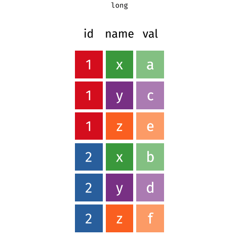
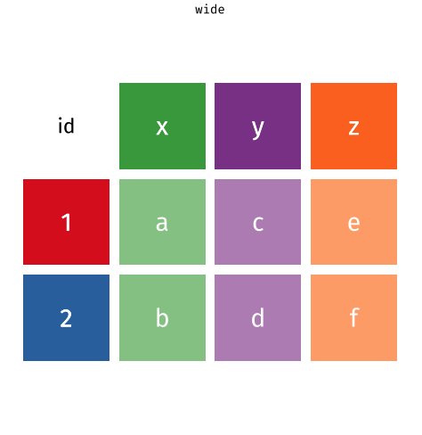

```{r setup, include=FALSE}
library(learnr)
library(tidyverse)
library(prenoms)

cases <- tribble(
  ~Country, ~"2011", ~"2012", ~"2013",
      "FR",    7000,    6900,    7000,
      "DE",    5800,    6000,    6200,
      "US",   15000,   14000,   13000
)

cases2 <- tribble(
  ~city, ~country,  ~continent,     ~"2011", ~"2012", ~"2013",
  "Paris",    "FR", "Europe",           7000,    6900,    7000,
  "Berlin",   "DE", "Europe",           5800,    6000,    6200,
  "Chicago",  "US", "North America",   15000,   14000,   13000
)

pollution <- tribble(
       ~city, ~size, ~amount,
  "New York", "large",      23,
  "New York", "small",      14,
    "London", "large",      22,
    "London", "small",      16,
   "Beijing", "large",     121,
   "Beijing", "small",     121
)

checker <- function(label, user_code, check_code, envir_result, evaluate_result, ...) {
  list(message = check_code, correct = TRUE, location = "append")
}
tutorial_options(exercise.timelimit = 60, exercise.checker = checker)
knitr::opts_chunk$set(echo = FALSE)
```

## Bienvenue

Les notions apprises dans les séquences précédentes fonctionnent mieux lorsque les données sont organisées d'une manière particulière. Ce format est connu sous le nom de **tidy data** (ou **données ordonnées**). Il apparaît tout au long du tidyverse (parfois connu sous le terme d'ordocosme dans la langue de Molière). Vous passerez beaucoup de temps en tant que Data Scientist à gérer vos données dans un format utilisable. Il est donc important d'apprendre à le faire rapidement.

Ce module vous apprendra comment reconnaître les "tidy data". Et bien sûr... comment restructurer les données dans un format bien ordonné lorsqu'elles ne le sont pas ! Dans ce document, seront abordées les principales fonctions du tidyverse :

* `pivot_longer()` - restructure les données d'un format dit **large** en format dit **long**, et 
* `pivot_wider()`  - restructure les données d'un format dit **long** en format dit **large**

Nous y reviendrons par la suite, mais rappelez-vous que des données sont dites 'dans un format long' (*long* en anglais) si une même observation y apparaît plusieurs fois. Comme ici :

```{r out.width = "45%", fig.align = "center"}

```

Au contraire, des données sont dites 'dans un format large' (*wide* en anglais) si une même observation n'y apparaît qu'une seule fois. Comme ici :

```{r out.width = "30%", fig.align = "center"}

```

Ce module utilise les [packages qui composent le coeur du tidyverse ](http://tidyverse.org/), notamment {ggplot2}, {dplyr} et {tidyr}. Nous utiliserons également le package `{prenoms}` made in ThinkR (voir [ici](https://github.com/ThinkR-open/prenoms) pour l'installer). Tous ces packages ont été préinstallés et préchargés pour vous dans ce module. Nul besoin donc de les installer et les charger de nouveau.

Cliquez sur le bouton pour commencer.

## Donnees ordonnees (tidy data)

### Variables, valeurs, et observations

En [analyse exploratoire de données](), nous proposons trois définitions utiles pour la science des données :

*   Une __variable__ est une quantité, une qualité, ou une propriété que vous pouvez mesurer. 

*   Une __valeur__ est l'état d'une variable quand vous la mesurez. La valeur d'une variable peut ainsi varier d'une mesure à l'autre.

*   Une __observation__ est un ensemble de mesures effectuées dans des conditions similaires (vous effectuez généralement toutes les mesures sur une observation en même temps et sur le même objet). Une observation contiendra plusieurs valeurs, chacune associée à une variable différente. Nous allons parfois désigner une observation comme un cas ou un point de données.

Ces définitions sont liées au concept de **tidy data** (données ordonnées). Pour voir comment, appliquons les définitions à certaines données réelles.

### Quiz 1 - Quelles sont les variables ?

```{r echo = TRUE}
table1
```

```{r q1, echo = FALSE}
question("Quelles sont les variables de l'ensemble de données ci-dessus ? Cochez toutes les cases appropriées.",
         answer("country", correct = TRUE),
         answer("year", correct = TRUE),
         answer("cases", correct = TRUE),
         answer("population", correct = TRUE),
         answer("count"),
         answer("type"),
         allow_retry = TRUE, 
         correct = "Bon travail ! Le jeu de données contient quatre variables mesurées sur six observations : country, year, cases, et population."
)
```

### Quiz 2 - Quelles sont les variables ?

Explorer maintenant ce nouveau jeu de données. Contient-il les mêmes variables que précédemment ?

```{r echo = TRUE}
table2
```

```{r q2, echo = FALSE}
question("Les données contiennent-elles les variables **country**, **year**, **cases**, et **population** ?",
         answer("Oui", correct = TRUE, message = "Effectivement ! Si vous regardez attentivement, vous verrez qu'il s'agit du même jeu de données qu'auparavant, mais organisé d'une nouvelle manière."),
         answer("Non", message = "Ne vous laissez pas induire en erreur par les deux nouveaux noms de colonnes : une variable et un nom de colonne ne sont pas nécessairement liés (même si c'est effectivement mieux si c'est le cas)."),
         allow_retry = TRUE
)
```

### Formes des données

Ces jeux de données révèlent quelque chose d'important : _vous pouvez réorganiser le même ensemble de variables, de valeurs et d'observations de différentes manières._

Ce n'est pas difficile à faire. Si vous exécutez les blocs de code ci-dessous, vous pouvez voir les mêmes données affichées de trois autres façons.

```{r ex1, exercise = TRUE}
table3
```

```{r ex2, exercise = TRUE}
table4a; table4b
```

```{r ex3, exercise = TRUE}
table5
```

### Tidy data (données ordonnées)

Les données peuvent être présentées sous différents formats, mais l'un d'entre eux est plus pertinent à utiliser pour l'analyse de données. Ce format est connu sous le nom de **tidy data** (ou **données ordonnées**). Un ensemble de données est bien ordonné si :

1. Chaque _variable_ est dans sa propre _colonne_
2. Chaque _observation_ est dans sa propre _ligne_
3. Chaque _valeur_ est dans sa propre _cellule_ (cela découle des #1 et #2)

Parmi nos tables ci-dessus, seule `table1` est bien ordonnée.

```{r echo = TRUE}
table1
```

### Extraction de variables

Pour voir pourquoi les tidy data sont plus faciles à utiliser, focalisons-nous sur une tâche de base. Chaque bloc de code ci-dessous extrait les valeurs de la variable `cases` sous la forme d'un vecteur et calcule la moyenne de la variable. On utilise une table bien ordonnée, `table1` :

```{r echo = TRUE}
table1 %>% 
  summarise(moyenne = mean(cases))
```

L'autre utilise une table désordonnée, `table2`:

```{r echo = TRUE}
table2 %>%
  slice(c(1, 3, 5, 7, 9, 11)) %>%
  summarise(moyenne = mean(count))
```

Quelle ligne de code est la plus facile à écrire ? Et oui, la première ! C'est également la seule que vous auriez pu écrire si vous n'aviez regardé que la première ligne des données. Ce qui n'est pas le cas de la deuxième, puisque vous devez voir l'intégralité des données pour l'écrire. Pas très pratique...

### Réutilisation du code

Non seulement le code de `table1` est plus facile à écrire, mais il est plus facile à réutiliser. C'est-à-dire ? Pour illustrer le propos, modifiez les morceaux de code ci-dessous pour calculer la moyenne de la variable `population` pour chaque table.

D'abord avec `table1` :

```{r ex4, exercise = TRUE}
table1 %>% 
  summarise(moyenne = mean(cases))
```

```{r ex4-solution}
table1 %>% 
  summarise(moyenne = mean(population))
```

Puis avec `table2` :

```{r ex5, exercise = TRUE}
table2 %>%
  slice(c(1, 3, 5, 7, 9, 11)) %>%
  summarise(moyenne = mean(count))
```

```{r ex5-solution}
table2 %>%
  slice(c(2, 4, 6, 8, 10, 12)) %>%
  summarise(moyenne = mean(count))
```

Encore une fois, `table1` est plus facile à travailler ; il vous suffit de changer le nom de la variable que vous souhaitez extraire. Un code comme celui-ci est plus facile à généraliser sur de nouveaux jeux de données (s'ils sont bien ordonnés) et plus facile à automatiser avec une fonction.

Regardons un avantage de plus.

### Calculs

Supposons que vous souhaitiez calculer les ratios `cases`/`population` pour chaque pays et chaque année. Pour ce faire, vous devez vous assurer que la bonne valeur de `cases` est associée à la bonne valeur de `population` lorsque vous effectuez le calcul.

Une fois de plus, c'est plus compliqué à faire avec la table désordonnée `table2`:

```{r echo = TRUE}
table2 %>% slice(c(1, 3, 5, 7, 9, 11)) %>% select(count) / table2 %>% slice(c(2, 4, 6, 8, 10, 12)) %>% select(count)
```

Alors que c'est beaucoup plus simple avec `table1`. Regardez par vous-même :

```{r ex6, exercise = TRUE}

```

```{r ex6-solution}
table1 %>% select(cases) / table1 %>% select(population)
```

Ces petites différences peuvent sembler minimes ; mais lorsqu'elles s'additionnent tout au long du processus d'analyse de données, elles permettent de gagner du temps et d'éviter des erreurs.

### Tidy data et R

Si le format tidy data fonctionne si bien pour R, c'est parce qu'il aligne la structure des données avec la mécanique de R :

* R stocke chaque bloc de données (data.frame) sous forme d'une liste de vecteurs juxtaposés en colonnes, ce qui facilite l'extraction d'une colonne d'un data.frame en tant que vecteur. Les tidy data placent chaque variable dans son propre vecteur de colonne, ce qui facilite l'extraction de toutes les valeurs d'une variable pour calculer une statistique descriptive ou pour utiliser la variable dans un calcul.

* R calcule de nombreuses fonctions et opérations de manière vectorisée : il fait correspondre les premières valeurs de chaque vecteur d'entrée pour calculer le premier résultat, puis fait correspondre les secondes valeurs de chaque entrée pour calculer le deuxième résultat, etc. Les calculs se font tere à terme. Des données bien ordonnées garantissent que R fera toujours correspondre les bonnes valeurs entre elles, dès lors que ces valeurs sont tirées de la même table.

```{r out.width = "90%"}
knitr::include_graphics("www/images/vectorized.png")
```

Par conséquent, la plupart des fonctions dans R --- et chaque fonction dans le tidyverse --- s'attendent à ce que vos données soient organisées dans un format bien ordonné. En effet, Vous avez peut-être remarqué ci-dessus que nous pourrions utiliser les fonctions {dplyr} pour travailler sur `table1`, mais pas sur `table2`.
 
### Résumé

> "Data comes in many formats, but R prefers just one: tidy data." - "Les données peuvent être présentées dans de nombreux formats, mais R en préfère un seul : les données ordonnées."

> --- Garrett Grolemund

Un jeu de données est bien ordonné si :

1. Chaque _variable_ est dans sa propre _colonne_
2. Chaque _observation_ est dans sa propre _ligne_
3. Chaque _valeur_ est dans sa propre _cellule_ (cela découle de #1 et #2)

Maintenant que vous savez ce que sont les tidy data, que pouvez-vous faire avec des **données désordonnées** ?

Dans les sections suivantes, vous allez découvrir les fonctions :

* `pivot_longer()` - remodèle les données larges en données longues en rassemblant des colonnes, et 

* `pivot_wider()` - remodèle les données longues en données larges en étendant des colonnes.

Nous y reviendrons par la suite, mais voici un aperçu du fonctionnement de ces deux fonctions : 


## Rassembler des colonnes

### Données désordonnées (untidy data)

> "Tidy data sets are all alike; but every messy data set is messy in its own way." - "Les jeux de données tidy se ressemblent tous, mais chaque jeu de données désordonné l'est à sa manière."
> --- Hadley Wickham

Ainsi, la façon dont vous ordonnez un jeu de données désordonné dépendra de la configuration initiale des données. Par exemple, considérez le jeu de données `cases` ci-dessous.

```{r echo = TRUE}
cases
```

### Quiz 3 - Quelles sont les variables ?

```{r q3}
question("Quelles sont les variables dans cases?",
         answer("Country, 2011, 2012, et 2013", message = "Bien essayé, mais cela semble-t-il probable ? Est-ce que 7000 est un cas de figure d'une caractéristique nommée 2011 ?"),
         answer("Country, year, et quelques quantités inconnues (n, count, number of cases, etc.)", correct = TRUE),
         answer("FR, DE, et US", message = "Cela ressemble à des noms de pays abrégés, pas à des noms de trois caractéristiques dont les valeurs peuvent varier selon les observations."),
         allow_retry = TRUE
)
```

### Une version tidy

<iframe width="560" height="315" src="https://www.youtube.com/embed/tNNnGX5iO-0" frameborder="0" allow="accelerometer; autoplay; encrypted-media; gyroscope; picture-in-picture" allowfullscreen></iframe>


### pivot_longer()

Vous pouvez utiliser la fonction `pivot_longer()` du package **{tidyr}** pour convertir des données larges en données longues. Attention, notez que `pivot_longer()` renvoie une copie ordonnée du jeu de données, mais ne modifie pas le jeu de données d'origine. Si vous souhaitez utiliser cette copie ultérieurement, vous devrez la sauvegarder quelque part en utilisant `<-`.

```{r echo = TRUE}
cases %>%
  pivot_longer(cols = c(2, 3, 4), names_to = "year", values_to = "n")
```

Regardons d'un peu plus près la syntaxe de `pivot_longer()`.

### Syntaxe de pivot_longer()

Voici le même code écrit sans l'opérateur pipe (%>%), ce qui rend la compréhension du bloc de code un peu plus ardue.

```{r echo = TRUE, eval = FALSE}
pivot_longer(cases, cols = c(2, 3, 4), names_to = "year", values_to = "n")
```

Pour utiliser `pivot_longer()`, passez-lui en argument le nom d'un jeu de données à restructurer suivi de l'argument `cols` qui indique quelles colonnes utiliser pour construire les nouvelles colonnes (sous forme de nombres). Ici, `pivot_longer()` utilisera les deuxième, troisième et quatrième colonnes. `pivot_longer()` supprimera ces colonnes dans le résultat, mais leur contenu apparaîtra dans les nouvelles colonnes. Toutes les colonnes non spécifiées resteront dans le jeu de données, et leur contenu sera répété aussi souvent que nécessaire pour dupliquer chaque relation du jeu de données désordonné d'origine.

Il faut également passer à `pivot_longer()` les deux nouveaux noms de colonne à utiliser. Chaque nom doit être une chaîne de caractères entourée de guillemets :

* `names_to` : chaîne de caractères qui deviendra le nom de la nouvelle colonne qui contiendra les anciens noms de colonne.
* `values_to` : chaîne de caractères qui deviendra le nom de la nouvelle colonne contenant les anciennes valeurs contenues dans les cellules.

### Exercice 1 - Ordonner table4a

Maintenant que vous avez vu `pivot_longer()` en action, essayez de l'utiliser pour ordonner `table4a` :

```{r echo = TRUE}
table4a
```

Le résultat devrait contenir trois colonnes : `country`, `year`, et `cases`. Commencez par modifier le code ci-dessous.

```{r ex7, exercise = TRUE}
cases %>%
  pivot_longer(cols = c(2, 3, 4), names_to = "year", values_to = "n")
```

```{r ex7-solution}
table4a %>%
  pivot_longer(cols = c(2, 3), names_to = "year", values_to = "cases")
```

```{r ex7-check}
"Bien joué !"
```

### Spécification des colonnes

Jusqu'à présent, nous avons utilisé des nombres pour décrire les colonnes à restructurer avec `pivot_longer()`, mais ce n'est pas nécessaire. `pivot_longer()` reconnaît également les noms de colonnes ainsi que tous les outils `select()` dont vous avez entendu parler dans [Isoler les données avec {dplyr}](). Ainsi, par exemple, ces expressions feraient toutes la même chose :

```{r echo = TRUE, eval = FALSE}
table4a %>%
  pivot_longer(cols = c(2, 3), names_to = "year", values_to = "cases")
table4a %>%
  pivot_longer(cols = c(`1999`, `2000`), names_to = "year", values_to = "cases")
table4a %>%
  pivot_longer(cols = -country, names_to = "year", values_to = "cases")
table4a %>%
  pivot_longer(cols = one_of(c("1999", "2000")), names_to = "year", values_to = "cases")
```

Notez que 1999 et 2000 sont des nombres. Lorsque vous appelez directement des noms de colonnes qui sont des nombres, vous devez les entourer de guillemets. Sinon `pivot_longer()` penserait que vous voulez dire les 1999ème et 2000ème colonnes... Utilisez `?select_helpers` pour ouvrir une page d'aide qui répertorie les outils `select()`.

### Exercice 2 - Ordonner table4b

Utilisez `pivot_longer()` et l'outil `-` pour ordonner `table4b` en un jeu de données avec trois colonnes : `country`, `year`, et `population`.

```{r echo = TRUE}
table4b
```

```{r ex8, exercise = TRUE}

```

```{r ex8-solution}
table4b %>% 
  pivot_longer(cols = -country, names_to = "year", values_to = "population")
```

```{r ex8-check}
"Bon travail ! Ensemble, les versions tidy de table4a et table4b répètent les informations de table1. Dans la séquence 'Joindre des ensembles de données', vous apprendrez à les regrouper en un seul jeu de données."
```

### Conversion de types de données

Si vous avez examiné de près vos résultats des exercices précédents, vous avez peut-être remarqué quelque chose d'étrange : la nouvelle colonne `year` contient des vecteurs de caractères. Vous pouvez le savoir car R affiche `<chr>` sous le nom de la colonne.

Vous pouvez demander à R de convertir chaque nouvelle colonne en un type de données approprié en utilisant l'argument `names_ptypes` à l'appel `pivot_longer()`. Cet argument doit être renseigné sous la forme `names_ptypes = list(year = integer())`. R transformera le contenu de la colonne `year` en entiers (integer). Essayez-le dans le code ci-dessus !

```{r ex9, exercise = TRUE}
table4b %>% 
  pivot_longer(cols = -country, names_to = "year", values_to = "population")
```

```{r ex9-solution}
table4b %>% 
  pivot_longer(cols = -country, names_to = "year", values_to = "population", names_ptypes = list(year = integer()))
```

```{r ex9-check}
"Bon travail ! Maintenant <int> apparaît sous la colonne year, ce qui signifie que R a bien stocké les années sous forme d'entiers au lieu de chaînes de caractères. Les entiers sont l'un des deux types de données numériques de R, avec les doubles."
```

### Flexibilité de pivot_longer()

`cases`, `table4a`, et `table4b` sont toutes des tables rectangulaires : 

* chaque ligne correspond à la valeur d'une variable, et
* chaque colonne correspond à la valeur d'une variable

Les tables rectangulaires sont une forme simple de données étendues. Mais vous rencontrerez également des exemples plus complexes de données étendues. Par exemple, il est courant que les chercheurs placent un sujet par ligne. Dans ce cas, vous pouvez voir plusieurs colonnes d'informations d'identification suivies d'un ensemble de colonnes qui répertorient les mesures répétées de la même variable. `cases2` représente un tel ensemble de données.

```{r echo = TRUE}
cases2
```

Pour ordonner ces données, vous souhaitez conserver les trois premières colonnes telles quelles. Pouvez-vous ordonner ces données avec `pivot_longer()` ? Oui, vous savez déjà comment. Réfléchissez au problème, puis rangez `cases2` dans un jeu de données à cinq colonnes : `city`, `country`, `continent`, `year` et `cases`.

```{r ex10, exercise = TRUE}

```

```{r ex10-solution}
cases2 %>% 
  pivot_longer(cols = c(4, 5, 6), names_to = "year", values_to = "cases")
```

```{r ex10-check}
"Bon travail ! Voyons maintenant comment ordonner un autre type commun de données désordonnées."
```

## Etendre des colonnes

### Données étroites

Le jeu de données `pollution` ci-dessous affiche la quantité de petites et grandes particules dans l'air de trois villes. Il illustre un autre type courant de données désordonnées. Les **données étroites** (ou **narrow data**) utilisent une colonne contenant des noms de variables et une colonne contenant les valeurs associées à ces variables pour stocker plusieurs variables. Pouvez-vous dire ici laquelle est laquelle ?

```{r echo = TRUE}
pollution
```

### Quiz 4 - Quelle colonne contient les noms des variables ?

```{r echo = TRUE}
pollution
```

```{r q4}
question("Quelle colonne du jeu de données pollution contient les noms des variables ?",
         answer("city"),
         answer("size", correct = TRUE, message = "Deux propriétés sont mesurées dans ces données : 1) la quantité de petites particules dans l'air, et 2) la quantité de grosses particules"), 
         answer("amount"),
         allow_retry = TRUE
)
```

### Quiz 5 - Quelle colonne contient les valeurs ?

```{r echo = TRUE}
pollution
```

```{r q5}
question("Quelle colonne du jeu de données pollution contient les valeurs associées aux noms des variables ?",
         answer("city"),
         answer("size"), 
         answer("amount", correct = TRUE, message = "Que représentent ces chiffres ? Vous pouvez seulement le dire quand vous les associez avec les noms de variable large (pour les grandes particules) et small (pour les petites particules)."),
         allow_retry = TRUE
)
```

### Une version tidy

<iframe width="560" height="315" src="https://www.youtube.com/embed/49c1IxOWlCM" frameborder="0" allow="accelerometer; autoplay; encrypted-media; gyroscope; picture-in-picture" allowfullscreen></iframe>


### pivot_wider()

Vous pouvez "étendre" les noms des variables sur leur propre ensemble de colonnes avec la fonction `pivot_wider()` du package **{tidyr}**. Pour utiliser `pivot_wider()`, passez-lui le nom d'un ensemble de données à étendre (fourni ici par le pipe `%>%`). Indiquez ensuite à `pivot_wider()` quelle colonne contient les noms des variables et quelle colonne contient les valeurs associées à ces variables.

```{r echo = TRUE}
pollution %>% 
  pivot_wider(names_from = size, values_from = amount)
```

`pivot_wider()` donnera à chaque valeur unique de la colonne _names_from_ sa propre colonne. Le nom de la valeur deviendra le nom de la colonne. `pivot_wider()` redistribuera ensuite les valeurs de la colonne _values_from_ à travers les nouvelles colonnes d'une manière qui préserve chaque relation dans le jeu de données d'origine.

### Exercice 3 - Ordonner table2

Utilisez `pivot_wider()` pour ordonner `table2` en un jeu de données avec quatre colonnes : `country`, `year`, `cases`, et `population`. En d'autres termes, convertissez `table2` pour qu'il ressemble à `table1`.

```{r echo = TRUE}
table2
```


```{r ex11, exercise = TRUE}

```

```{r ex11-solution}
table2 %>% 
  pivot_wider(names_from = type, values_from = count)
```

```{r ex11-check}
"Bon travail ! Vous disposez désormais de deux outils complémentaires pour restructurer la mise en forme des données. En jonglant entre pivot_longer() et pivot_wider(), vous pouvez réorganiser les valeurs de n'importe quel ensemble de données dans de nombreuses configurations différentes."
```


### Utiliser des guillemets ou non

Vous remarquerez peut-être que `pivot_longer()` et `pivot_wider()` prennent tous les deux des arguments `names_` et `values_`. Et, dans cas cas-là, les arguments sont définis sur des noms de colonnes. Mais dans `pivot_longer()` vous devez entourer les noms avec des guillemets et dans le cas de `pivot_wider()` vous ne le faites pas. Pourquoi ?

```{r echo = TRUE, eval = FALSE}
table4b %>% 
  pivot_longer(cols = -country, names_to = "year", values_to = "population")
pollution %>% 
  pivot_wider(names_from = size,  = amount)
```

Ne laissez pas la différence vous piéger. Pensez plutôt à la signification des guillemets.

* Dans R, tout "mot" entouré de guillemets est une chaîne de caractères, c'est une donnée en soi.

* Par contre, tout "mot" non entouré de guillemets est le nom d'un objet, qui contient ou pointe vers une donnée. Chaque fois que R évalue un nom d'objet, il recherche l'objet pour trouver les données qu'il contient. Si l'objet n'existe pas quelque part, R retournera une erreur.

###  

Dans notre code `pivot_longer()` ci-dessus, "year" et "population" font référence à deux colonnes qui _n'existent pas encore_ dans les données. Si R essayait de rechercher des objets nommés _year_ et _population_, il ne les trouverait pas (du moins pas dans le jeu de données `table4b`). Lorsque nous utilisons `pivot_longer()` nous passons à R deux valeurs (chaînes de caractères) à utiliser comme noms des futures colonnes qui apparaîtront dans le résultat.

Dans notre code `pivot_wider()`, `names_from` et `values_from` pointent vers deux colonnes qui _existent_ dans le jeu de données `pollution` : _size_ et _amount_. Lorsque nous utilisons `pivot_wider()`, nous demandons à R de trouver ces objets (colonnes) dans le jeu de données et d'utiliser leur contenu pour créer le résultat. Puisqu'ils existent, nous n'avons pas besoin de les entourer de guillemets.

En pratique, l'utilisation ou non de guillemets dépendra de la façon dont l'auteur de la fonction l'a écrite (par exemple, `pivot_wider()` fonctionnera quand même si vous incluez des guillemets). Cependant, vous pouvez utiliser l'intuition ci-dessus comme guide pour savoir comment utiliser les guillemets dans le tidyverse.

### Filles et garçons dans le jeu de données prenoms

Appliquons `pivot_wider()` à des données réelles. Le graphique ci-dessous visualise un aspect du jeu de données `prenoms` du package **prenoms**.

```{r out.width = "80%"}
prenoms %>%
  group_by(year, sex) %>% 
  summarise(n = sum(n)) %>% 
  ggplot() +
    aes(year, n, color = sex) +
    geom_line()
```

Le ratio filles/garçons dans `prenoms` n'est pas le même en fonction du temps. Nous pouvons explorer ce phénomène d'un peu plus près en recréant les données utilisées pour la création du graphique. 

### Créer les données

```{r out.width = "80%"}
prenoms %>%
  group_by(year, sex) %>% 
  summarise(total = sum(n)) %>% 
  ggplot() +
    aes(year, total, color = sex) +
    geom_line()
```

Pour créer les données affichées sur le graphique ci-dessus, nous avons d'abord groupé les prénoms par `year` et `sex`. Ensuite, nous avons calculé un résumé pour chaque groupe : `total`, qui est égal à la somme de `n` pour chaque groupe. Nous avons ainsi calculé le nombre total de garçons et le nombre total de filles nés chaque année.

Utilisez les fonctions de {dplyr} pour récréer ce processus :

```{r ex12, exercise = TRUE}

```

```{r ex12-solution}
prenoms %>%
  group_by(year, sex) %>% 
  summarise(total = sum(n))
```

```{r ex12-check}
"Bien joué ! Maintenant que nous avons les données, recréons le graphique."
```

### Construire le graphique

```{r out.width = "80%"}
prenoms %>%
  group_by(year, sex) %>% 
  summarise(total = sum(n)) %>% 
  ggplot() +
    aes(year, total, color = sex) +
    geom_line()
```

Utilisez les données ci-dessous pour construire le graphique (qui a été créé avec les fonctions {ggplot2}).

```{r ex13, exercise = TRUE}
prenoms %>%
  group_by(year, sex) %>% 
  summarise(total = sum(n))
```

```{r ex13-solution}
prenoms %>%
  group_by(year, sex) %>% 
  summarise(total = sum(n)) %>% 
  ggplot() +
    aes(year, n, color = sex)+
    geom_line()
```

```{r ex13-check}
"Bon travail ! Vous pouvez par exemple voir que les données montrent que, avant 1936, plus de filles sont nées que de garçons. Le phénomène est inversé pour les années après 1936 : plus de garçons sont nés que de filles."
```

### Une meilleure façon de regarder les données

Une meilleure façon d'explorer ce phénomène serait de tracer directement un ratio garçons/filles dans le temps. Pour construire un tel graphique, vous avez d'abord besoin de calculer le ratio garçons/filles pour chaque année de 1900 à 2018 :

$$\text{ratio} = \frac{\text{total garçons (M)}}{\text{total filles (F)}}$$

Mais comment pouvons-nous tracer ces données ? Notre version actuelle de `prenoms` indique le nombre total de garçons et de filles pour chaque année dans la même colonne, ce qui rend difficile l'utilisation des deux totaux dans le même calcul.

```{r echo = TRUE}
prenoms %>%
  group_by(year, sex) %>% 
  summarise(total = sum(n))
```

### But

Il serait plus facile de calculer le ratio garçons/filles si nous pouvions restructurer nos données dans l'objectif d'avoir le nombre total de garçons nés par an dans une colonne et le nombre total de filles nées par an dans une autre :

```{r}
prenoms %>%
  group_by(year, sex) %>% 
  summarise(total = sum(n)) %>% 
  pivot_wider(names_from = sex, values_from = total)
```

Ensuite, nous pourrions calculer le ratio en utilisant nos données dans `mutate(ratio = M / F)`.

### Exercice 4 - Construire le graphique

Transformer le code ci-dessous pour :

1. Restructurer la disposition des données pour placer le nombre total de garçons par an dans une colonne et le nombre total de filles nées par an dans une deuxième colonne.

2. Calculer le ratio garçons/filles.

3. Afficher sur le graphique le ratio garçons/filles au cours du temps.

```{r ex14, exercise = TRUE}
prenoms %>%
  group_by(year, sex) %>% 
  summarise(total = sum(n))
```

```{r ex14-solution}
prenoms %>%
  group_by(year, sex) %>% 
  summarise(total = sum(n)) %>%
  pivot_wider(names_from = sex, values_from = total) %>%
  mutate(ratio = M / F) %>%
  ggplot() + 
    aes(year, ratio) +
    geom_line()
```

```{r ex14-check}
"Bon travail !"
```

### Récapitulatif

Vos données seront plus faciles à utiliser dans R si vous les restructurez sous un format tidy au début de votre analyse. Les données sont **tidy** (ordonnées) si :

1. Chaque variable est dans sa propre colonne
2. Chaque observation est dans sa propre ligne
3. Chaque valeur est dans sa propre cellule

Vous pouvez utiliser `pivot_longer()` et `pivot_wider()`, ou une séquence itérative des deux, pour restructurer vos données dans n'importe quelle configuration possible qui :

1. Conserve toutes les valeurs de votre jeu de données d'origine, et

2. Conserve toutes les relations entre les valeurs de votre jeu de données d'origine.

En particulier, vous pouvez utiliser ces fonctions pour refondre vos données dans un format ordonné.

### Matière à réflexion

Il n'est pas toujours facile de déterminer si un jeu de données est tidy ou non. Par exemple, la version de `prenoms` qui était tidy quand nous voulions tracer le nombre total d'enfants par année, ne l'était plus quand nous avons voulu calculer le rapport garçons/filles.

L'ambiguïté vient de la définition des données ordonnées. La notion d'ordre dépend des variables de votre jeu de données. Mais la variable dépend de ce que vous essayez de faire.

Petit conseil : Pour identifier les variables avec lesquelles vous devez travailler, décrivez ce que vous voulez faire avec une équation. Chaque variable de l'équation doit correspondre à une variable dans vos données.

Ainsi, dans notre premier cas, nous voulions faire un tracé avec les paramètres suivants :

$$x = year$$
$$y = total$$
$$color = sex$$

Pour faire cela, nous avions besoin d'un jeu de données avec les variables $year$, $total$, et $sex$ dans leur propre colonne.

Dans le second cas, nous voulions calculer le $ratio$, où 

$$\text{ratio} = \frac{\text{total M}}{\text{total F}}$$
Cette formule a trois variables : _ratio_, _total M_, et _total F_. Pour créer la première variable, nous avions besoin d'un jeu de données qui isolait la deuxième et la troisième variable (_total M_ et _total F_) dans leur propre colonne.
