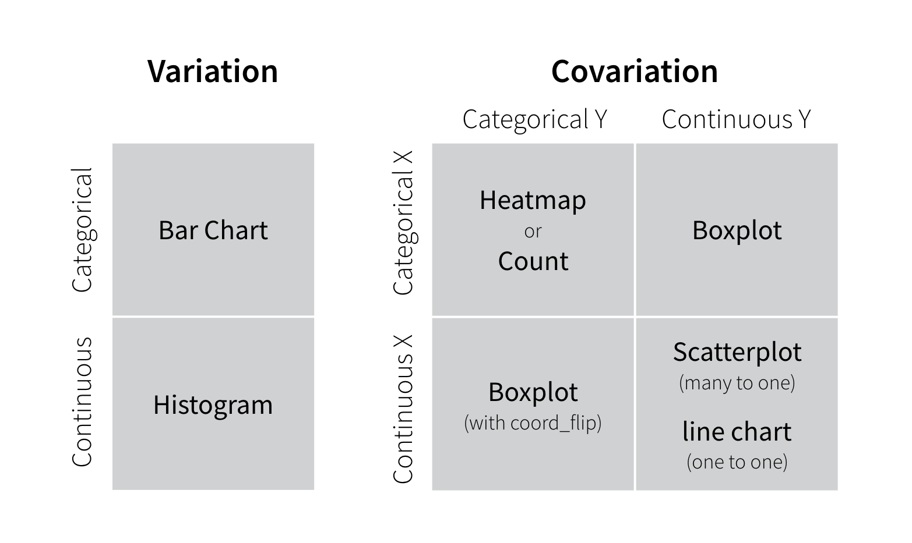

```{r setup, include=FALSE}
library(learnr)
library(tidyverse)

checker <- function(label, user_code, check_code, envir_result, evaluate_result, ...) {
  list(message = check_code, correct = TRUE, location = "append")
}
tutorial_options(exercise.timelimit = 60, exercise.checker = checker)
knitr::opts_chunk$set(error = TRUE)
```

## Bienvenue

Ce module va vous montrer comment explorer vos données de façon systématique : ce que les statisticiens appellent **l'analyse exploratoire de données** (AED). Dans ce module vous allez apprendre à :

* Développer une stratégie pour explorer des données

* Reconnaître des tendances (*patterns*) dans les données

* Assimiler des astuces pour déterminer quel type de graphique doit être utilisé pour explorer les données

Ce module provient du livre _R for Data Science_ de Hadley Wickham et Garrett Grolemund, publié par O’Reilly Media, Inc., 2016, ISBN: 9781491910399. Vous pouvez vous procurer le livre à [shop.oreilly.com](http://shop.oreilly.com/product/0636920034407.do).

## Analyse exploratoire de donnees

### Qu'est-ce que l'analyse exploratoire de données ?

L'analyse exploratoire de données est un cycle itératif qui vous aide à comprendre vos données. Lorsque vous faites un analyse exploratoire de données, vous :

1. Générez des questions sur vos données

2. Cherchez des réponses par visualisation, transformation, et/ou modélisation de vos données

1. Utilisez ce que vous avez appris des données pour affiner vos questions ou générer de nouvelles questions

L'analyse exploratoire de données est une partie importante de toute analyse de données. Vous pouvez utiliser l'analyse exploratoire de données pour faire des découvertes ; ou bien pour vous assurer de la qualité de vos données.

### L'analyse exploratoire de données : une façon de penser

L'analyse exploratoire de données n’est pas un processus formel avec une liste stricte de règles. Plus que tout, c'est une façon de penser. Lors des phases initiales de l'analyse exploratoire de données, vous devez vous sentir libre de creuser toutes les questions qui vous passent par la tête. Certaines de ces idées vont se développer, d'autres vont être abandonnées. Tout au long de votre exploration, vous allez noter vos idées et vos découvertes qui méritent d'être approfondies ou communiquées aux autres.

### Questions

Le but de l'analyse exploratoire de données est de développer votre compréhension de vos données. Un moyen de faire cela est d'utiliser des questions pour guider votre réflexion. Lorsque vous vous posez une question, la question attire votre attention sur une partie spécifique de votre jeu de données. Cela vous aide à décider quel graphique, modèle, transformation il serait judicieux de mettre en place.

> "Far better an approximate answer to the right question, which is often
> vague, than an exact answer to the wrong question, which can always be made
> precise. (Mieux vaut une réponse approximative à la bonne question, qui est souvent vague, que la réponse exacte à la mauvaise question, bien qu'elle soit précise.)" --- John Tukey

### Quantité vs Qualité

L'analyse exploratoire de données est, fondamentalement, un processus créatif. Et comme tout processus créatif, la clé pour se poser de _bonnes_ questions c'est de se poser un _grand nombre_ de questions. Il est difficile de se poser des questions perspicaces au début de votre analyse parce que vous ne savez pas ce qu'il y a dans vos données. Et chaque question que vous allez vous poser va révéler un nouvel aspect de votre jeu de données et augmenter votre chance de découvrir quelque chose. Vous pouvez rapidement creuser dans la partie la plus intéressante de vos données ---et développer des questions pertinentes--- si vous suivez chaque question avec une nouvelle question basée sur ce que vous avez trouvez.

> "There are no routine statistical questions, only questionable statistical
> routines. (Il n'y a pas de routine de questions statistiques, seulement des 
> routines statistiques discutables)." --- Sir David Cox

### Deux questions utiles

Il n'y a pas de règle concernant des questions que vous devez vous poser pour guider votre recherche. Cependant, deux types de questions vont toujours être utiles pour faire des découvertes dans vos données : 

1. Quel type de **variabilité** (ou variance) existe-t-il **à l'intérieur** de mes variables ?

2. Quel type de **covariation** existe-t-il **entre** mes variables ?

Le reste de ce module va se concentrer sur ces deux questions. Voilà quelques définitions :

### Définitions

*   Une __variable__ est une quantité, une qualité, ou une propriété que vous pouvez mesurer. 

*   Une __valeur__ est l'état d'une variable quand vous la mesurez. La valeur d'une variable peut ainsi varier d'une mesure à l'autre.

*   Une __observation__ est un ensemble de mesures effectuées dans des conditions similaires (vous effectuez généralement toutes les mesures dans une observation en même temps et sur le même objet). Une observation contiendra plusieurs valeurs, chacune associée à une variable différente. Nous allons parfois désigner une observation comme un cas ou un point de données.

*   Un __jeu de données tabulaire__ est une table de valeurs, avec chaque valeur associée à une variable et à une observation. Un jeu de données tabulaire est __bien ordonné (ou tidy)__ si chaque valeur est placée dans une cellule, chaque variable dans une colonne et chaque observation dans une ligne. 

Jusqu'à présent, tous les jeux de données que vous avez vus dans les modules étaient ordonnés. Dans la vraie vie, la plupart des données ne le sont pas.
    
### Quiz 1 - Découverte ou confirmation ? 

Vous pouvez penser à la science comme un processus avec deux étapes : _découverte_ et _confirmation_. Les scientifiques observent tout d'abord le monde pour découvrir une hypothèse à tester. Ensuite, ils utilisent un test pour tenter de réfuter l'hypothèse face à de nouvelles données. Si l'hypothèse survit à de nombreux tests, les scientifiques commencent à croire que c'est une explication raisonnable des données.

La séparation entre la découverte et la confirmation est particulièrement importante pour les Data scientists. Il arrive souvent que des tendances apparaissent dans les données par coïncidence. Les Data Scientists cherchent ainsi en premier lieu des tendances, puis ils essaient de confirmer que ces tendances existent dans la vraie vie. Parfois, cette confirmation nécessite de calculer la probabilité que l'observation de la tendance est due à la chance, quelque chose qui implique souvent de collecter de nouvelles données.

```{r q1, echo = FALSE}
question("Est-ce que l'analyse exploratoire de données aide à découvrir ou à confirmer ?",
         answer("Découvrir", correct = TRUE, message = "L'analyse exploratoire de données sert à découvrir. C'est l'une des façons les plus pertinentes de faire des découvertes en science. Nous allons uniquement traiter de la découverte dans ce module, mais gardez en tête que vous devrez confirmer une tendance que vous découvrez avant de la prendre pour acquise."),
         answer("Confirmer", message = "L'analyse exploratoire de données révèle des tendances, mais ne confirme pas que celles-ci existent au delà de votre jeu de données."),
         allow_retry = TRUE
)
```

### Quiz 2 - Qualité ou Quantité ?

```{r q2, echo = FALSE}
question("Lorsque vous commencer à explorer vos données, est-il plus pertinent de formuler une ou deux grosses questions à poser ou beaucoup de petites questions à explorer ? ",
         answer("Une ou deux grosse questions", message = "Il est difficile de trouver de bonnes questions avant de commencer parce que vous ne savez pas quelles découvertes vous attendent dans vos données."),
         answer("Plein de petites questions", correct = TRUE, message = "Chaque question que vous vous posez va créer une nouvelle opportunité de découvrir quelque chose de surprenant. Vous pouvez ainsi vous embarquez vous-même dans un processus de bonnes questions en cherchant plus loin derrière les questions qui donnent les résultats les moins probables."),
         allow_retry = TRUE
)
```

### Quiz 3 - Définitions

`iris` est un jeu de données dans R qui est très connu. Ce jeu de données décrit 150 fleurs d'iris. Chaque ligne de `iris` correspond à des mesures de dimensions de pétales et de sépales. Ces mesures peuvent être utilisées pour déduire l'espèce de la fleur, qui est aussi renseignée dans `iris`.

```{r}
iris
```

```{r q3, echo = FALSE}
quiz(caption = "Variables, valeurs, et observations",
     question("Laquelle de ces propositions est une variable du jeu de données `iris` ?",
              answer("setosa"),
              answer("Sepal.Length", correct = TRUE),
              answer("flowers"),
              answer("5.1"),
              allow_retry = TRUE,
              random_answer_order = TRUE),
     question("Laquelle de ces propositions est une valeur du jeu de données `iris` ?",
              answer("3.5", correct = TRUE),
              answer("Petal.Length", message = "Ceci est le nom d'une variable dans le jeu de données."),
              answer("flowers"),
              answer("Species", message = "Ceci est le nom d'une variable dans le jeu de données."),
              allow_retry = TRUE,
              random_answer_order = TRUE),
     question("Laquelle de ces propositions est une observation du jeu de données `iris` ?",
              answer("L'ensemble de mesures, `5.1`, `3.5`, `1.4`, `0.2`, et `setosa`, qui décrit la première fleur dans le jeu de données.", correct = TRUE, message = "Ces mesures ont étés collectées dans des circonstances similaires : sur la même fleur, probablement au même moment. S'il existe une relation entre les variables que ces valeurs décrivent, on s'attendrait aussi à ce que la relation entre ces deux valeurs existe."),
              answer("L'ensemble de noms, `Sepal.Length`, `Sepal.Width`, `Petal.Length`, `Petal.Width`, et `Species`.", message = "Ces noms décrivent les variables dans le jeu de données."),
              answer("L'ensemble de mesures, `5.1`, `4.9`, `4.7`, et ainsi de suite, qui sont toutes les valeurs dans la colonne Sepal.Length.", message = "Ce sont sont les valeurs de la variable Sepal.Length."),
              allow_retry = TRUE,
              random_answer_order = TRUE)
)
```


## Variabilite

### Qu'est-ce que la variabilité ?

La **variabilité** est la tendance qu'ont les valeurs d'une variable à changer d'une mesure à l'autre. Vous pouvez voir de la variabilité dans la vraie vie. Si vous mesurez n'importe quelle variable continue deux fois ---et suffisamment précisément--- vous obtiendrez deux résultats différents. Ceci est vrai même si vous mesurez des quantités constantes, comme la vitesse de la lumière. Chacune de vos mesures a une part d'erreur qui varie d'une mesure à l'autre. Les variables catégorielles peuvent aussi varier si vous les mesurez à travers différents objets (p. ex. la couleur des yeux de différentes personnes), ou à différents moments (p. ex. le niveau d'énergie d'un électron à différents moments). 

Chaque variable a sa propre tendance de variabilité, qui peut être une information très utile. Un bon moyen de comprendre cette variabilité est de visualiser la distribution des valeurs de la variable. La manière avec laquelle vous allez visualiser la distribution d'une variable va dépendre de la nature de la variable : variable **catégorielle** ou variable **continue**.

### Variables catégorielles

Une variable est dite **catégorielle** si elle peut prendre uniquement une valeur au sein d'un petit nombre de possibilités. Dans R, les variables catégorielles sont généralement enregistrées comme facteurs ou comme vecteurs de caractères. Vous pouvez visualiser la distribution d'une variable catégorielle avec un diagramme en barres, comme ci-dessous.

```{r echo = FALSE, out.width = "100%"}
ggplot(data = mpg) +
  aes(x = class) + 
  geom_bar() + 
  ggtitle("Classes de voitures dans mpg")
```

Ne vous inquiétez pas si vous ne savez pas construire ou interpréter un diagramme à barres. Nous allons voir ensemble différents types de graphiques dans ce module. Vous apprendrez à créer chaque type de graphique dans les modules suivants.

### Variables continues

Une variable est dite **continue** si elle peut prendre une série de valeurs infinie, dans le sens où si vous ordonnez les valeurs possibles de la variable le long d'une ligne, une infinité de valeurs existent entre deux points de la ligne. Par exemple, il existe une infinité de valeurs entre 0 et 1 : par exemple 0.9, 0.99, 0.999, et ainsi de suite.

Les nombres et les dates sont deux exemples de variables continues. Vous pouvez visualiser la distribution d'une variable continue avec un histogramme, comme ci-dessous :

```{r echo = FALSE, message = FALSE, out.width = "100%"}
ggplot(data = faithful) +
  aes(x = eruptions) +
  geom_histogram(binwidth = 0.25) + 
  ggtitle("Durée de 272 éruptions de Old Faithful")
```

### Fréquences

Dans les diagrammes à barres et les histogrammes, les grandes barres montrent les valeurs courantes de la variable, c.-à-d. les valeurs qui apparaissent fréquemment. Les barres plus courtes montrent les valeurs moins fréquentes. Là où il n'y a pas de barre, il n'y a pas de valeurs correspondant dans les données. Pour transformer ces informations en questions utiles, tentez de comparez ce que vous observez à ce que vous vous attendiez à voir :

* Quelles valeurs sont les plus fréquentes ? Pourquoi ?

* Quelles valeurs sont rares ? Pourquoi ? Est-ce que cela est attendu ?

* Voyez-vous une tendance à laquelle vous ne vous attendiez pas ? Qu'est-ce qui pourrait l'expliquer ?

* Y a-t-il des **outliers** (données aberrantes), qui sont des valeurs qui semblent bien éloignées des autres valeurs ou ne pas suivre la tendance générale ? Ces outliers sont-ils le résultat d'erreurs lors de l'enregistrement des données ou est-ce autre chose ?

La plupart de ces questions va vous amener à explorer la relation qu'il peut exister *entre* les variables, pour voir si les valeurs d'une variable peuvent expliquer les valeurs d'une autre variable. On y reviendra sous peu.

### Quiz - Fréquences

La diagramme à barres ci-dessous décrit la distribution de la variable `class` dans le jeu de données `mpg`, qui est dans le package {ggplot2}. La hauteur des barres révèlent combien de voitures sont dans chaque classe.

```{r echo = FALSE, out.width = "100%"}
ggplot(data = mpg) +
  aes(x = class) +
  geom_bar() + 
  ggtitle("Classes de voitures dans mpg")
```

```{r fq1, echo = FALSE}

quiz(caption = "La distribution de class dans `mpg`",
  question("Quel est le type de voitures le plus courant dans le jeu de données `mpg` ?",
           answer("2seater"),
           answer("compact"),
           answer("midsize"),
           answer("minivan"),
           answer("pickup"),
           answer("subcompact"),
           answer("suv", correct = TRUE),
           allow_retry = TRUE
  ),
  question("Quel est le type de voitures le plus rare dans le jeu de données `mpg` ?",
           answer("2seater", correct = TRUE),
           answer("compact"),
           answer("midsize"),
           answer("minivan"),
           answer("pickup"),
           answer("subcompact"),
           answer("suv"),
           allow_retry = TRUE
  ), 
  question("Est-ce que la distribution des types de voitures dans le jeu de données `mpg` semble refléter la distribution des types de voitures que vous voyez sur la route ? Est-ce que votre réponse va influencer la façon dont vous utilisez ces données ?",
           answer("J'ai mes réponses", correct = TRUE) 
  )
)
```

### Clusters

Pour les variables continues, des clusters (= groupes homogènes) de valeurs similaires suggèrent que des sous-groupes existent dans vos données. Pour comprendre ces sous-groupes, demandez-vous :

* En quoi les observations au sein de chaque cluster sont similaires entre elles ?

* En quoi les observations dans des clusters différents sont différentes les unes des autres ?

* Comment pouvez-vous expliquer ou décrire les clusters ?

* Pourquoi l'apparence des clusters peut-elle être mal interprétée ?

### Quiz - Clusters

L'histogramme ci-dessous montre la distribution de la variable `eruptions` dans le jeu de données `faithful`, qui est dans R base. `eruptions` montre la durée (en minutes) de 272 éruptions du geyser de Old Faithful dans le parc national de Yellowstone.

Pour interpréter l'histogramme, regardez tout d'abord l'axe des x, qui montre la durée des éruptions du jeu de données. L'échelle des x montre que l'éruption la plus courte à duré environ une minute et la plus longue environ 5 minutes.

Pour voir combien d'éruptions ont une durée spécifique, trouvez la durée sur l'axe des x puis regardez la hauteur de la barre au dessus de cette durée. Par exemple, selon l'histogramme, 30 éruptions ont duré environ 2 minutes mais uniquement trois ont duré environ 3 minutes (la hauteur de la barre au-dessus de 2 est 30 et au-dessus de 3 est 3).

```{r echo = FALSE, message = FALSE, out.width = "100%"}
ggplot(data = faithful) +
  aes(x = eruptions) +
  geom_histogram(binwidth = 0.25) + 
  ggtitle("Durées de 272 éruptions de Old Faithful")
```

```{r cq1, echo = FALSE}
question("Y a-t-il des clusters de durées d'éruptions ? Combien ?",
           answer("Non. Il n'y a pas de clusters."),
           answer("Oui. Deux clusters.", correct = TRUE, message = "Il semble y avoir deux sous-groupes : il y a des éruptions courtes (environ 2 minutes) et des éruptions longues (4-5 minutes), mais peu de durées d'éruptions entre les deux."),
           answer("Oui. Trois clusters."),
           answer("Oui. Quatre clusters."),
           allow_retry = TRUE
  )
```

## Covariation

### Qu'est-ce que la covariation ?

Si la variabilité décrit le comportement _à l'intérieur_ d'une variable, la covariation décrit le comportement _entre_ variables. La **covariation** est la tendance qu'ont les valeurs de deux ou plus variables à varier ensemble de manière connexe. Un bon moyen de voir la covariation est de visualiser la relation entre deux ou plusieurs variables. La façon de le faire va dépendre de la nature des variables (catégorielles ou continues).

### Deux variables catégorielles

Vous pouvez représenter la relation entre deux variables catégorielles avec un heatmap ou avec un geom_count :

```{r echo = FALSE, out.width = "50%"}
diamonds %>% 
  count(color, cut) %>% 
  ggplot() +
    aes(x = color, y = cut, fill = n) +
    geom_tile() +
    ggtitle("Gradient de couleur vs. qualité de la taille pour 53940 diamants")

ggplot(diamonds) +
  aes(color, cut) +
  geom_count() +
    ggtitle("Gradient de couleur vs. qualité de la taille pour 53940 diamants")
```

De nouveau, ne vous inquiétez pas de ne pas savoir comment faire ces graphiques. Pour le moment, restez concentrez sur la stratégie de comment utiliser ces visualisations dans un contexte d'analyse exploratoire de données. Vous apprendrez comment faire ces graphiques dans les modules qui suivent.

### Une variable continue et une variable catégorielle

Vous pouvez représenter la relation entre une variable continue et une variable catégorielle avec une boîte à moustaches (boxplot) :

```{r echo = FALSE, out.width = "100%"}
ggplot(mpg) +
  aes(reorder(class, hwy, median), hwy) +
  geom_boxplot() +
    ggtitle("Pickup et SUV ont la consommation la plus efficace") +
    labs(x = "class")
```

### Deux variables continues

Vous pouvez représenter la relation entre deux variables continues avec un nuage de points :

```{r echo = FALSE, message = FALSE, out.width = "100%"}
ggplot(data = faithful) +
  aes(x = eruptions, y = waiting) +
  geom_point() + 
  ggtitle("Durée d'éruption vs. attente avant éruption")
```

### Tendances

Les tendances dans vos données vous donnent des indices sur les relations entre les variables. S'il existe une relation systématique entre deux variables, cela ressortira comme une tendance dans les données. Si vous voyez une tendance, demandez-vous : 

+ Est-ce que cette tendance peut être due à une coïncidence uniquement (par chance) ?

+ Comment pouvez-vous décrire la relation impliquée par la tendance ? 

+ Quelle est la force de la relation impliquée par la tendance ?

+ Quelle(s) autre(s) variable(s) pourrai(en)t affecter cette relation ?

+ Est-ce que la relation change si vous regardez des sous-groupes données séparément ?


Rappelez-vous que les clusters et les outliers sont aussi des types de tendances. Des graphiques en deux dimensions peuvent révéler des clusters et des outliers qui ne seraient pas visibles dans un graphique uni-dimensionnel. Si vous voyez une quelconque tendance, demandez-vous ce qu'elle implique.

### Quiz - Tendances

Le nuage de points ci-dessous montre la relation entre la durée d'une éruption de Old Faithful et le temps d'attente avant l'éruption (c.-à-d. le temps passé entre une éruption et la précédente).

```{r echo = FALSE, message = FALSE, out.width = "100%"}
ggplot(data = faithful) +
  aes(x = eruptions, y = waiting) +
  geom_point() + 
  ggtitle("Durée d'éruption vs. attente avant éruption")
```

```{r pq1, echo = FALSE}
question("Est-ce que le nuage de points révèle une tendance qui aide à expliquer la variabilité de durée des éruptions de Old Faithful ?",
         answer("Non. Il n'y a pas de tendance"),
         answer("Oui. Les éruptions longues sont associées à une attente _courte_ avant l'éruption"),
         answer("Oui. Les éruptions longues sont associées à une attente _longue_ avant l'éruption", correct = TRUE, message = "Les données semblent suggérer qu'une longue attente avant éruption est associée à une éruption longue. Le graphique montre également les deux clusters que nous avons vus précédemment : il y a de longues éruptions avec de longs temps d'attente ainsi que des éruptions courtes avec de courts temps d'attente."),
         allow_retry = TRUE
)
```

### L'incertitude 

Les tendances sont des outils utiles pour les Data Scientists parce qu'elles révèlent des covariations. Si vous pensez à la variabilité comme à un phénomène qui crée de l'incertitude, la covariation est un phénomène qui réduit l'incertitude. Lorsque deux variables covarient, vous pouvez utiliser les valeurs d'une variable pour faire de meilleure prédictions pour les valeurs de la seconde variable. Si la covariation est due à une relation causale (un cas spécial), vous pouvez utiliser les valeurs d'une variable pour contrôler les valeurs de la seconde.

<!--

### Note sur les observations

Les observations sont une des idées les plus compliquées de la Data science, mais essayons de les comprendre à la lumière de la covariation. En tant que scientifique, nous voulons découvrir des covariations, ou plus généralement des relations entre les variables. Voyez une observation comme _un outil pour découvrir les relations entre des variables_. Voilà comment cela fonctionne :

Une observation est un ensemble de valeurs, mais un ensemble de valeurs n'est pas forcément une observation. Pour être une observation, un ensemble de valeurs doit avoir une propriété particulière : _si une relation existe entre les variables que les valeurs décrivent, alors la relation existe aussi entre les valeurs elles-mêmes_. Si cela est vrai, alors chaque observation donne un aperçu de la relation. Si on visualise de nombreuses observations, alors on verra la forme de la relation ---littéralement.

Toutes les combinaisons de valeurs n'auront pas cette propriété. Par exemple, si vous couplez l'attente avant une éruption qui a lieu aujourd'hui avec une éruption qui a lieu demain, la combinaison va vous donner peu d'information sur la relation entre l'attente avant éruption et la durée d'éruption. 

### Quelles combinaisons ?

La combinaison correcte de valeurs à utiliser va dépendre de la relation que vous essayez de découvrir.

-->

### Récapitulatif

Vous avez appris beaucoup de choses dans ce module. Voilà ce que vous devriez gardez en tête :

* L'analyse exploratoire de données est un cycle itératif construit autour du questionnement et du raffinement du questionnement.

* Voilà deux questions qui sont toujours utiles : 

    1. Quel type de variabilité existe-t-il _au sein_ de mes variables ?
    
    2. Quel type de variabilité existe-t-il _entre_ mes variables ?

* Souvenez vous des définitions de _variable_, _valeur_, _observation_, _variabilité_, _covariation_, _catégoriel_, et _continu_. Vous allez en avoir besoin à nouveau. Souvent.

Dans ce module, vous avez aussi rencontré certaines recommandations sur les graphiques permettant de représenter la variabilité et la covariation de variables catégorielles et continues. Les graphiques sont un peu comme des questions en analyse exploratoire de données : nous vous recommandons d'en faire beaucoup et d'essayer tout ce qui attise votre curiosité. Vous pouvez par la suite affiner les graphiques que vous voulez montrer à d'autres personnes. Cela viendra naturellement durant l'analyse exploratoire de données.

Ces suggestions peuvent vous servir de base pour visualiser vos données. Dans le prochain module, vous apprendrez à faire chaque type de graphique ainsi qu'à utiliser les bonnes pratiques et des compétences avancées lors de la visualisation de données.

```{r echo = FALSE, out.width = "100%"}

```
