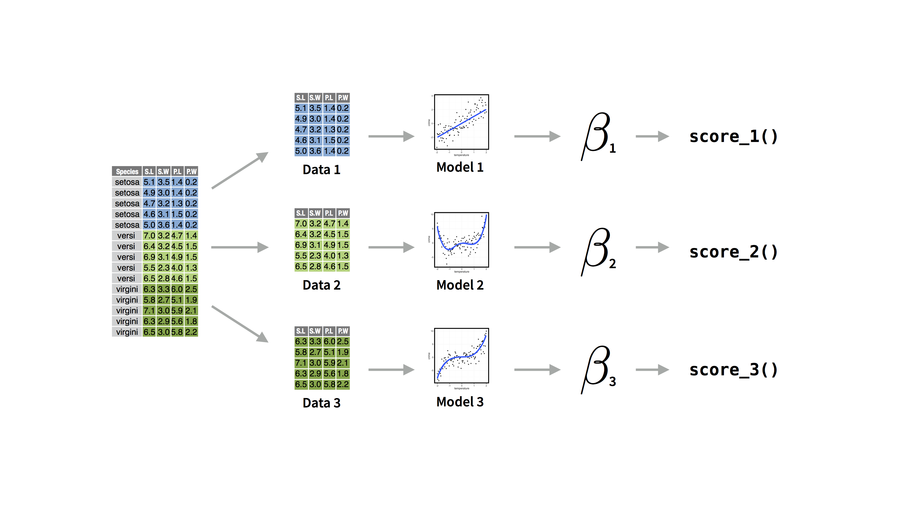
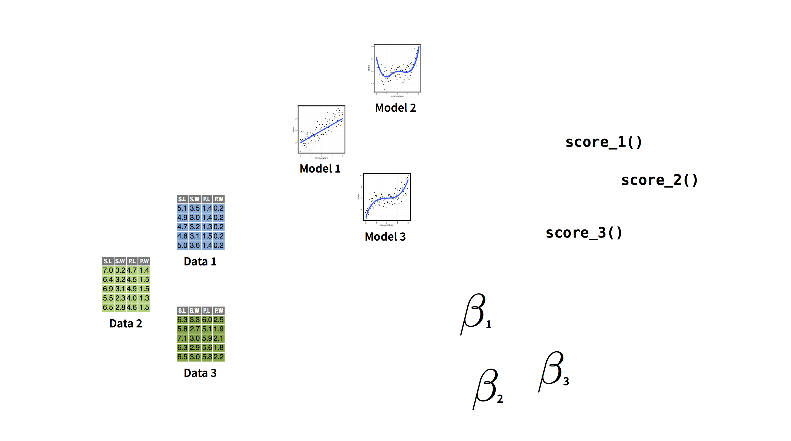
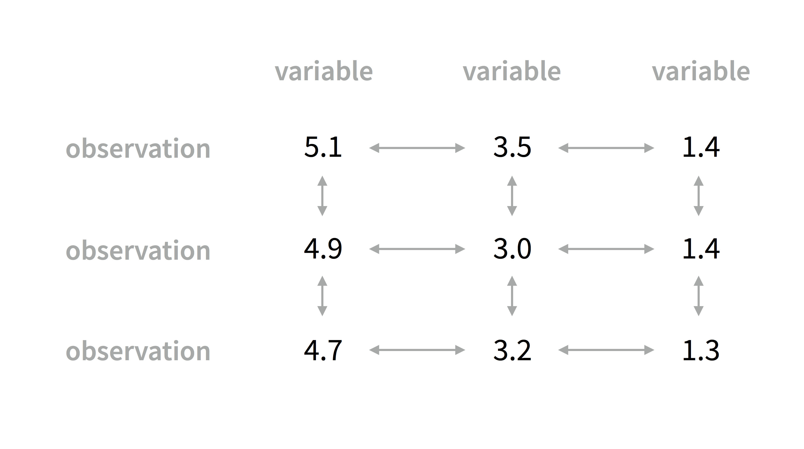
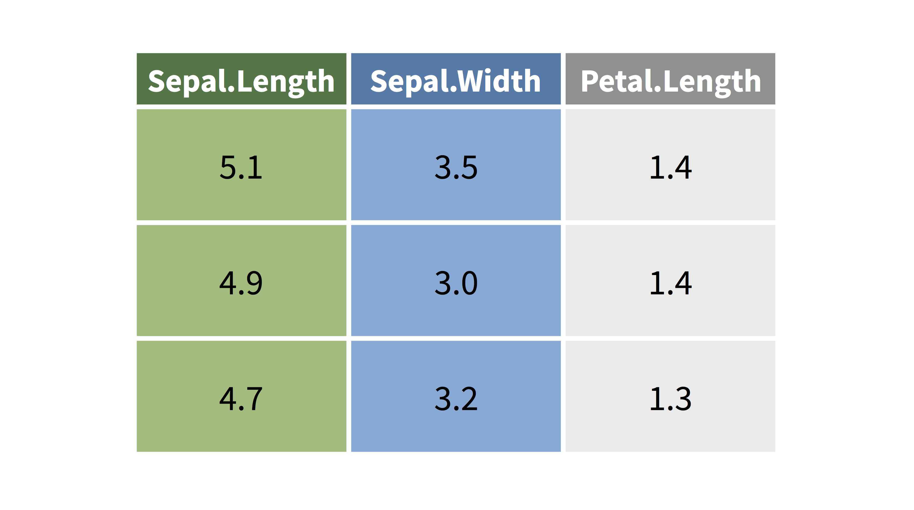
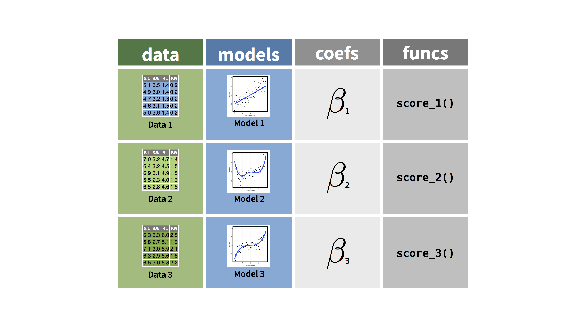
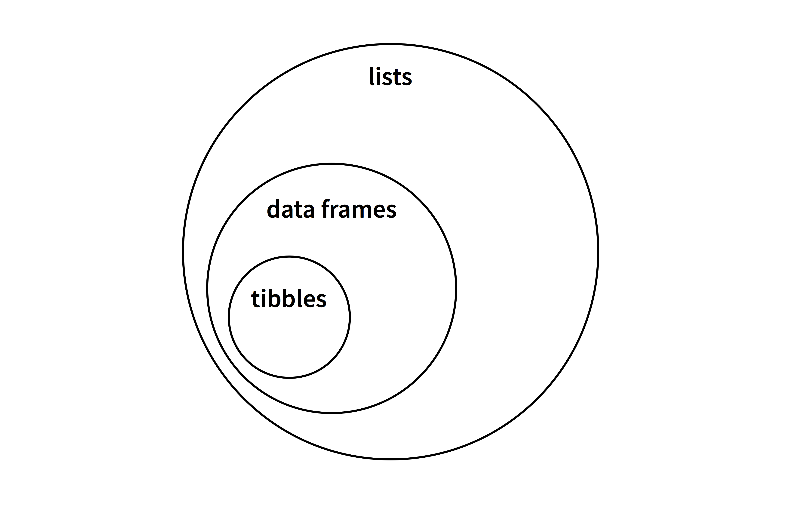
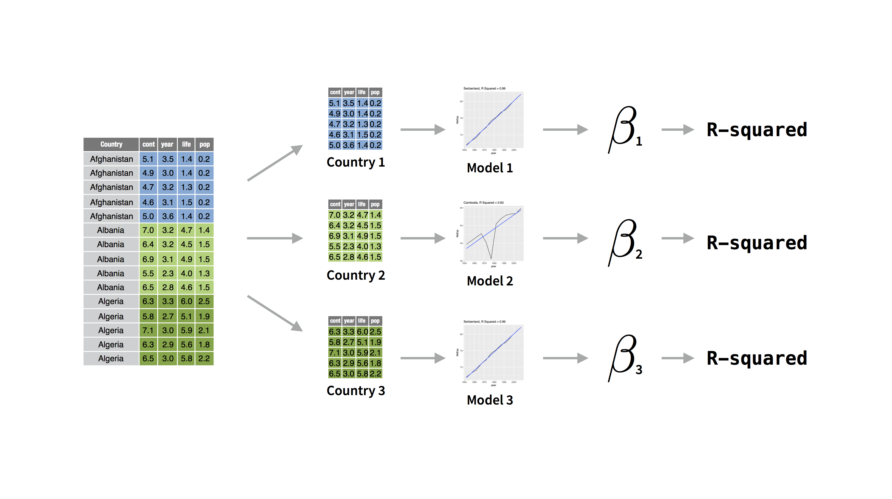

```{r setup, include=FALSE}
library(learnr)
library(tidyverse)
library(gapminder)

nested_gapminder <- 
  gapminder %>% 
  group_by(country) %>% 
  nest()

gap_models <- 
  nested_gapminder %>% 
  mutate(models = map(data, ~lm(lifeExp ~ year, data = .x)))

gap_coefs <-
  gap_models %>% 
  mutate(coefficient = map_dbl(models, ~coef(.x) %>% pluck("year")))

gap_final <-
  gap_coefs %>% 
  mutate(r_squared = map_dbl(models, ~summary(.x) %>% pluck("r.squared")))

checker <- function(label, user_code, check_code, envir_result, evaluate_result, ...) {
  list(message = check_code, correct = TRUE, location = "append")
}
tutorial_options(exercise.timelimit = 60, exercise.checker = checker)
knitr::opts_chunk$set(error = TRUE, out.width = "100%")
```

```{r, context="server-start", include=FALSE}
# Capture metrics only if running an official primer hosted by RStudio
library(curl)
library(later)
tryCatch(
  source("https://metrics.rstudioprimers.com/learnr/installMetrics", local=TRUE), 
  error = function(e){ 
    print("Warning: An error occurred with the tracking code.")
  }
)
```

```{r, context = "render", results = 'asis', echo = FALSE}
tryCatch(
  source("https://metrics.rstudioprimers.com/learnr/installClient", local=TRUE)$value,
  error = function(e){ 
    print("Warning: An error occurred with the client code.")
  }
)
```

## Motivation

###  

Now that you know how to use the map family of functions, you can organize your data science work in a new way. A _superior_ way.

###  

Consider an example.

You have a data set that describes multiple groups. You fit a model for each group. From those models you extract coefficients, or statistics. Perhaps you use the coefficients to write a scoring function.

```{r echo=FALSE, out.width = "100%"}

```

###  

Soon you have many different things that are related to each other. How would you keep track of them?

```{r echo=FALSE, out.width = "100%"}

```

###  

This is a lot like having a data set. A data set contains many separate values that are related to each other in specific ways.

```{r echo=FALSE, out.width = "100%"}

```

###  

You keep track of the values by storing them in a table. Not only does the table keep the values together in one place, it encodes the relationships between the values; which means that you can use the table to do all of the cool things that you do with data sets, like filter, select, arrange, mutate, summarise, join, etc.

```{r echo=FALSE, out.width = "100%"}

```

###   

Why not do the same thing with all of your data analysis components? If you put them into a table, you could filter, select, mutate, summarise, and join them as well.

```{r echo=FALSE, out.width = "100%"}

```

Well, you can. But you will need to use list columns to do it.

## List Columns

###  

Before you ask, "What is a list column?", let's remind ourselves what a data frame is.

### Data frames

A data frame is a table of data, but R saves each data frame as a _list_. In this list, 

1. each element of the list is a _vector_ 
1. each vector is the same length

Here is a list that could be a data frame

```{r}
df <- list(
  name = c("John", "Mary", "Mike"),
  age = c(20, 21, 22),
  height = c(69, 64, 72)
)
df
```

###  

Data frames also have the class `"data.frame"` and a `"row.names"` attribute. If we give these things to our list, R realizes that the list represents a table and each element is a column vector. And that's how R builds data frames.

```{r}
class(df) <- "data.frame"
attr(df, "row.names") <- c("1", "2", "3")
df
```

(You would usually use `as.data.frame()` to convert a list to a data frame, but now you can see the relationship between lists and data frames).

### tibbles

So data frames are a type of list. 

Let's take this a step further. Tibbles are a type of data frame.

```{r echo=FALSE, out.width = "100%"}

```

###  

To convert a data frame to a tibble, you assign it two extra classes (you would usually do this with `as_tibble()` from the tibble package).

```{r message=FALSE, warning=FALSE}
library(tibble)
class(df) <- c("tbl_df", "tbl", "data.frame")
df
```

If you have the tibble package loaded, R will display tibbles in a slightly different way than data frames. I think the difference is an improvement.

### The takeaway 

The important thing to remember is that if a tibble is a data frame and a data frame is a list of vectors, then both data frames and tibbles are _lists of vectors_.

```{r echo=FALSE, out.width = "100%"}

```

### List columns

So what is a list column?

Often each column vector in a data frame is a data vector, like a character vector, an integer vector, or so on.

```{r}
df <- data.frame(
  name = c("John", "Mary", "Mike"),
  age = c(20, 21, 22),
  height = c(69, 64, 72)
)

df
```


###  

But a column vector can also be a list because a list is a type of vector, a _recursive vector_. When a column vector contains a list, we call the column a _list column_.

Here I'm adding a list as a list column named `heights2`.

```{r}
df$height2 <- list(
  c(feet = 5, inches = 9),
  c(feet = 5, inches = 4),
  c(feet = 6, inches = 0)
)

df
```

### List columns and tibbles

It is easy to inspect the contents of `heights2` above; but unfortunately, R's print method for data frames becomes hard to read when list columns contain exotic objects, or more than a few values in each cell.

As a result, I recommend that you always use tibbles when you use list columns. The tibble display summarizes the contents of each list column in a more robust way.

```{r}
as_tibble(df)
```

### Uses

List columns are very useful because you can put _anything_ into a list, which means that you can put _anything_ into a list column, even things that you might not normally think to put in a data frame...

...like model objects, functions, or other data frames.

```{r echo=FALSE, out.width = "100%"}

```

### Complications

However, the benefits of list columns do not come for free. You need to treat list columns as lists, not as data vectors.

Luckily, you already know everything you need to know to do this.

The Case Study will demonstrate the value of list columns and give you practice manipulating list columns with dplyr and purrr.

## Case Study

###  

In this primer, you've encountered several versions of the `gapminder` data set that comes in the gapminder package. 

Now let's use the original `gapminder` data set to explore changes in life expectancy in a new way.

* Click Submit Answer to see the contents of `gapminder`.

```{r gapminder, exercise = TRUE}
library(gapminder)
gapminder
```

```{r gapminder-hint}
"Click Submit Answer."
```

```{r gapminder-solution}
library(gapminder)
gapminder
```

```{r gapminder-check}
"Good job. You've already seen this data in list form if you've taken the map tutorials in this primer."
```

### Goals

As you saw in the last tutorial, you can discover useful information when you apply a separate linear model to each country in the data set.

For example, when you regress `lifeExp` on `year`, the `year` coefficient will be an estimate of how fast life expectancy changed in a country.

###   

The r-squared of the model also reveals something: it shows how linear a country's change in life expectancy was. Some countries experienced a linear change in life expectancy, like Switzerland. Other countries experienced a non-linear change in life expectancy, like Cambodia.

```{r echo = FALSE, out.width = "50%"}

ggplot(data = filter(gapminder, country == "Switzerland"), mapping = aes(x = year, y = lifeExp)) +
  geom_line() +
  geom_smooth(method = lm, se = FALSE, color = "blue") +
  ggtitle("Switzerland (R-squared = 0.99)")

ggplot(data = filter(gapminder, country == "Cambodia"), mapping = aes(x = year, y = lifeExp)) +
  geom_line() +
  geom_smooth(method = lm, se = FALSE, color = "blue") +
  ggtitle("Cambodia (R-squared = 0.64)")

```

### The plan

In this case study, you will:

1. Split the data into separate data sets by country 
1. Fit a model to each data set
1. Extract the `year` coefficients from the models
1. Extract the R-squareds from the models

```{r echo=FALSE, out.width = "100%"}

```

###  

More importantly, you will use list columns to organize the outputs into a single table. This will let you quickly explore the outputs when you are finished.

```{r echo=FALSE, out.width = "100%"}
knitr::include_graphics("www/images/list-columns-8.png")
```

Click Continue to begin.

### nest()

You can split the `gapminder` data set into separate data sets by country with `group_by()` and `nest()`.

* Use `group_by()` to group `gapminder` by `country`. `group_by()` comes in the dplyr package, which I have preloaded for you.
* Pipe the results straight into `nest()` (with no arguments). `nest()` comes in the tidyr package, which I've preloaded for you.
* Click Submit to see the results. What did `nest()` do?

```{r nest, exercise = TRUE}
gapminder
```

```{r nest-hint-1}
"Begin by piping gapminder to group_by()."
```

```{r nest-hint-2}
"Don't forget to specify the variable to group by: country."
```

```{r nest-hint-3}
"Take the grouped data and pipe it to nest()."
```

```{r nest-solution}
gapminder %>% 
  group_by(country) %>% 
  nest()
```

```{r nest-check}
'Excellent! nest() returns a new data set that contains one column for each grouping variable followed by a list column. Each cell of the list column contains a tibble. You can set the name of the list column by passing nest() a .data argument, e.g. .data = "tibbles". Click continue to see what is in the tibbles.'
```

### Nested data

The `data` column in your output is a list column. You can inspect the contents of any of its cells by first extracting the column (R will return it as a list). Then extract a "cell" (i.e. element) from the list.

I've saved your previous result as `nested_gapminder`.

* Use `pluck()` to extract the `"data"` column from `nested_gapminder`.
* Use `pluck()` a second time to extract the first cell from `nested_gapminder` (yes you should use `%>%` in this exercise to build a pipe).
* Click Submit Answer. What did R return?

```{r pluck, exercise =TRUE}
nested_gapminder
```

```{r pluck-hint}
'Recall that you can extract elements with pluck() by name (e.g. pluck(iris, "Species")) and by position (e.g. pluck(iris, 1)).'
```

```{r pluck-solution}
nested_gapminder %>%  
  pluck("data") %>% 
  pluck(1)
```

```{r pluck-check}
"Good job extracting a cell! You can see that each tibble in the list column contains the data from the original data set that is relevant to the group it represents. For example, our result is all of the data related to Afghanistan, the group that appears in the first row of nested_gapminder."
```

### unnest()

`nested_gapminder` contains all of the data that was present in `gapminder`, which makes it easy to rebuild `gapminder`. You can unnest a nested data set with `unnest()`, also from the tidyr package.

Give it a try. 

* Unnest `nested_gapminder` to recreate `gapminder`. Then click Submit Answer.

```{r unnest, exercise = TRUE}
nested_gapminder
```

```{r unnest-hint}
"Call unnest() pass it nested_gapminder as its first argument."
```

```{r unnest-solution}
nested_gapminder %>% 
  unnest()
```

```{r unnest-check}
"Good job! It is important to remember that nest() and unnest(), like all functions in the tidyverse, do not modify the original data frame. They return a modified copy of the original data frame."
```

### Manipulating nested data

Can you fit a model to each tibble nested within `nested_gapminder` and then store those models as a list column? 

Let's approach this problem in three parts.

###  

You have code that extracts one of the nested tibbles. Let's fit a model to the single tibble as a test case.

* Extend the code below to fit a linear model of `lifeExp ~ year` to the tibble (See the hint if you are not familiar with some of the advanced features of piping). 
* Then click Submit Answer.

```{r lm, exercise = TRUE, exercise.eval = TRUE}
nested_gapminder %>%  
  pluck("data") %>% 
  pluck(1)
```

```{r lm-hint}
"By default, %>% pipes the expression on its left hand side into the first argument of the function on its right hand side. You can use a . to pipe the expression into an argument other than the first, e.g. iris %>% lm(Sepal.Length ~ Petal.Length, data = .)."
```

```{r lm-solution}
nested_gapminder %>%  
  pluck("data") %>% 
  pluck(1) %>% 
  lm(lifeExp ~ year, data = .)
```

```{r lm-check}
"Excellent! Life expectancy increased on average by 0.27 years per year in Afghanistan."
```

###  

Let's push this one step further. The code below extracts the `data` column of `nested_gapminder` as a list.

* Use `map()` and an expression to apply your model to every tibble in the list. Then click Submit Answer.

```{r data-list, exercise = TRUE}
nested_gapminder %>%  
  pluck("data")
```

```{r data-list-solution}
nested_gapminder %>%  
  pluck("data") %>% 
  map(~lm(lifeExp ~ year, data = .x))
```

```{r data-list-hint}
"You learned how to use expressions with map() in the Map Shortcuts tutorial."
```

```{r data-list-check}
"Very good job. Notice that you get the result back as a new list. Let's look at one more step that you will need to save your models in your data frame."
```

###  

I'd like you to add your model output as a new column to your data frame. How do you add new columns to a data frame? Let's review.

* Use a dplyr function to add a new column to `iris`. The new column shoud be named `length2` and it should contain the output of `round(Sepal.Length)`. Then click Submit Answer.

```{r mutate, exercise = TRUE, exercise.eval = TRUE}
iris
```

```{r mutate-solution}
iris %>% 
  mutate(length2 = round(Sepal.Length))
```

```{r mutate-hint}
"You learned about dplyr functions in the Work with Data primer."
```

```{r mutate-check}
"Perfect. You can use the same operation--mutate()--to add a new column to your data, whether or not that new column contains a list."
```

### Models

Can you use what you did in the last three exercises to add a list column to your data set that looks like this? `models` contains the output of your map expression.

```{r echo = FALSE}
nested_gapminder %>% 
  mutate(models = map(data, ~lm(lifeExp ~ year, data = .x)))
```

###  

* Add a new column to your data frame named `models`. `models` should be a list column that contains the result of fitting `~lm(lifeExp ~ year, data = .x)` to each tibble in `data`. 

    Click Hints if you would like step by step guidance. Then click Submit Answer.

```{r models-lc, exercise = TRUE, exercise.eval = TRUE}
nested_gapminder
```

```{r models-lc-solution}
nested_gapminder %>% 
  mutate(models = map(data, ~lm(lifeExp ~ year, data = .x)))
```

```{r models-lc-hint-1}
"nested_gapminder is a table. You want to add a new column to it. So your first call should be to mutate()."
```

```{r models-lc-hint-2}
"You want to use mutate() to create a new column named models."
```

```{r models-lc-hint-3}
"models should contain the map() output that you created in the previous exercise..."
```

```{r models-lc-hint-4}
"...i.e., models should contain the output of data %>% map(~lm(lifeExp ~ year, data = .x)). Is this output a list? Yes. Can mutate() handle a list? Sure, mutate() will save it as a list column."
```

```{r models-lc-check}
"You did great! Notice that data means two different things here. The first data refers to the column named data in `nested_gapminder`. The second data is an argument name in the lm function. As you can see, mutate() and the other tidyverse functions know how to work with list columns. If the input to mutate() creates a list, mutate() saves the result as a list column."
```

### Coefficients

Next, let's extract the `year` coefficients of each model and save them as a column in our data frame named `coefficient`, like this:

```{r echo = FALSE}
nested_gapminder %>% 
  mutate(models = map(data, ~lm(lifeExp ~ year, data = .x)),
         coefficient = map_dbl(models, ~coef(.x) %>% pluck("year")))
```

###  

I've saved your previous result as `gap_models`. Let's add a new column to `gap_models` that contains the year coefficient for each model. To do this:

* Use `mutate()` to add a new column named `coefficient` to `gap_models` 
* Within `mutate()`, use a function that takes a list as input (`models`) and returns a double vector as output to place in `coefficient`. Don't forget to actually provide `models` as an argument when you call the function.
* Use the map expression `~coef(.x) %>% pluck("year")` to populate `coefficient` with the year coefficients of each model. 
* Then click Submit Answer.

There is a lot going on here, so don't be afraid to click Show Hint if you get stuck.

```{r dbl, exercise = TRUE, exercise.eval = TRUE}
gap_models
```

```{r dbl-solution}
gap_models %>% 
  mutate(coefficient = map_dbl(models, ~coef(.x) %>% pluck("year")))
```

```{r dbl-hint-1}
"You learned about map functions that return different types of output in the Map tutorial."
```

```{r dbl-hint-2}
"You learned about map functions that return different types of output in the Map tutorial."
```

```{r dbl-check}
"Another great job! You've now used mutate() to create a list column from a list column and to create a regular column from a list column."
```

### R-squared

Repeat the previous workflow one more time, but this time create a column that contains the R-squared from each model, like this:

```{r echo = FALSE}
gap_coefs %>% 
  mutate(r_squared = map_dbl(models, ~summary(.x) %>% pluck("r.squared")))
```

###  

You can use the map expression `~summary(.x) %>% pluck("r.squared")` to acquire the R-squares. Do you remember the rest of the workflow?

I've saved your previous result as `gap_coefs`.

* Add an `r_squared` column to `gap_coefs`.

```{r r2, exercise = TRUE, exercise.eval = TRUE}
gap_coefs
```

```{r r2-solution}
gap_coefs %>% 
  mutate(r_squared = map_dbl(models, ~summary(.x) %>% pluck("r.squared")))
```

```{r r2-hint-1}
"gap_coefs is a table. You want to add a new column to it. So your first call should be to mutate()."
```

```{r r2-hint-2}
"You want to use mutate() to create a new column named r_squared."
```

```{r r2-hint-3}
"To make r_squared you need to begin with the models column, which is a list and end with a numeric (double) vector to put in r_squared. That is a job for map_dbl."
```

```{r r2-hint-4}
"Be sure to call models as the first argument of map_dbl. The second argument should be the expression from the prompt."
```

```{r r2-check}
"Nice! I'll save this result as gap_final. Now let's talk about what you have done."
```

### Why list columns?

List columns allowed you to keep the separate pieces of your analysis in one place. You put data frames and linear model objects into your list columns, but you could've put any type of object in your list columns. 

And to accomplish this, all you needed to do was combine what you know about dplyr and purrr.

But _why_ use list columns?

### Efficiency

First of all, list columns are efficient. 

Some things, like models, take a lot of computation to generate. It makes sense to store these things so you do not need to regenerate them in the future.

Because you retained your models in your data set, it was easy to pull out the coefficients and then the R-squareds from each model, _without re-fitting the models_.

You could store the models independently as a list, but then you would have to keep track of the list and ensure that it doesn't become out of synch with your data set.

### Power

Second, power. You are a data scientist. You know how to wrangle tables. By placing the pieces of your analysis into a table you can wrangle them too.

For example...

###  

What if you want to find the models with the most rapid increase in life expectancy?

```{r}
gap_final %>% 
  arrange(desc(coefficient))
```

###   

How about the ten countries with the most non-linear change in life expectancy? Here they are, along with all of their data.

```{r}
gap_final %>% 
  top_n(10, wt = desc(r_squared))
```

###   

Interested in comparing the two Koreas? Here is everything you need. (North Korea is the democratic one).

```{r}
gap_final %>% 
  filter(str_detect(country, "Korea"))
```

Once you place all of your output into a single table, it is easy to arrange, filter, summarise, mutate, and select from your results.


### Leaving list columns

Remember that you can access the contents of any cell in a list column in all of the usual ways. For example, each of these pieces of code would extract the first model from `gap_final`.

```{r eval = FALSE}
gap_final %>% 
  pluck("models") %>% 
  pluck(1)

gap_final[[1, 3]]

gap_final$models[[1]]
```

```{r echo = FALSE}
gap_final %>% 
  pluck("models") %>% 
  pluck(1)
```

### Congratulations

Congratulations on finishing the tutorial and the primer. You have learned a new vocabulary of R functions that will allow you to both iterate and organize your work.

I urge you to explore what list columns and iteration can do for you in your own projects. 

To learn more about the purrr package, visit [purrr.tidyverse.org](http://purrr.tidyverse.org).


