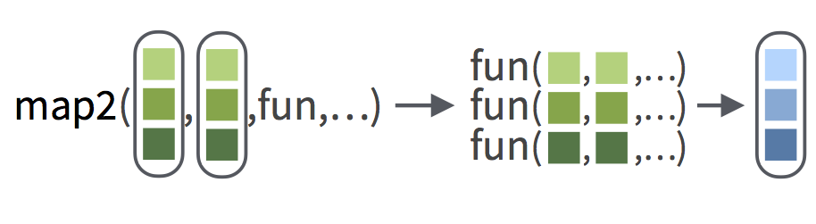
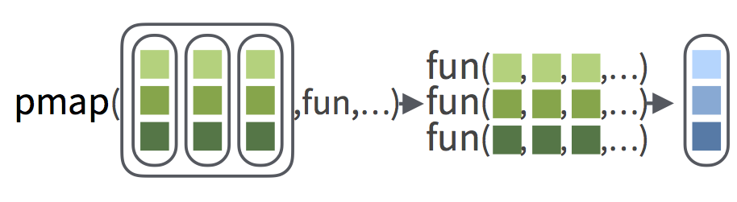
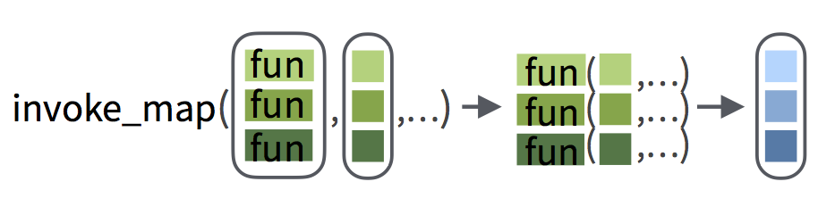

```{r setup, include=FALSE, message = FALSE, warning=FALSE}
library(learnr)
library(tidyverse)
library(repurrrsive)

gap_dfs <- gap_split %>% map(select, -1, -2)

model1 <- gap_dfs %>%
  map(~ lm(lifeExp ~ year, data = .x))

model2 <- gap_dfs %>%
  map(~ lm(lifeExp ~ year + gdpPercap, data = .x))

model3 <- gap_dfs %>%
  map(~ lm(lifeExp ~ year + gdpPercap + pop, data = .x))


checker <- function(label, user_code, check_code, envir_result, evaluate_result, ...) {
  list(message = check_code, correct = TRUE, location = "append")
}
tutorial_options(exercise.timelimit = 60, exercise.checker = checker)
knitr::opts_chunk$set(error = TRUE, out.width = "100%")
```

```{r, context="server-start", include=FALSE}
# Capture metrics only if running an official primer hosted by RStudio
library(curl)
library(later)
tryCatch(
  source("https://metrics.rstudioprimers.com/learnr/installMetrics", local=TRUE), 
  error = function(e){ 
    print("Warning: An error occurred with the tracking code.")
  }
)
```

```{r, context = "render", results = 'asis', echo = FALSE}
tryCatch(
  source("https://metrics.rstudioprimers.com/learnr/installClient", local=TRUE)$value,
  error = function(e){ 
    print("Warning: An error occurred with the client code.")
  }
)
```

## Introduction

###  

You've learned how to map any expresssion over the elements of a _single_ vector.

Now you'll learn how to map an expression over the elements of _two or more_ vectors at once.

### A case study

To see how useful this technique can be, let's use multi-vector mapping to compare two lists of models. At the end of the Map Shortcuts tutorial, you fit two models for every country in `gap_dfs`. This created two lists:

1. A list of models that predicted life expectancy by year, which I saved as `model1`.

    ```{r eval = FALSE}
    model1 <- gap_dfs %>%
      map(~ lm(lifeExp ~ year, data = .x))
    ```

1. A list of models that predicted life expectancy by both year _and GDP per capita_, which I saved as `model2`.

    ```{r eval = FALSE}
    model2 <- gap_dfs %>%
      map(~ lm(lifeExp ~ year + gdpPercap, data = .x))
    ```


###  

But which model is better? In other words, does adding GDP per capita improve your predictions for life expectancy?

### anova() 

One way to tell is with the `anova()` function. `anova()` takes two models and tests whether the second model outperforms the first.

Let's try it. You can use your two models for the United States

```{r}
usa_mod1 <- model1 %>% pluck("United States")
usa_mod2 <- model2 %>% pluck("United States")
```

###  

```{r}
anova(usa_mod1, usa_mod2)
```

The anova results suggest that adding GDP per capita did _not_ improve your predictions for the US. 

How can you tell? The very last number in the anova table is a p-value (here 0.1424). If the number is above 0.05, there is not enough evidence to suggest that the second model outperforms the first: you can ascribe the difference between the two to random chance.

### Beyond the US

So GDP per capita doesn't improve your predictions for the United States, but what about for the other countries? 

You can iterate through all of the countries to find out, but this is a new type of iteration problem. At each step, `anova()` will require one element from `model1` and one element from `model2`. You'll need to simultaneously iterate over _two_ lists. But how?

## map2()

###  

Enter `map2()`.

Syntactically, `map2()` behaves like `map()`, but it takes _two_ vectors as arguments before it takes a function (remember that lists are a type of vector). 

At each step of the iteration, `map2()` will pass an element from the first vector to the first argument of the function. It will pass an element from the second vector to the second argument of the function.

```{r echo=FALSE, out.width = "70%"}

```

###  

* Use `map2()` to run an anova on each pair of models in `model1` and `model2`. Then click Submit Answer.

```{r map2, exercise = TRUE}

```

```{r map2-solution}
map2(model1, model2, anova)
```

```{r map2-check}
"Nice job! A quick scan of the results suggests that adding gdpPercap only improved your predictions for the poorest countries."
```

### map2() and map()

`map2()` is similar to map in almost every way. For example, you can pass extra arguments to your function as extra arguments to `map2()`, e.g.

```{r eval = FALSE}
# map2 will pass test = "Chisq" to the anova function
map2(model1, model2, anova, test = "Chisq")
```

###  

Like `map()`, `map2()` returns its results as a list, but it also comes with variants that will return the result in other formats. As with `map()`, you should use the variant of `map2()` that will return your results in the format that you want:

Map function | Map2 function | Output
------------ | ------------- | ----------------
`map()`      | `map2()`      | list
`map_chr()`  | `map2_chr()`  | character vector
`map_dbl()`  | `map2_dbl()`  | double (numeric) vector
`map_dfc()`  | `map2_dfc()`  | data frame (output column binded)
`map_dfr()`  | `map2_dfr()`  | data frame (output row binded)
`map_int()`  | `map2_int()`  | integer vector
`map_lgl()`  | `map2_lgl()`  | logical vector
`walk()`     | `walk2()`     | returns the input invisibly (used to trigger side effects)

### Map2 expressions

`map2()` also uses shortcuts like `map()`. While the "name" and integer shortcuts do not make sense for `map2()`, the expressions shortcut does.

To make an expression for `map2()`:

1. Begin the expression with `~`
2. Refer to elements from the first vector as `.x`
3. Refer to elements from the second vectore as `.y`

Only the last step is different from `map()`.

### Try an expression

How much does the year coefficient change between `model1` and `model2` for the US? The code below computes the answer. 

```{r}
pluck(coef(usa_mod2), "year") - pluck(coef(usa_mod1), "year")
```

Can you do the same thing for _every_ country?

* Turn the code above into an expression and map it over the `model1` and `model2` lists. 
* Return the results as a double vector.
* Round the results to two decimal places.
* Click Submit Answer when you are finished.

```{r map2-exp, exercise = TRUE}
model1 %>%
  map2(model2, anova)
```

```{r map2-exp-hint-1}
"First, replace anova with your expression."
```

```{r map2-exp-hint-2}
"Second, replace map2() with a variant that will return a double (numeric) vector."
```

```{r map2-exp-hint-3}
"Third, round the results with %>% round(digits = 2)."
```

```{r map2-exp-solution}
model1 %>%
  map2_dbl(model2, ~ pluck(coef(.y), "year") - pluck(coef(.x), "year")) %>%
  round(digits = 2)
```

```{r map2-exp-check}
"Great work! Click Continue to learn how to make these results even easier to work with."
```

### From named vector to data frame

You can make long named vectors easier to work with, with the `enframe()` function from the tidyr package. `enframe()` takes a named vector and returns a data frame with two columns:

1. A `name` column that contains the names in the vector
1. A `value` column that contains the value associated with each name

Once you turn your long vector into a data frame, you can use the familiar dplyr tools to explore the vector.

* `enframe()` the result below. I've pre-loaded the tidyr package for you.
* Use `arrange()` and `desc()` to see which countries had the biggest change.
* Click Submit Answer when you are finished.

```{r enframe, exercise = TRUE}
model1 %>%
  map2_dbl(model2, ~ pluck(coef(.y), "year") - pluck(coef(.x), "year")) %>%
  round(digits = 2)
```

```{r enframe-solution}
model1 %>%
  map2_dbl(model2, ~ pluck(coef(.y), "year") - pluck(coef(.x), "year")) %>%
  round(digits = 2) %>%
  enframe() %>%
  arrange(desc(value))
```

```{r enframe-hint-1}
"First, pass the result to enframe()."
```

```{r enframe-hint-2}
"Then pass the result to arrange(). arrange() comes in the dplyr package, you can learn how to use it in the Work with Data primer."
```

```{r enframe-hint-3}
'Finally, recall that enframe() named the variable that you want to arrange over "value". Here, you want to arrange over descending values of value.'
```

```{r enframe-check}
"Bravo! There was a lot to the last two exercises and you handled them purrrfectly."
```

### More models

You can use `anova()` to compare any number of models. For example, you could compare three different models for each country:

1. A model that predicts life expectancy by year, like those in `model1`.
1. A model that predicts  life expectancy by both year _and GDP per capita_, like those in `model2`.
1. A model that predicts  life expectancy by year and GDP per capita _and population_, like those in `model3`. (I made `model3` for you while you weren't looking)

###   

Here's the comparison for the US

```{r}
usa_mod1 <- model1 %>% pluck("United States")
usa_mod2 <- model2 %>% pluck("United States")
usa_mod3 <- model3 %>% pluck("United States")
anova(usa_mod1, usa_mod2, usa_mod3)
```

Each value in the `Pr(>F)` column shows the p-value that results from comparing the model to the model above it.

Now can we do _this_ for every country?

### Mapping over three vectors

Anova can handle three arguments. Can you?

Yes, but not with `map3()` as you might think. `map3()` doesn't exist. Instead purrr offers the `pmap()` function for mapping over three _or more_ vectors.

## pmap()

###  

The syntax of `pmap()` is a little different from the syntax of `map()` and `map2()`. Instead of accepting vectors one at a time as arguments, `pmap()` expects a single argument that contains a _list of vectors_ and then a function to apply to the vectors within that list of vectors.

```{r echo=FALSE, out.width = "70%"}

```

###  

Name each vector in your list of vectors with the name of the argument that it should map to. `pmap()` will match names to arguments whenever you provide them. So this code, for example, will round each of the long numbers to a different number of digits, and it works because `round`'s arguments are called `x` and `digits`.

```{r}
long_numbers <- list(pi, exp(1), sqrt(2))
digits <- list(2, 3, 4)
pmap(list(x = long_numbers, digits = digits), round)
```

If you do not provide names, `pmap()` will map vectors to arguments by order.

### Use pmap()

Got that? Let's give it a try.

* Use `pmap()` to iterate over `model1`, `model2`, and `model3`, applying `anova()` as you go. Then click Submit Answer.

_Note: `anova()` does not use argument names, so you will need to supply model1, model2, and model3 in the correct order._

```{r pmap, exercise = TRUE}

```

```{r pmap-hint}
"Be sure to wrap model1, model2, and model3 in a list before/as you pass them to pmap()."
```

```{r pmap-solution}
pmap(list(model1, model2, model3), anova)
```

```{r pmap-check}
"Excellent. You can use pmap() to map over three, four, or any number of vectors."
```

### similarities between pmap(), map2() and map()

`pmap()` also tries to resemble `map()` and `map2()` wherever possible. 

Specifically, `pmap()` will pass extra arguments to your function, just as `map()` and `map2()` will.

###  

`pmap()` also comes with derivative functions that return output in new formats:

Map function | Map2 function | pmap function | Output
------------ | ------------- | ------------- | --------------
`map()`      | `map2()`      | `pmap()`      | list
`map_chr()`  | `map2_chr()`  | `pmap_chr()`  | character vector
`map_dbl()`  | `map2_dbl()`  | `pmap_dbl()`  | double (numeric) vector
`map_dfc()`  | `map2_dfc()`  | `pmap_dfc()`  | data frame (output column binded)
`map_dfr()`  | `map2_dfr()`  | `pmap_dfr()`  | data frame (output row binded)
`map_int()`  | `map2_int()`  | `pmap_int()`  | integer vector
`map_lgl()`  | `map2_lgl()`  | `pmap_lgl()`  | logical vector
`walk()`     | `walk2()`     | `pwalk()`     | returns the input invisibly (used to trigger side effects)

###   

`pmap()` also uses expressions that start with a `~`. However, `pmap()` expects you to name the elements within an expression `..1`, `..2`, `..3` and so on instead of `.x` and `.y`. Notice the double dots.

For example, you could return the year coefficients of each model with the code below.

* Click Run Code to see the results.

```{r pmaps, exercise = TRUE}
pmap(
  list(model1, model2, model3),
  ~ c(
    mod1 = pluck(coef(..1), "year"),
    mod2 = pluck(coef(..2), "year"),
    mod3 = pluck(coef(..3), "year")
  )
)
```

### pmap() and data frames

Although its name does not suggest it, `pmap()` is an important tool for manipulating data frames. 

Recall from the Introduction to Iteration tutorial that a data frame is a list of column vectors that contains a special class ("data.frame") and a row.names attribute.

### rowwise operations

Because a data frame is a list, you can pass a data frame to the first argument of `pmap()`.
`pmap()` will do something natural when you do this:
it will apply a function to each row of a data frame
(i.e., to corresponding elements of the columns in the list used to store the data frame).

Take a look at this in action. The code below makes a small data frame of values.

```{r}
parameters <- data.frame(
  n = c(1, 2, 3),
  min = c(0, 5, 10),
  max = c(1, 6, 11)
)
parameters
```

* Click Submit Answer to see how `pmap()` applies `runif()` in a rowwise fashion to simulate three groups of random uniform values.

```{r runif-setup}
parameters <- data.frame(
  n = c(1, 2, 3),
  min = c(0, 5, 10),
  max = c(1, 6, 11)
)
```

```{r runif, exercise = TRUE}
parameters %>% pmap(runif)
```

```{r runif-solution}
parameters %>% pmap(runif)
```

### Your Turn

Can you use this technique to run your own simulation? R's `rnorm()` function generates random normal variables and takes three arguments: 

1. `n` - the number of values to generate
1. `mean` - the mean of the distribution to draw the values from
1. `sd` - the standard deviation of the distribution to draw values from

* Create a data frame and use `pmap()` to generate three groups of normal values:
    1. Three values drawn from a normal distribution with a mean of zero and a standard deviation of one.
    1. Two values from a normal distribution with a mean of one and a standard deviation of two.
    1. One value from a normal distribution with a mean of 10 and a standard deviation of 100.

* Click Submit Answer when you are finished.

```{r pmap-gen, exercise = TRUE}

```

```{r pmap-gen-solution}
parameters <- data.frame(n = c(3, 2, 1), 
                 mean = c(0, 1, 10),
                 sd = c(1, 2, 100))

parameters %>% pmap(rnorm)
```

```{r pmap-gen-check}
"Good job! Remember that pmap() is a useful tool for doing rowwise operations on data frames (and tibbles, since tibbles are data frames too)."
```

### More simulation

Generating small numbers of values is a simple way to demonstrate how to use `pmap()` with a data frame.

Now, let's push it one step further. What if you wanted to use a different simulation function for each row? For example, you could use:

1. `rnorm()` to generate normal values from the first row
1. `rlnorm()` to generate log normal values from the second row
1. `rcauchy()` to generate cauchy values from the third row

This would be a different type of iteration problem. Instead of iterating over _values_, you would need to iterate over _functions_, which is the topic of the last section.

## invoke_map()

###  

purrr's `invoke_map()` function is designed to iterate over a vector of functions followed by a vector of arguments. It will run the first function with the first argument, the second function with the second argument, and so on.

```{r echo=FALSE, out.width = "70%"}

```

###  

So for example, you could use `invoke_map()` to generate sets of _standard_ normal, log normal, and cauchy values. These are "standard" because in this example we do not change the default parameter values for each distribution, e.g. mean = 0, sd = 1.

* Click Submit Answer to give it a try.

```{r invoke, exercise = TRUE}
functions <- list(rnorm, rlnorm, rcauchy)
n <- c(1, 2, 3)

invoke_map(functions, n) # functions %>% invoke_map(n)
```

```{r invoke-solution}
functions <- list(rnorm, rlnorm, rcauchy)
n <- c(1, 2, 3)

invoke_map(functions, n) # functions %>% invoke_map(n)
```

```{r invoke-check}
"Very interesting! But what if you would like to supply additional arguments to your functions?"
```
### Arguments

As with `map()`, `map2()`, and `pmap()`, `invoke_map()` will pass on extra arguments to the functions that it runs. For example, you could provide a mean argument

```{r echo = FALSE}
functions <- list(rnorm, rlnorm, rcauchy)
n <- c(1, 2, 3)
```

```{r eval = FALSE}
invoke_map(functions, n, mean = 100)
```

But before you run _this_ code, let me tell you: it will return an error. 

```{r q1, echo = FALSE}
question("Can you predict why?", 
         answer("I lied. You cannot pass extra arguments to invoke_map().", message = "You certainly can pass extra arguments to invoke_map(). I would never lie to you!"),
         answer("The purrr package is not loaded.", message = "I assure you that the purrr package is loaded; you've been using it for the whole tutorial."),
         answer("rlnorm() and rcauchy() do not take an argument named mean, which will cause an error.", correct = TRUE, message = "Passing arguments to invoke_map() is more complicated than with other purrr functions. invoke_map() will pass on the arguments in exactly the same way, but it will be passing the arguments to multiple functions. As a result, you need to think harder about what you are doing."),
         allow_retry = TRUE)
```

###  

When you pass extra arguments to `invoke_map()`, `invoke_map()` will try to match them to each function by argument name, which is why the last piece of code does not run.

```{r}
invoke_map(functions, n, mean = 100)
```

`rnorm()`, `rlnorm()`, and `rcauchy()` all take a "mean-like" value and a "sd-like" value, but they name them different things:

* `rnorm(n, mean = 0, sd = 1)` 
* `rlnorm(n, meanlog = 0, sdlog = 1)`
* `rcauchy(n, location = 0, scale = 1)`

###   

But recall that map functions, including `invoke_map()` will pass on _unnamed_ extra arguments by position.

* Take advantage of this to create values that are all centered around 100 instead of zero. Then click Submit Answer.

```{r unnamed-setup}
functions <- list(rnorm, rlnorm, rcauchy)
n <- c(1, 2, 3)
```

```{r unnamed, exercise = TRUE}
invoke_map(functions, n)
```

```{r unnamed-solution}
invoke_map(functions, n, 100)
```

```{r unnamed-check}
"Good job thinking outside of the box! Remember though that it is always best practice to include argument names (whenever it does not result in an error)."
```

### Multiple arguments

If you would like to iterate over _multiple_ arguments, you can pass `invoke_map()` a list of vectors as its second argument. Each vector should contain a set of arguments tailored to a single function. `invoke_map()` will pass the first vector to the first function, the second vector to the second, and so on.

* Use `functions`, `parameters`, and `invoke_map` to generate three normal values, two log normal values, and one cauchy value.

```{r}
args <- list(norm = c(3, mean = 0, sd = 1), 
             lnorm = c(2, meanlog = 1, sdlog = 2),
             cauchy = c(1, location = 10, scale = 100))

invoke_map(functions, args)
```

### invoke_map() variants

Lastly, `invoke_map()` comes with most of the familiar map variants that return output in new formats:

Map function | Map2 function | pmap function | invoke function    | Output
------------ | ------------- | ------------- | ------------------ | --------------
`map()`      | `map2()`      | `pmap()`      | `invoke_map()`     | list
`map_chr()`  | `map2_chr()`  | `pmap_chr()`  | `invoke_map_chr()` | character vector
`map_dbl()`  | `map2_dbl()`  | `pmap_dbl()`  | `invoke_map_dbl()` | double (numeric) vector
`map_dfc()`  | `map2_dfc()`  | `pmap_dfc()`  | `invoke_map_dfc()` | data frame (output column binded)
`map_dfr()`  | `map2_dfr()`  | `pmap_dfr()`  | `invoke_map_dfr()` | data frame (output row binded)
`map_int()`  | `map2_int()`  | `pmap_int()`  | `invoke_map_int()` | integer vector
`map_lgl()`  | `map2_lgl()`  | `pmap_lgl()`  | `invoke_map_lgl()` | logical vector
`walk()`     | `walk2()`     | `pwalk()`     |                    | returns the input invisibly (used to trigger side effects)


### A few final functions

To be a true purrr master, you should know that a couple more mapping functions come with purrr:

1. `lmap()`, which works exclusively with functions that take lists
1. `imap()`, which applies a function to each element of a vector, and its index
1. `map_at()` and `map_if()`, which only map a function to specific elements of a list
1. `modify()`, `modify_at()`, `modify_if()`, and `modify_depth()`, which return a modified version of the original data.

You can learn more about each at their help pages or [purrr.tidyverse.org](http://purrr.tidyverse.org).

### Congratulations

You've finished the Multiple Vectors tutorial, and you now have a wealth of new information to think about. 

When you are ready, the List Column tutorial will show you how to integrate your purrr skills with your dplyr skills to create an unusually well organized data science workflow.


