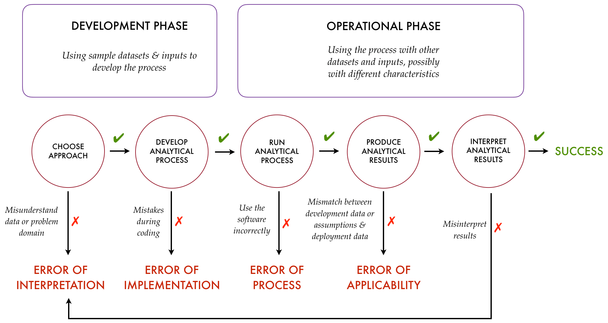

```{r include=FALSE}
knitr::opts_chunk$set(collapse = TRUE, comment = "#>", error = TRUE, out.width = "100%")
library(learnr)
library(grader)
library(tidyverse)
library(assertthat)
library(testthat)
tutorial_options(exercise.timelimit = 60, exercise.checker = grade_learnr)
```

## Theory and Practice

Any discussion of software and correctness has to start with three ideas. The first is that no amount of testing can ever prove that a piece of code is correct. A function that takes three arguments, each of which can have a hundred different values, theoretically needs a million tests. Even if we were to write them, how would we check that the values we're testing against are correct? And how would we tell that we had typed in those comparison values correctly, or that we were using the right equality checks in our code, or---the list goes on and on.

In practice, however, the situation is far from hopeless. Suppose we want to test a function that returns the sign of a number. Can we group potential inputs, to reduce the number of cases? If it works for the number 3, it will almost certainly work for 4, and for 5, and so on. In fact, there are only a handful of cases that we actually need to test:

| Value    | Expected | Reason |
| -------- | -------- | ------ |
| `-Inf`   | -1       | Only value of its kind |
| `Inf`    | 1        | Only value of its kind |
| `NaN`    | NaN      | Only value of its kind |
| `-5`     | -1       | Or some other negative number |
| `0`      | 0        | The only value that has a sign of 0 |
| `127489` | 1        | Or some other positive number |

As this table shows, we can divide test inputs into equivalence classes and check one member of each. Yes, there's a chance that we'll be mistaken in our classification---that the code we're testing will behave differently for values we have put in the same class---but this approach reduces the number of tests we have to write *and* makes it easier for the next person reading our code to understand what it does.

```{r machine-epsilon, echo=FALSE}
question("What is the sign of `.Machine$double.eps`?",
  answer("0"),
  answer("1", correct = TRUE),
  answer("Inf"),
  answer("NA"))
```

## Terminology and Tools

The second big idea is that each test can have three possible outcomes:

1.  **success**, meaning that the test passed correctly,
2.  **failure**, meaning that the software being tested didn't do what it was supposed to, and
3.  **error**, meaning that the test itself failed (in which case, we don't know anything about the software being tested).

A **unit test** is a function that runs some code and produces one of these three results. The input data to the unit test is called the **fixture**; we tell if the test passed or not by comparing the **actual output** to the **expected output**. For example, here's a very badly written version of `numSign` and an equally badly written pair of tests for it:

```{r numsign-example}
numSign <- function(x) {
  if (x > 0) {
    1
  } else {
    -1
  }
}

stopifnot(numSign(1) == 1)
stopifnot(numSign(-Inf) == -1)
stopifnot(numSign(NULL) == 0)
```

Here, the fixtures are 1, `NULL`, and `-Inf`, and the corresponding expected outputs are 1, 0, and -1. These tests are badly written for two reasons:

1.  Execution halts at the first failed test, which means we get less information than we could about the state of the system we're testing.
2.  Each test prints its output to the screen---there is no overall summary, and no easy way to tell which test produced which result. This isn't a problem when there are only three tests, but experience shows that if the output isn't comprehensible at a glance, developers will stop paying attention to it.

A **test framework** is a library that provides us with functions that help us write tests, and includes a **test runner** that will find test functions, execute them, and report both individual results that require attention and a summary of overall results. The most popular test framework for R is [testthat](https://cran.r-project.org/web/packages/testthat/index.html), which we will explore in [the next lesson](FIXME:URL).

```{r classify-error, echo=FALSE}
question('Suppose `numSign` is supposed to halt with an error message if it is given a non-numeric value, but instead gives a warning when passed a string like `"0.0"` that can be interpreted as a number. How should this be classified for testing purposes?',
  answer("Error, because the function runs when it shouldn't."),
  answer("Failure, because the function doesn't produce what's expected.", correct = TRUE),
  answer("Success, because the function runs instead of halting."))
```

## But It Used to Work

The diagram below, taken from the [TDDA website](http://tdda.info), shows that making mistakes during coding is only one of the places where data analysis can go wrong:



Software testing cannot help with the first and last stages (choosing an approach and interpreting the results), but it *can* help with running the process and producing results. This is sometimes called **production testing**, and is meant to guard against things like mistaken configuration, changes in upgraded packages, and data that differs from what the pipeline was designed to handle. What we want to put checks in between the stages of our pipeline that don't modify the data. For example, suppose we have table:

```{r sample-data}
data <- tribble(
  ~a,  ~b,  ~c,
  1.1, 1.2, 1.3,
  2.1, 2.2, 2.3
)
```

The pipeline below checks that the values in column `c` are strictly greater than the values in columns `a` and `b` before calculating a score:

```{r pipeline-example}
data %>%
  nickr_col((a < c) && (b < c), msg = "a and b must be less than c") %>%
  mutate(score = c / (a + b))
```

Testing a condition like "`c` must be greater than either `a` or `b`" is **executable documentation**: it specifies what we expect in a way that both computers and human beings can understand. It also ensures that if someone ever does run this pipeline with inappropriate data, they'll get an error message instead of a plausible but nonsensical result. Here and elsewhere, our primary goal is to guard against **silent failure** in which our code appears to be working when it actually isn't.

```{r test-conditions, echo=FALSE}
question("If `span(data)` is `max(data) - min(data)` and `sd(data)` is the standard deviation function, which of the following are good data integrity checks?",
  answer("sd(data) < span(data)"),
  answer("(0 <= sd(data)) && (0 <= span(data))"),
  answer("Both of the above", correct = TRUE))
```
