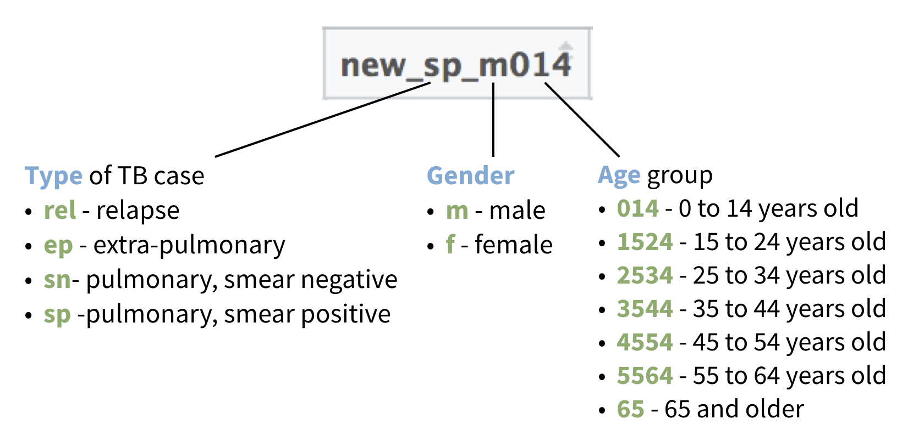
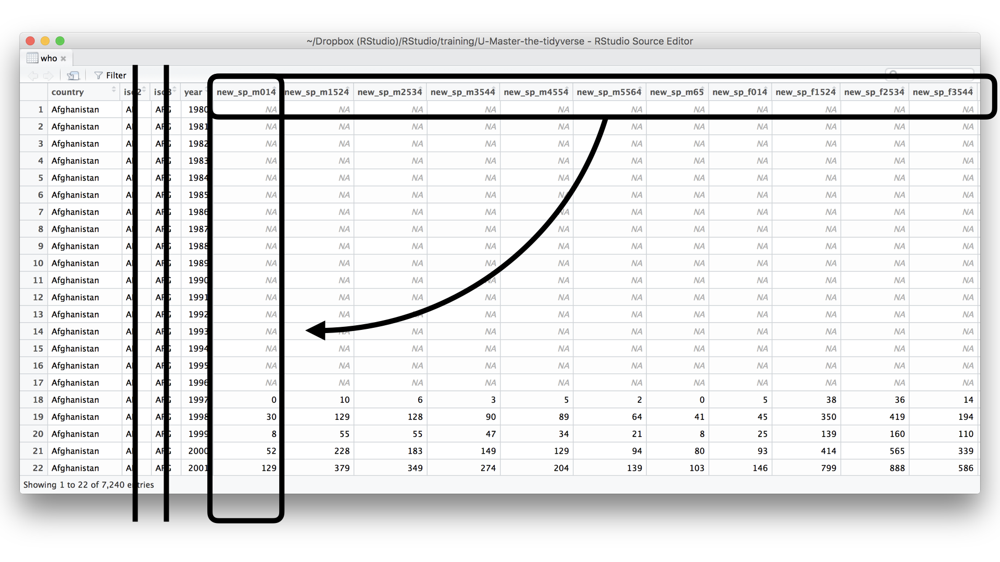

```{r setup, include=FALSE}
library(learnr)
library(tidyverse)
library(babynames)

hurricanes <- tribble(
     ~name,  ~wind_speed, ~pressure,        ~date,
  "Alberto",         110,      1007, "2000-08-03",
     "Alex",          45,      1009, "1998-07-27",
  "Allison",          65,      1005, "1995-06-03",
      "Ana",          40,      1013, "1997-06-30",
   "Arlene",          50,      1010, "1999-06-11",
   "Arthur",          45,      1010, "1996-06-17"
)

x <- tribble(
  ~x1, ~x2,
  "A",   1,
  "B",  NA,
  "C",  NA,
  "D",   3,
  "E",  NA
)

# To avoid a distracting detail during tutorial
names(who) <- stringr::str_replace(names(who), "newrel", "new_rel")

checker <- function(label, user_code, check_code, envir_result, evaluate_result, ...) {
  list(message = check_code, correct = TRUE, location = "append")
}
tutorial_options(exercise.timelimit = 60, exercise.checker = checker)
knitr::opts_chunk$set(echo = FALSE)
```

```{r, context="server-start", include=FALSE}
# Capture metrics only if running an official primer hosted by RStudio
library(curl)
library(later)
tryCatch(
  source("https://metrics.rstudioprimers.com/learnr/installMetrics", local=TRUE), 
  error = function(e){ 
    print("Warning: An error occurred with the tracking code.")
  }
)
```

```{r, context = "render", results = 'asis', echo = FALSE}
tryCatch(
  source("https://metrics.rstudioprimers.com/learnr/installClient", local=TRUE)$value,
  error = function(e){ 
    print("Warning: An error occurred with the client code.")
  }
)
```

## Welcome

Data is easiest to analyze in R when it is stored in a tidy format. In the last tutorial, you learned how to tidy data that has an untidy layout, but there is another way that data sets can be untidy: a data set can combine multiple values in a single cell or spread a single value across multiple cells. This makes it difficult to extract and use values in your analysis.

This tutorial will teach you two tools that you can use to tidy this type of data:

* `separate()` - which separates a column of cells into multiple columns
* `unite()` - which combines multiple columns of cells into a single column

It ends with a case study that requires you to use all of the tidy tools to wrangle a messy real world data set.

This tutorial uses the [core tidyverse packages](http://tidyverse.org/), including tidyr. All of these packages have been pre-installed and pre-loaded for your convenience.

Click the Next Topic button to begin.

## separate()

### hurricanes

The `hurricanes` data set contains historical information about five hurricanes. At first glance it appears to contain four variables: _name_, *wind_speed*, _pressure_, and _date_. However, there are three more variables hidden in plain sight. Can you spot them?

```{r}
hurricanes
```

```{r q1}
question('Which variables are "hidden" in hurricanes? Check three.',
   answer("location"),
   answer("year", correct = TRUE),
   answer("month", correct = TRUE),
   answer("day", correct = TRUE),
   allow_retry = TRUE,
   correct = "Good job! The date variable also displays the year, month, and day associated with each measurement.",
   incorrect = "Not quite. Keep going: which _three_ variables are displayed in hurricanes?"
)
```

### Dates

Did you realize that dates are a combination of multiple variables? They are. 

You'll almost always display these variables together to make a date, because a date is itself a variable---one that conveys more than the sum of its parts.

However, there are times where it is convenient to treat each element of a date separately. For example, what if you wanted to filter `hurricanes` to just the storms that occurred in June (i.e. `month == 6`)? Then it would be convenient to reorganize the data to look like this.

```{r}
hurricanes %>% 
  separate(date, c("year","month","day"), sep = "-", convert = TRUE)
```

But how could you do it?

### separate()

You can separate the elements of `date` with the `separate()` function. `separate()` divides a column of values into multiple columns that each contain a portion of the original values.

Run the code below to see `separate()` in action. Then click continue to learn about the syntax.

```{r ex1, exercise = TRUE}
hurricanes %>% 
  separate(col = date, into = c("year","month","day"), sep = "-")
```

```{r ex1-check}
"Good job! As with other tidyverse functions, `separate()` returns a modified copy of the orginal data. You will need to save the copy if you wish to use it later."
```

### Syntax

Let's rewrite our above command without the pipe, to make the syntax of `separate()` easier to see.

```{r echo = TRUE, eval = FALSE}
separate(hurricanes, col = date, into = c("year","month","day"), sep = "-")
```

`separate()` takes a data frame and then the name of a column in the data frame to separate. Here our code will separate the `date` column of the `hurricane` data set.

The `sep = "-"` argument tells `separate()` to split each value in `date` wherever a `-` appears. You can choose to split on any character or character string. 

Separating on `-` will split each date into three dates: a year, month, and day. As a result, `separate()` will need to add three new columns to the result. The `into` argument gives `separate()` a character vector of names to use for the new columns. Since the result will have three new columns, this vector will need to have three new names. `separate()` will provide an error message if it ends up creating fewer or more columns than column names.

### Defaults

By default `separate()` will separate values at the location of _any_ non-alphanumeric character, like `-`, `,`, `/`, etc. So for example, we could run our code without the `sep = "-"` argument and---in this case---get the same result. 

Or will we? Do a quick mental check and then run the code to see if you are right.

```{r ex2, exercise = TRUE}
hurricanes %>% 
  separate(col = date, into = c("year","month","day"))
```

```{r ex2-check}
'Good job! "-" is the only non-alphanumeric character used in our dates, which means that the defaults return the same output as setting sep = "-"'
```

### Separating by position

If you set `sep` equal to an integer, `separate()` will split the values at the location indicated by the integers. For example,

* `sep = 1` will split the values after the first character
* `sep = -2` will split the values after the _second to last_ character, no matter how many characters appear in the value. In other words, it will split off the last character of each value.
* `sep = c(2, 4, 6)` will split the values after the second, fourth, and sixth characters, creating four sub-values

Think you have it? Create this version of `hurricanes` by adding a second call to `separate()` that uses an integer separator to the code below:

```{r}
hurricanes %>% 
  separate(col = date, into = c("year","month","day")) %>% 
  separate(col = year, into = c("century", "year"), sep = 2)
```

```{r ex3, exercise = TRUE}
hurricanes %>% 
  separate(col = date, into = c("year","month","day"))
```

```{r ex3-solution}
hurricanes %>% 
  separate(col = date, into = c("year","month","day")) %>% 
  separate(col = year, into = c("century", "year"), sep = 2)
```

```{r ex3-check}
"Good job! Notice that when you separate on a character, separate() removes that character from the results. When you separate on a location, separate() retains all of the characters in the result."
```

### Quiz - What if

Would these two commands return the same result? Why or why not? Once you have an answer, run the code below to see if you were right.

```{r ex4, exercise = TRUE}
hurricanes %>% 
  separate(col = pressure, into = c("first", "last"), sep = 1)
```

```{r ex4-check}
"When sep = 1, separate() splits after the first character"
```


```{r ex5, exercise = TRUE}
hurricanes %>% 
  separate(col = pressure, into = c("first", "last"), sep = "1")
```

```{r ex5-check}
'When sep = "1", separate() splits at every appearance of the character "1". This happens because R treats a 1 surrounded by quotation marks as a character string, not a number.'
```

### Convert

You may have noticed that `separate()` returns its results as columns of character strings. However, in some cases, like ours, the columns will contain integers, doubles, or other types of non-character data.

You can ask `separate()` to convert the new columns to an appropriate data type by adding `convert = TRUE` to your `separate()` call. This is identical to the `convert = TRUE` argument of `gather()`.

Identify the data types of `year`, `month`, and `day` (they appear under the column names) in the output below. Then add `convert = TRUE` and re-run the code. What changes?

```{r ex6, exercise = TRUE, exercise.eval = TRUE}
hurricanes %>% 
  separate(col = date, into = c("year","month","day"))
```

```{r ex6-solution}
hurricanes %>% 
  separate(col = date, into = c("year","month","day"), convert = TRUE)
```

```{r ex6-check}
"Good job! Our columns now contain integers, which will make them easier to manipulate with mathematical operations."
```

### Remove

Let's take a look at one last argument for `separate()`. If you add `remove = FALSE` to your `separate()` call, R will retain the original column in the results.

```{r echo = TRUE}
hurricanes %>% 
  separate(col = date, into = c("year","month","day"), convert = TRUE, remove = FALSE)
```


## unite()

### unite()

You can do the inverse of `separate()` with `unite()`. `unite()` uses multiple input columns to create a single output column. It builds this column by pasting together the cells of the input column with a separator.

```{r ex7, exercise = TRUE, exercise.eval = TRUE}
hurricanes %>%
  separate(date, c("year", "month", "day"), sep = "-") %>%
  unite(col = "date", month, day, year, sep = ":")
```

### Syntax

```{r echo = TRUE, eval = FALSE}
hurricanes %>%
  separate(date, c("year", "month", "day"), sep = "-") %>%
  unite(col = "date", month, day, year, sep = ":")
```

Notice that the syntax of `unite()` is the inverse of `separate()`:

* The first argument is a character string: the name of the new column that `unite()` will make
* The arguments that follow are the columns to be combine into the new column. You can list as many columns as you like, their names do not need to be in quotes, and each name is listed as its own argument.

### Exercise - Separate and Unite

Use `separate()` and `unite()` to rewrite the dates in hurricanes in the format below:

* month/day/year, e.g., 1/27/2020

```{r ex8, exercise = TRUE}

```

```{r ex8-solution}
hurricanes %>%
  separate(date, c("year", "month", "day"), sep = "-") %>%
  unite(col = "date", month, day, year, sep = "/")
```

```{r ex8-check}
"Good job! Let's push it one step farther."
```

### Exercise - Separate and Unite 2

Use the chunk below to:

1. Use separate to isolate the first two digits of each date as "century"
2. Filter the data to just rows where `century == 19`. These will be storms that occurred in the 1900's.
3. Use `unite()` to return the results to the original date format. _Hint: you can set `sep = ""` to avoid including a separator character when uniting._

```{r ex9, exercise = TRUE}

```

```{r ex9-solution}
hurricanes %>%
  separate(col = date, c("century", "rest"), sep = 2) %>%
  filter(century == 19) %>% 
  unite(col = "date", century, rest, sep = "")
```

```{r ex9-check}
"Good job!"
```

### Tidy data

So far we've separated and united `date`, a variable that contains legitimate sub-variables. This is because it makes little sense to combine unrelated values within the same cells. However, many data sets follow this senseless practice. If you inherit one, you can use `separate()` and `unite()` to reorganize the values in a tidy fashion.

In the case study that follows, you will do just that. You will also practice using all of the tidyr functions as you do.

## Case study

### who 

The `who` data set contains a subset of data from the World Health Organization Global Tuberculosis Report, available [here](http://www.who.int/tb/country/data/download/en/).

In its original format, the data is very untidy

```{r echo = TRUE}
who
```

### who variables

The first four columns of `who` each contain a single variable:

* **country** - the name of a country
* **iso2** - a two letter country code
* **iso3** - a three letter country code
* **year** - year

The remaining columns are named after codes that contain multiple variables.

### who codes

Each column name after the fourth contains a code comprised of three values from three variables: _type of TB_, _gender_, and _age_.

```{r out.width = "90%"}

```

### A goal

To make `who` easier to use in R, we should tidy it into the format below. This data set contains six non-redundant variables: _country_, _year_, _type_, _sex_, _age (group)_, and _n_ (the number of cases of TB reported for each group).

```{r}
who %>%
  select(-iso2, -iso3) %>% 
  gather("codes", "n", 3:58) %>%
  separate(codes, c("new", "type", "sexage"), sep = "_") %>%
  select(-new) %>%
  separate(sexage, c("sex", "age"), sep = 1) %>%
  drop_na(n)
```

### Warm up

It will take a number of operations to tidy the `who` data set. When you look at the end result, the task may seem overwhelming, but each individual operation will be fairly simple (and familiar). We will use the pipe operator, `%>%`, to string these simple operations together.

Let's begin the pipe by removing the redundant variables `iso2` and `iso3` from `who`. In otherwords, let's use a dplyr function to select every column except `iso2` and `iso3`. Recall that there is a way to do this without a large amount of typing.

```{r ex10, exercise = TRUE}

```

```{r ex10-solution}
who %>% 
  select(-iso2, -iso3)
```

```{r ex10-check}
"Good job! The - helper becomes very handy when you have 60 column names to deal with!"
```

### A strategy

Next, we need to move the type, sex, and age variables out of the column names and into a column of their own. It is true that we want to separate these values into their own cells, but that will be easier to do once they are in their own column.

In short, we want to do something like this:

```{r out.width = "90%"}

```

### Exercise - Reshape

Add to the pipe below. Use a tidyr reshaping function to gather the column names into their own column, named "codes". Place the column cells into a column named "n". _Hint: it may be helpful to know that there are now 58 columns in the data set._

You can think of each column name as a key that combines the values of several variables. We want to move those keys into their own key column.

```{r ex11, exercise = TRUE}
who %>% 
  select(-iso2, -iso3)
```

```{r ex11-solution}
who %>%
  select(-iso2, -iso3) %>% 
  gather(key = "codes", value = "n", 3:58)
```

```{r ex11-check}
"Good job! The codes are easier to work with when they are in their own column."
```

### Exercise - Separate

Add to the pipe below. Separate the codes in `codes` into three columns named "new", "type", and "sexage". What type of separator should you separate on?

```{r ex12, exercise = TRUE}
who %>%
  select(-iso2, -iso3) %>% 
  gather(key = "codes", value = "n", 3:58) 
```

```{r ex12-solution}
who %>%
  select(-iso2, -iso3) %>% 
  gather(key = "codes", value = "n", 3:58) %>% 
  separate(codes, into = c("new", "type", "sexage"), sep = "_")
```

```{r ex12-check}
"Good job! Luckily, it is easy to decompose each code into its components by separating on the _ characters. However, sex and age still appear in the same column."
```

### Exercise - Separate again

Our last separate, isolated two components of the who codes: new and type. However, it did not separate the sex and age variables.

If you look closely at the structure of the `sexage` column, you will see that each cell begins with a single letter that represents a gender, `m` or `f`, and is then followed by three or more numbers, which represent an age group. Use this insight to perform a second separate that isolates the "sex" and "age" variables:

```{r ex13, exercise = TRUE}
who %>%
  select(-iso2, -iso3) %>% 
  gather(key = "codes", value = "n", 3:58) %>% 
  separate(codes, into = c("new", "type", "sexage"), sep = "_")
```

```{r ex13-solution}
who %>%
  select(-iso2, -iso3) %>% 
  gather(key = "codes", value = "n", 3:58) %>% 
  separate(codes, into = c("new", "type", "sexage"), sep = "_") %>% 
  separate(sexage, into = c("sex", "age"), sep = 1)
```

```{r ex13-check}
"Great job! We've almost finished tidying this data set. Let's add some finishing touches."
```

### Exercise - Select

Add to the pipe to remove the `new` variable, which doesn't provide any useful information. (Every row in the data set shows new cases of TB and has the same value of `new`).


```{r ex14, exercise = TRUE}
who %>%
  select(-iso2, -iso3) %>% 
  gather(key = "codes", value = "n", 3:58) %>% 
  separate(codes, into = c("new", "type", "sexage"), sep = "_") %>% 
  separate(sexage, into = c("sex", "age"), sep = 1)
```

```{r ex14-solution}
who %>%
  select(-iso2, -iso3) %>% 
  gather(key = "codes", value = "n", 3:58) %>% 
  separate(codes, into = c("new", "type", "sexage"), sep = "_") %>% 
  separate(sexage, into = c("sex", "age"), sep = 1) %>% 
  select(-new)
```

```{r ex14-check}
"Good job! Now let's turn our attention to the NA's in the n column."
```

### n

Notice that the `n` column of `who` contains the most insightful information. You do not need to take any measurments to list out the country, year, type, sex, and age combinations in the data set. In a sense, you know these combinations in advance. However, `n` shows how many cases of TB were reported for each combination. You do not know this information in advance, and you can only acquire it through field work---yours or someone else's. 
As a result, it is concerning that our data contains so many `NA`s for `n`.

### NA

`NA` is R's symbol for missing information, and it is common to have multiple `NA`s when you reshape your data from a wide format to a long format. The rectangular table structure imposed by wide data requires a place holder for every combination of variable values---even if no data was collected for that combination.

In contrast, the long data format does not require a place holder for each combination of variable values. Since each combination is saved as its own row, you can simply not include rows that contain an NA.

### drop_na()

The tidyr package provides a convenient function for dropping rows that contain an NA in a specific column. The function is `drop_na()`. To use it, give `drop_na()` a data set (perhaps via a pipe), then list one or more columns in that data set, e.g.

```{r echo = TRUE, eval = FALSE}
data %>% drop_na(column1, column2)
```

`drop_na()` will drop every row that contains an NA in one or more of the listed columns.

Add `drop_na()` to the pipe below to drop every row that has an NA in the `n` column.


```{r ex15, exercise = TRUE}
who %>%
  select(-iso2, -iso3) %>% 
  gather(key = "codes", value = "n", 3:58) %>% 
  separate(codes, into = c("new", "type", "sexage"), sep = "_") %>% 
  separate(sexage, into = c("sex", "age"), sep = 1) %>% 
  select(-new)
```

```{r ex15-solution}
who %>%
  select(-iso2, -iso3) %>% 
  gather(key = "codes", value = "n", 3:58) %>% 
  separate(codes, into = c("new", "type", "sexage"), sep = "_") %>% 
  separate(sexage, into = c("sex", "age"), sep = 1) %>% 
  select(-new) %>% 
  drop_na(n)
```

```{r ex15-check}
"Good job! You may have noticed that drop_na(n) does the same thing as filter(!is.na(n)). However, drop_na(n) is easier to read and type."
```

### Recap

Good job! You've wrangled `who` into a tidy, polished data set that is ready to be explored, modelled, and analyzed.

The difference between the initial and final versions of `who` is drastic, but each step in our pipe imposed a small, logical change. This is by design.

The tidyverse contains a vocabulary of functions that each do one simple thing, but can be combined to do more sophisticated tasks. In this way, the tidyverse is like a written language, it is made up of words (functions) that can be combined into sentences that have a sophisticated meaning (pipes).

This approach also makes it easier to solve problems with code. You can approach any problem by decomposing it into a series of small, simple steps.


