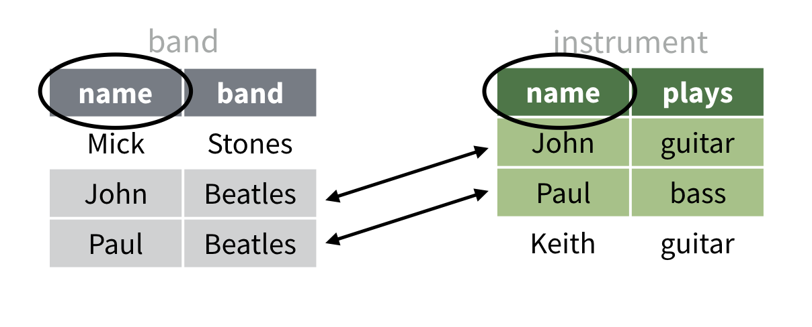
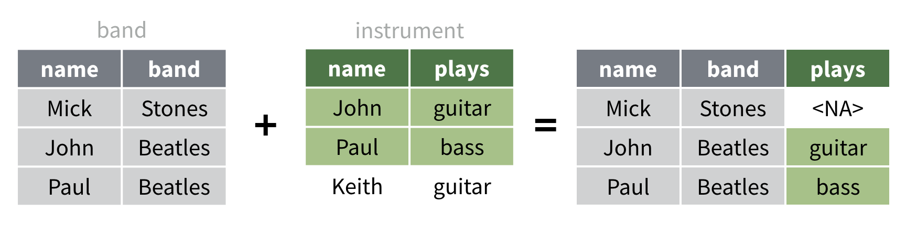
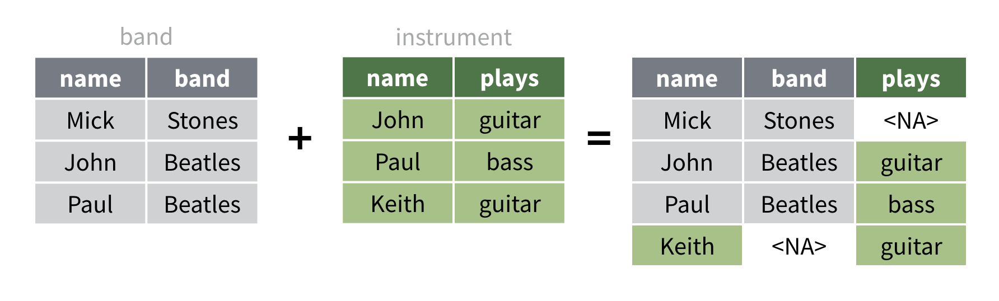
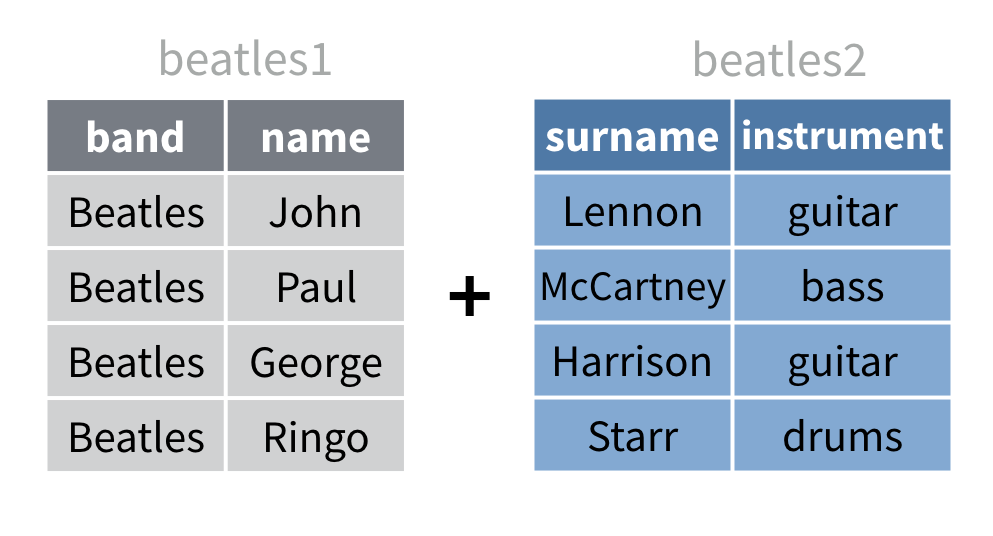
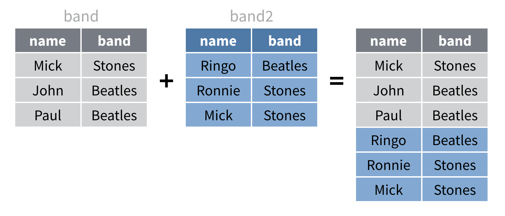
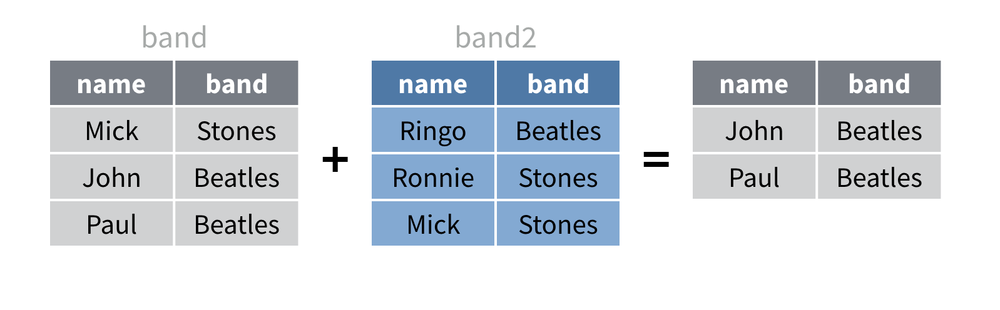

```{r setup, include=FALSE}
library(learnr)
library(tidyverse)
library(nycflights13)

band <- tribble(
   ~name,     ~band,
  "Mick",  "Stones",
  "John", "Beatles",
  "Paul", "Beatles"
)

band2 <- tribble(
    ~name,     ~band,
  "Ringo", "Beatles",
 "Ronnie",  "Stones",
   "Mick",  "Stones"
)

instrument <- tribble(
    ~name,   ~plays,
   "John", "guitar",
   "Paul",   "bass",
  "Keith", "guitar"
)

instrument2 <- tribble(
    ~artist,   ~plays,
   "John", "guitar",
   "Paul",   "bass",
  "Keith", "guitar"
)

beatles1 <- tribble(
      ~band,    ~name,
  "Beatles",   "John",
  "Beatles",   "Paul",
  "Beatles", "George",  
  "Beatles",  "Ringo"
)

beatles2 <- tribble(
     ~surname, ~instrument,
     "Lennon",    "guitar",
  "McCartney",      "bass",
   "Harrison",    "guitar",  
      "Starr",     "drums"
)

criteria <- tribble(
  ~month, ~carrier,
       1,     "B6", # B6 = JetBlue
       2,     "WN"  # WN = Southwest
)

criteria

checker <- function(label, user_code, check_code, envir_result, evaluate_result, ...) {
  list(message = check_code, correct = TRUE, location = "append")
}
tutorial_options(exercise.timelimit = 60, exercise.checker = checker)
knitr::opts_chunk$set(echo = FALSE)
```

```{r, context="server-start", include=FALSE}
# Capture metrics only if running an official primer hosted by RStudio
library(curl)
library(later)
tryCatch(
  source("https://metrics.rstudioprimers.com/learnr/installMetrics", local=TRUE), 
  error = function(e){ 
    print("Warning: An error occurred with the tracking code.")
  }
)
```

```{r, context = "render", results = 'asis', echo = FALSE}
tryCatch(
  source("https://metrics.rstudioprimers.com/learnr/installClient", local=TRUE)$value,
  error = function(e){ 
    print("Warning: An error occurred with the client code.")
  }
)
```

## Welcome

Data often comes as multiple data sets that are related to each other. When this happens, the data will be easier to analyze if you join the data sets into a single table. This tutorial will teach you several functions that join data sets together. These functions do something sophisticated: they match rows from one data set to corresponding rows in another data set, even if the rows appear in a different order. The functions are:

* `left_join()`, `right_join()`, `full_join()`, and `inner_join()` - which augment a copy of one data frame with information from a second
* `semi_join()` and `anti_join()` - which filter the contents of one data frame against the contents of a second
* `bind_rows()`, `bind_cols()`, and set operations - which combine data sets in more simple ways

Each of these functions come in the **dplyr** package, not the tidyr package. You may wonder why we are learning about them in the Tidy Data primer. Joins are a useful component of data tidying; your data can hardly be tidy if observations are split across multiple data frames where they are listed in different orders.

This tutorial uses the [core tidyverse packages](http://tidyverse.org/), including dplyr, as well as the nycflights13 package. All of these packages have been pre-installed and pre-loaded for your convenience.

Click the Next Topic button to begin.

## Mutating Joins

### Which airlines have the largest arrival delays?

Flight delays are an unfortunate aspect of air travel. If you've flown more than a handful of times, you've probably experienced a delayed flight, which may make you wonder: is it possible to predict which flights will be delayed?

The `flights` data set in the **nycflights13** package provides some relevant information. It contains details of every flight that departed from an airport that serves New York City in 2013. Let's use it to explore which airlines have the largest flight delays.

```{r echo = TRUE}
flights
```

### Review - Which airlines have the largest arrival delays?

The `carrier` variable of flights uses a carrier code to identify which airline operated each flight. This gives us a strategy for comparing the average delay time by airline:

1. Premeptively drop all of the rows that have an NA in `arr_delay`, which is the variable that records how delayed each flight was when it arrived at its destination (flights with a negative `arr_delay` arrived early).
1. Group the data by `carrier`
1. Calculate `avg_delay`: the average delay per carrier group
1. Arrange the carrier groups in descending order according to their `avg_delay` scores. The carriers with the largest average delays will appear at the top of the list.

Use dplyr functions in the code chunk below to enact this strategy. Which airlines have the largest average delays?

```{r ex1, exercise = TRUE}

```

```{r ex1-solution}
flights %>% 
  drop_na(arr_delay) %>% 
  group_by(carrier) %>% 
  summarise(avg_delay = mean(arr_delay)) %>% 
  arrange(desc(avg_delay))
```

```{r ex1-check}
"Good job! You've calculated the average delay per airline, but the results are difficult to interpret. We don't know which codes are associated with which airlines."
```

### airlines

Our results show that the carrier `F9` had the worst record for delays in the New York City area in 2013. But unless you are an air traffic controller, you probably do not know which airline has the carrier code `F9`.

Luckily, the **nycflights13** package comes with another data set, `airlines`, which matches the name of each airline to its carrier code.

```{r}
airlines
```

### A join

While you _could_ look up `F9` manually in `airlines`, and then repeat that process for every other code, the task would not be enjoyable. Your boss or your client will probably not be as willing as you to do it.

A better solution would be to join the `airlines` data set to your results programatically. In other words, to instruct R to add the `name` that is associated with each carrier code in `airlines` to the row that is associated with each carrier code in your results.

This is easy to do with one of dplyr's four join functions: `left_join()`, `right_join()`, `full_join()`, and `inner_join()`. Each performs a variation of the basic task above. 

### Toy data

The easiest way to learn how join functions work is visually. To this end, I've created some small toy data sets that we can visualize in their entirety: `band` and `instrument`, which look like this:

```{r out.width = "60%"}

```

Notice that each data set has a column named `name`. Also, notice that each data set contains a row about John and a row about Paul. If you know a little about The Beatles, you'll recognize that these rows match: they describe the same people. On ther other hand, the rows named Mick and Keith do not match any rows in the other data set. Finally, notice that the matching rows do not appear in the same place in each data set. For example, John is in the second row of `band`, but the first row of `instrument`.

These small data sets do a good job of matching the haphazard nature of real data. Our job will be to join them into a single data set that correctly matches the John and Paul rows to each other. 

If you wish to see the raw data in `band` and `instrument`, take a peek by running the code below.

```{r demo, exercise = TRUE}
band
instrument
```

### left_join()

Let's look at each dplyr join function and then deconstruct their syntax.

The `left_join()` function returns a copy of a data set that is augmented with information from a second data set. It retains all of the rows of the first data set, and only adds rows from the second data set that match rows in the first. 

So here, Mick is retained in the result (with an `NA` in the appropriate spot) because Mick appears in the first data set. On the other hand, Kieth does not appear in the result because Keith does not appear in the first data set.

```{r out.width = "90%"}

```

To see what this result looks like in R, run the code below.

```{r ex2, exercise = TRUE}
band %>% left_join(instrument, by = "name")
```

### right_join()

`right_join()` does the opposite of `left_join()`; it retains every row from the second data set and only adds rows from the first data set that have a match in the second data set. Now Keith appears in the result because Keith appears in the second data set. On the other hand, Mick does not appear in the result because he does not appear in the second data set.

```{r out.width = "90%"}
knitr::include_graphics("www/images/right-join.png")
```

You can think of `left_join()` as prioritizing the first data set, and `right_join()` as prioritizing the second. To see the results in R, run the code below.

```{r ex3, exercise = TRUE}
band %>% right_join(instrument, by = "name")
```

### Test your comprehension

How can you swap the names in the code below to attain the results pictured in the right join diagram (don't worry about the order of the columns the result).

```{r out.width = "90%"}
knitr::include_graphics("www/images/right-join.png")
```

```{r ex4, exercise = TRUE}
band %>% left_join(instrument, by = "name")
```

```{r ex4-solution}
instrument %>% left_join(band, by = "name")
```

```{r ex4-check}
"Good Job! Since right and left joins are analagous, you can acheive the same results by switching the order of the data sets in a left join. Notice that this will affect the column order."
```

### full_join()

A `full_join()` is more inclusive than either a `right_join()` or a `left_join()`. A `full_join()` retains every row from _each_ data sets, inserting NA placeholders throughout the results as necessary. 

This is the only join that does not lose _any_ information from the original data sets. Both Mick and Kieth appear in the results.

```{r out.width = "90%"}

```

To see what this result looks like in R, run the code below.

```{r ex5, exercise = TRUE}
band %>% full_join(instrument, by = "name")
```

### inner_join()

In contrast, an `inner_join()` is the most exclusive join. It only retains rows that appear in _both_ data sets. As a result, only John and Paul appear in the result. Mick and Keith are left behind.

```{r out.width = "90%"}
knitr::include_graphics("www/images/inner-join.png")
```

To see what this result looks like in R, run the code below.

```{r ex6, exercise = TRUE}
band %>% inner_join(instrument, by = "name")
```

### Mutating join syntax

These four joins, `left_join()`, `right_join()`, `full_join()`, and `inner_join()`, are called _mutating joins_ because they each return a copy of a data set that has been augmented with new information, just as `mutate()` returns a copy of a data set that has been augmented with new information.

Each function uses the same syntax: 

```{r echo = TRUE, eval = FALSE}
 left_join(band, instrument, by = "name")
right_join(band, instrument, by = "name")
 full_join(band, instrument, by = "name")
inner_join(band, instrument, by = "name")
```

First, pass the function the names of two data sets to join.

Then set the `by` argument to the name or names of the column or columns to join on. These names should be passed as a vector of character strings, i.e. characters surrounded by quotes. In the code above, we join on a single column so our vector of strings simplifies to a single string, but you could imagine doing something like `left_join(band, instrument, by = c("first", "last"))`.

Each column name in `by` should appear in both data sets. The join function will match together rows that have identical combinations of values in the columns listed in `by`. If you do not specify a `by` argument, dplyr will join on the set of all column names that appear in both data sets.

### Exercise - Which airlines?

Now that you've familiarized yourself with the mutating join functions, let's use one to finish our airlines query. Add two more lines to the code below.

1. In the first, join the results to `airlines` in a way that keeps every row of the results, but only the matching rows of `airlines`.
2. In the second, select just the `name` and `avg_delay` columns in that order.

```{r ex7, exercise = TRUE}
flights %>% 
  drop_na(arr_delay) %>% 
  group_by(carrier) %>% 
  summarise(avg_delay = mean(arr_delay)) %>% 
  arrange(desc(avg_delay))
```

```{r ex7-solution}
flights %>% 
  drop_na(arr_delay) %>% 
  group_by(carrier) %>% 
  summarise(avg_delay = mean(arr_delay)) %>% 
  arrange(desc(avg_delay)) %>% 
  left_join(airlines, by = "carrier") %>% 
  select(name, avg_delay)
```

```{r ex7-check}
"Great Job! It is now easy to see that Frontier Airlines, AirTran, and ExpressJet had the longest average delays departing New York City in 2013."
```

### nycflights13 data sets

`airlines` is not the only data set in nycflights13 that expands upon flights. nycflights13 contains a total of five data sets that each focus on a related aspect of air travel.

1. `flights` - describes each flight that departed from a New York City airport (i.e. Newark, La Guardia, or JFK)
1. `airports`- describes major airports in the US, including their FAA codes and names
1. `planes` - describes the individual airplanes, identified by their tail numbers
1. `weather` - describes the hourly weather conditions for each NYC airport 
1. `airlines` - lists the carrier codes and names for each airline

The diagram below lists the column names for each data set. You can see that each data set shares one or more common columns with `flights`. Let's use one to answer a new query.

```{r out.width = "80%"}
knitr::include_graphics("www/images/nycflights13.png")
```

### Which airports have the largest arrival delays?

Let's repeat our last investigation to see which destinations have the largest average arrival delays. By swapping `carrier` with `dest` we arrive at 

```{r echo = TRUE}
flights %>% 
  drop_na(arr_delay) %>%
  group_by(dest) %>%
  summarise(avg_delay = mean(arr_delay)) %>%
  arrange(desc(avg_delay))
```

But we face a similar problem. How can we replace the `dest` codes with names?

### airports

Luckily, the `airports` data set shows the names associated with each code. But look closely at `airports`:

```{r ex8, exercise = TRUE}
airports
```

```{r q1}
question("Which variable name does airports use for the airport codes?",
         answer("dest"),
         answer("origin"),
         answer("name"),
         answer("faa", correct = TRUE, message = "This makes it difficult to join these two data sets because flights and airports use different column names for the codes columns (dest and faa)."),
         allow_retry = TRUE
)
```

### Different column names

`airports` and `flights` share a common variable, airport codes, but save the variable under different column names `dest` and `faa`. This is a common occurence with data. We can recreate it by making a second instrument data set that replaces the first column name with artist.

```{r echo = TRUE}
instrument2
```

We can still join `band` to `insturment2`, but we will need to tell R to match the `name` column to the `artist` column. To do this, you will need to know a little about how to name the elements of a vector.

```{r out.width = "52%"}
knitr::include_graphics("www/images/names.png")
```

### Named vectors

A named vector is a vector whose elements have been given names. To create a named vector, simply assign names to each element of the vector when you create the vector with `c()`. 

For example, this creates an unnamed vector:

```{r echo = TRUE}
c(1, 2, 3)
```

And this creates a named vector. Here the first element is named "uno", the second is named "dos", and so on.

```{r echo = TRUE}
c(uno = 1, dos = 2, tres = 3)
```

If you like, you can place quotes around the names when you make the vector, like `c("uno" = 1, "dos" = 2, "tres" = 3)`. You'll see me do that in the next section to make things look symmetric.

Named vectors are a basic feature of R. Let's look at how we can use them to solve our join problem.

### Matching column names

To match on columns with different names, change the `by` argument of your join function from a vector of character strings to a _named_ vector of character strings. 

```{r echo = TRUE}
band %>% left_join(instrument2, by = c("name" = "artist"))
```

R will match the column in the first data set that has the name (here `"name"`) with the column in the second data set that has the element (here `"artist"`).

```{r out.width = "90%"}
knitr::include_graphics("www/images/match-names.png")
```

To see what the result looks like in R, run the code below.

```{r ex9, exercise = TRUE}
band %>% left_join(instrument2, by = c("name" = "artist"))
```

### Two details

You can use this syntax to describe multiple pairs of columns. For example,

```{r echo = TRUE, eval = FALSE}
foo %>% left_join(foo2, by = c("first" = "artist1", "last" = "artist2"))
```

Technically, you do not need to surround the names of the vector with quotes. This would work.

```{r echo = TRUE, eval = FALSE}
foo %>% left_join(foo2, by = c(first = "artist1", last = "artist2"))
```

But you do need to use quotes in the elements of the vector, which are character strings. I like to use quotes on both sides of the `=` for parity.

### Exercise - Which airports have the largest arrival delays?

Complete our code below to show the name of each destination paired with its average arrival delay.

```{r ex10, exercise = TRUE}
flights %>% 
  drop_na(arr_delay) %>%
  group_by(dest) %>%
  summarise(avg_delay = mean(arr_delay)) %>%
  arrange(desc(avg_delay))
```

```{r ex10-solution}
flights %>% 
  drop_na(arr_delay) %>%
  group_by(dest) %>%
  summarise(avg_delay = mean(arr_delay)) %>%
  arrange(desc(avg_delay)) %>% 
  left_join(airports, by = c("dest" = "faa")) %>% 
  select(name, avg_delay)
```

```{r ex10-check}
"Good Job! Flights from NYC to Columbia, South Carolina seem to have arrived particularly late in 2013. At the other end of the list, far off destinations in Alaska and Hawaii tended to arrive ahead of schedule."
```

### Mutating Joins Recap

The four join functions cover all of the ways you can combine information from one data set with another data set. 

* `left_join()` - joins relevant data from the _second_ data set to the _first_
* `right_join()` - joins relevant data from the _first_ data set to the _second_
* `full_join()` - retains _all_ available data
* `inner_join()` - retians only observations that appear in _both_ data sets

If you wish to combine more than two data sets, you can run the joins sequentially, first joining two data sets, then joining the result to a third, and so on. This process is easy to automate with the `reduce()` function in the **purrr** package.

The next Topic will look at a group of joins that do something surprisingly different.

## Filtering Joins

### Destinations

Let's look more closely at the destinations of flights from New York City. 

To do this we will use a new type of join: _a filtering join_. Filtering joins are different than mutating joins in that they do not add new data to a data set. Instead, they filter the rows of a data set based on whether or not the rows match rows in a second data set.

dplyr comes with two filtering join functions:

* `semi_join()`
* `anti_join()`

Both follow the same syntax as the mutating joins.

### semi_join()

`semi_join()` returns every row in the first data set that has a match in the second data set. So, for example, here `semi_join()` returns the John and Paul rows of `band`. Notice that `semi_join()` has not added anything to those rows.

```{r out.width = "90%"}
knitr::include_graphics("www/images/semi-join.png")
```

To see what the results look like in R, run the code below.

```{r ex11, exercise = TRUE}
band %>% semi_join(instrument, by = "name")
```

### anti_join()

`anti_join()` does just the opposite of `semi_join()`; it returns all of the rows in the first data set that _do not_ have a match in the second data set.

```{r out.width = "90%"}
knitr::include_graphics("www/images/anti-join.png")
```

To see what the results look like in R, run the code below.

```{r ex12, exercise = TRUE}
band %>% anti_join(instrument, by = "name")
```


### distinct()

We will also use a new function that comes in dplyr: `distinct()`. `distinct()` isn't a join function, but it is incredibly useful. `distinct()` returns the _distinct_ values of a column.

```{r ex13, exercise = TRUE}
instrument %>% distinct(plays)
```

```{r out.width = "90%"}

```

If you do not supply a column, `distinct()` returns the _distinct_ rows of the data frame, removing duplicates.

Now let's put these three functions to work.

### How many airports does New York connect to?

Use `distinct()` below to determine how many airports New York City connects to. This will be the number of distinct destinations in the `flights` data set. First create a data set with these destinations, then look for the number of rows in the data (it appears beneath the table in the results).

```{r ex14, exercise = TRUE}

```

```{r ex14-solution}
flights %>% 
  distinct(dest)
```

```{r ex14-check}
"Good job! There are 105 distinct destinations in the flights data set."
```

### Exercise - Replace codes with names

Now let's replace these codes with recognizable names. Add to the code below to left join our results to `airports`. Remember that the two data sets use different column names. Then select just the `name` column.

```{r ex15, exercise = TRUE}
flights %>% 
  distinct(dest)
```

```{r ex15-solution}
flights %>% 
  distinct(dest) %>% 
  left_join(airports, by = c("dest" = "faa")) %>% 
  select(name)
```

```{r ex15-check}
"Good job! But uh-oh. The third result is an NA. What's going on?"
```

### NAs

Rolling back our results just a bit, you can see that some codes did not have a match with in the `airports` data set. 

```{r echo = TRUE}
flights %>% 
  distinct(dest) %>% 
  left_join(airports, by = c("dest" = "faa")) %>% 
  select(dest, name)
```

### Which codes did not match?

This is unexpected. It would be useful to see which codes did not have a match. Extend the code below with a filtering join to return just the rows that do not have a match in `airports`.

```{r ex16, exercise = TRUE}
flights %>%
  distinct(dest)
```

```{r ex16-solution}
flights %>%
  distinct(dest) %>% 
  anti_join(airports, by = c("dest" = "faa"))
```

```{r ex16-check}
"Good job!"
```

### doublechecking with anti_join()

`anti_join()` provides an easy way to double check a join. It shows whether or not all of the rows that you think will have a match _will_ have a match.

Its not uncommon for `anti_join()` to return values that have a misspelling or typo that prevents the join. Keep in mind that the typo could be in either data set.

Here, these appear to be real airport codes that have been overlooked by `airports`. We cannot check the names of these four airports because, by definition, they are not in our data set of airport names.

### Exercise - How many flights are associated with a known airport name?

Let's gauge how this affects our data. Use the code chunk below to return all of the flights that _do_ match an airport in `airports`. Be sure to use a filtering join, not a mutating join.

```{r ex17, exercise = TRUE}

```

```{r ex17-solution}
flights %>% 
  semi_join(airports, by = c("dest" = "faa")) 
```

```{r ex17-check}
"Good job! Most of the rows in flights are associated with a known airport."
```

### semi_join() for filtering

How would you write a `filter()` statement that finds just the flights that:

1. Departed in January on JetBlue, or 
1. Departed in February on Southwest? 

It can be done---as can many other complicated filters. But you may find it easier to perform complicated filters with `semi_join()` instead of `filter()`.

### A semi_join() filter 1

For example, you can create a data set that has the combinations you want:

```{r echo = TRUE}
criteria <- tribble(
  ~month, ~carrier,
       1,     "B6", # B6 = JetBlue
       2,     "WN"  # WN = Southwest
)

criteria
```

Then you can run a `semi_join()` against the data set. Use `criteria` and `semi_join()` below to return just the flights that left in January on JetBlue or in February on Southwest.

```{r ex18, exercise = TRUE}

```

```{r ex18-solution}
flights %>% 
  semi_join(criteria, by = c("month", "carrier"))
```

### Filtering Joins Recap

Filtering joins filter a data set against the observations in a second data set. They are called joins because they use information from both data sets. However, they use this information to _filter_---not _augment_---the original data.

* `semi_join()` returns rows that _have_ a match in the second data set. It provides a useful shortcut for complicated filtering.
* `anti_join()` returns rows that _do not have_ a match in the second data set. It provides a useful way to check for possible errors in a join.

`distinct()` is not a join at all, but it does filter data sets in a useful way.

The last topic in this tutorial will cover straight-forward ways for combining data sets. These methods require your data sets to be pre-formatted to fit together and they are fairly simple to understand.

## Binds and Set Operations

### Non-joins

Join functions specialize in data sets that relate to each other, but are not preformatted to fit together.

Sometimes, however, you may wish to paste together data sets that already "fit together", as if they were split as is from some master data set. The functions in this topic will show you how.

### How to combine columns that already align?

Consider the two data sets below. Notice that they contain different variables, but identical observations. For example, the first row in `beatles1` aligns with the first row of `beatles2`, the second row aligns with the second row, and so on. 

```{r out.width = "50%"}

```

You wouldn't need to do a join to combine these data sets, you'd just need to paste them together. How could you do it?

### bind_cols()

If your data sets contain the same observations, in the same order, you can combine them together with `bind_cols()`

```{r out.width = "90%"}
knitr::include_graphics("www/images/bind-cols.png")
```

Run the code below to see what the results look like in R.

```{r ex19, exercise = TRUE}
beatles1 %>% bind_cols(beatles2)
```

Note that this is a dangerous way to store your data, because it is hard to ensure that the rows of one data set haven't gotten jumbled. `bind_cols()` cannot tell whether the rows are in the correct order or not, so you will need to be careful in these situations.

### How to combine rows that align?

These data sets provide the opposite case, which is more common. Here each data set contains the same variables, but different observations. You could think of `band2` as a continuation of `band`.

```{r out.width = "50%"}
knitr::include_graphics("www/images/band2.png")
```

### bind_rows()

Use `bind_rows()` to combine data sets that contain the same variables, but different observations.

```{r out.width = "90%"}

```

Run the code below to see what the results look like in R.

```{r ex20, exercise = TRUE}
band %>% bind_rows(band2)
```

### .id

When conbining data with `bind_rows()`, it can be useful to add a new column that shows where each row came from. 

```{r out.width = "90%"}
knitr::include_graphics("www/images/bind-rows-id.png")
```

The easiest way to do this is to save the input data sets as a named list and call _`bind_rows` on the list_. Then add the argument `.id` to your `bind_rows()` call and set `.id` to a character string. `bind_rows()` will use the character string as the name of a new column that displays the name of the data set that each row comes from (as determined by the names in the list). 

If you'd like to refresh your understanding of lists in R, revisit the [Programming Basics](https://rstudio.cloud/learn/primers/1.2) tutorial.

###  

Add a `.id` argument ot the code below to create the output displayed in the diagram.

```{r ex21, exercise = TRUE}
bands <- list(df1 = band, 
              df2 = band2)

bands %>% bind_rows()
```

```{r ex21-solution}
bands <- list(df1 = band, 
              df2 = band2)

bands %>% bind_rows(.id = "origin")
```

```{r ex21-check}
"Good Job! You can add more than two data sets to your list if you wish to bind together multiple data sets at once."
```


### Set operations

Did you notice that `bands` and `bands2` contain a duplicate row? Each contains a row for Mick.

When your data sets contain the same variables and overlapping sets of observations, you can use traditional set operations to return a reduced set of rows drawn from the data sets.

```{r out.width = "50%"}
knitr::include_graphics("www/images/band2.png")
```

Imagine what each of the set operations below will return when applied to the data sets above. Then run the code to check if you are right.

```{r ex22, exercise = TRUE}
band %>% union(band2)
band %>% intersect(band2)
band %>% setdiff(band2)
band2 %>% setdiff(band)
```

### union()

`union()` returns every row that appears in either data set, but it removes duplicate copies of the rows.

```{r echo = TRUE, eval = FALSE}
band %>% union(band2)
```

```{r out.width = "90%"}
knitr::include_graphics("www/images/union.png")
```

### intersect()

`intersect()` returns only the rows that appear in _both_ data sets. It too removes duplicate copies of these rows.

```{r echo = TRUE, eval = FALSE}
band %>% intersect(band2)
```

```{r out.width = "90%"}
knitr::include_graphics("www/images/intersect.png")
```

### setdiff()

`setdiff()` returns all of the rows that appear in the first data set but not the second.

```{r echo = TRUE, eval = FALSE}
band %>% setdiff(band2)
```

```{r out.width = "90%"}

```

