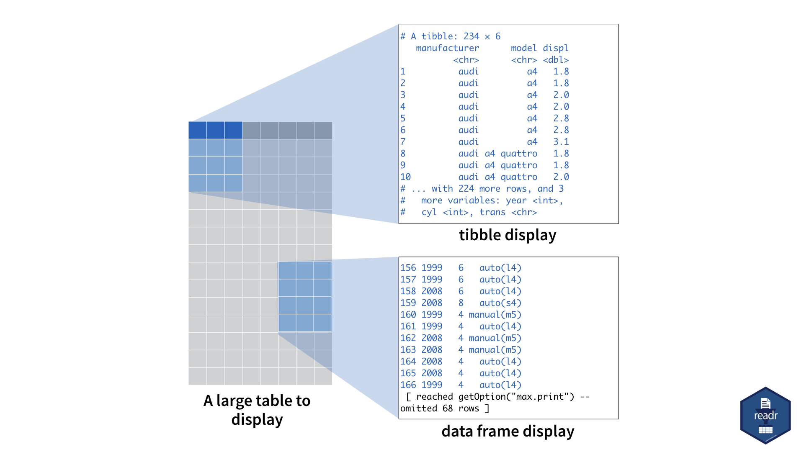

```{r setup, include=FALSE}
library(learnr)
library(tidyverse)

checker <- function(label, user_code, check_code, envir_result, evaluate_result, ...) {
  list(message = check_code, correct = TRUE, location = "append")
}
tutorial_options(exercise.timelimit = 60, exercise.checker = checker)
knitr::opts_chunk$set(echo = FALSE)
```

```{r, context="server-start", include=FALSE}
# Capture metrics only if running an official primer hosted by RStudio
library(curl)
library(later)
tryCatch(
  source("https://metrics.rstudioprimers.com/learnr/installMetrics", local=TRUE), 
  error = function(e){ 
    print("Warning: An error occurred with the tracking code.")
  }
)
```

```{r, context = "render", results = 'asis', echo = FALSE}
tryCatch(
  source("https://metrics.rstudioprimers.com/learnr/installClient", local=TRUE)$value,
  error = function(e){ 
    print("Warning: An error occurred with the client code.")
  }
)
```

## Welcome

In this primer, you will explore the popularity of different names over time. To succeed, you will need to master some common tools for manipulating data with R:

* tibbles and `View()`, which let you inspect raw data
* `select()` and `filter()`, which let you extract rows and columns from a data frame
* `arrange()`, which lets you reorder the rows in your data
* `%>%`, which organizes your code into reader-friendly "pipes"
* `mutate()`, `group_by()`, and `summarize()`, which help you use your data to compute new variables and summary statistics

These are some of the most useful R functions for data science, and the tutorials that follow will provide you everything you need to learn them. 

In the tutorials, we'll use a dataset named `babynames`, which comes in a package that is also named `babynames`. Within `babynames`, you will find information about almost every name given to children in the United States since 1880. 

This tutorial introduces `babynames` as well as a new data structure that makes working with data in R easy: the tibble.

In addition to `babynames`, this tutorial uses the [core tidyverse packages](http://tidyverse.org/), including ggplot2, tibble, and dplyr. All of these packages have been pre-installed for your convenience. But they haven't been pre-loaded---something you will soon learn more about!

Click the Next Topic button to begin.

## babynames

### Loading babynames

Before we begin, let's learn a little about our data. The `babynames` dataset comes in the **babynames** package. The package is pre-installed for you, just as ggplot2 was pre-installed in the last tutorial. But unlike in the last tutorial, I have not pre-_loaded_ babynames, or any other package.

What does this mean? In R, whenever you want to use a package that is not part of base R, you need to load the package with the command `library()`. Until you load a package, R will not be able to find the datasets and functions contained in the package. For example, if we asked R to display the `babynames` dataset, which comes in the babynames package, right now, we'd get the message below. R cannot find the dataset because we haven't loaded the babynames package.

```{r error = TRUE}
babynames
```

To load the `babynames` package, you would run the command `library(babynames)`. After you load a package, R will be able to find its contents _until you close R_. The next time you open R, you will need to reload the package if you wish to use it again.

This might sound like an inconvenience, but choosing which packages to load keeps your R experience simple and orderly.

In the chunk below, load babynames (the package) and then open the help page for `babynames` (the data set). Be sure to read the help page before going on.

```{r babynames-1, exercise = TRUE, exercise.setup = "bnames"}

```

```{r babynames-1-solution}
library(babynames)
?babynames
```

```{r bnames, echo = FALSE, message = FALSE}
library(babynames)
```

### The data

Now that you know a little about the dataset, let's examine its contents. If you were to run `babynames` at your R console, you would get output that looks like this:

```{r echo = TRUE, eval = FALSE}
babynames

#> 187     1880   F       Christina    65 6.659495e-04
#> 188     1880   F           Lelia    65 6.659495e-04
#> 189     1880   F           Nelle    65 6.659495e-04
#> 190     1880   F             Sue    65 6.659495e-04
#> 191     1880   F         Johanna    64 6.557041e-04
#> 192     1880   F           Lilly    64 6.557041e-04
#> 193     1880   F         Lucinda    63 6.454587e-04
#> 194     1880   F         Minerva    63 6.454587e-04
#> 195     1880   F          Lettie    62 6.352134e-04
#> 196     1880   F           Roxie    62 6.352134e-04
#> 197     1880   F         Cynthia    61 6.249680e-04
#> 198     1880   F          Helena    60 6.147226e-04
#> 199     1880   F           Hilda    60 6.147226e-04
#> 200     1880   F           Hulda    60 6.147226e-04
#>  [ reached getOption("max.print") -- omitted 1825233 rows ]
```

Yikes. What is happening?

### Displaying large data

`babynames` is a large data frame, and R is not well equiped to display the contents of large data frames. R shows as many rows as possible before your memory buffer is overwhelmed. At that point, R stops, leaving you to look at an arbitrary section of your data.

You can avoid this behaviour by transforming your data frame to a _tibble_. 

## tibbles

### What is a tibble?

A tibble is a special type of table. R displays tibbles in a refined way whenever you have the **tibble** package loaded: R will print only the first ten rows of a tibble as well as all of the columns that fit into your console window. R also adds useful summary information about the tibble, such as the data types of each column and the size of the data set. 

Whenever you do not have the tibble packages loaded, R will display the tibble as if it were a data frame. In fact, tibbles _are_ data frames, an enhanced type of data frame.

You can think of the difference between the data frame display and the tibble display like this:

```{r out.width = "75%"}

```

### as_tibble()

You can transform a data frame to a tibble with the `as_tibble()` function in the tibble package, e.g. `as_tibble(cars)`. However, `babynames` is already a tibble. To display it nicely, you just need to load the tibble package. 

To see what I mean, use `library()` to load the tibble package in the chunk below and then call `babynames`.

```{r babynames-3, exercise = TRUE, exercise.setup = "bnames"}

```

```{r babynames-3-solution}
library(tibble)
babynames
```

```{r babynames-3-check}
"Excellent! If you want to check whether or not an object is a tibble, you can use the `is_tibble()` function that comes in the tibble package. For example, this would return TRUE: `is_tibble(babynames)`."
```

```{r echo = FALSE, message = FALSE}
library(tibble)
```

You do not need to worry much about tibbles in these tutorials; in future tutorials, I'll automatically convert each data frame into an interactive table. However, you should consider making tibbles an important part of your work in R.

### View()

What if you'd like to inspect the remaining portions of a tibble? To see the entire tibble, use the `View()` command. R will launch a window that shows a scrollable display of the entire data set. For example, the code below will launch a data viewer in the RStudio IDE.

```{r echo = TRUE, eval = FALSE}
View(babynames)
```

`View()` works in conjunction with the software that you run R from: `View()` opens the data editor provided by that software. Unfortunately, this tutorial doesn't come with a data editor, so you won't be able to use `View()` today (unless you open the RStudio IDE, for example, and run the code there).


## tidyverse

### The tidyverse

The tibble package is one of several packages that are known collectively as ["the tidyverse"](http://tidyverse.org). Tidyverse packages share a common philosophy and are designed to work well together. For example, in this tutorial you will use the **tibble** package, the **ggplot2** package, and the **dplyr** package, all of which belong to the tidyverse.

### The tidyverse package

When you use tidyverse packages, you can make your life easier by using the **tidyverse** package. The tidyverse package provides a shortcut for installing and loading the entire suite of packages in "the tidyverse", e.g. 

```{r eval = FALSE}
install.packages("tidyverse")
library(tidyverse)
```

### Installing the tidyverse

Think of the **tidyverse** package as a placeholder for the packages that are in the "tidyverse". By itself, tidyverse does not do much, but when you install the tidyverse package it instructs R to install every other package in the tidyverse at the same time. In other words, when you run `install.packages("tidyverse")`, R installs the following packages for you in one simple step:

* ggplot2
* dplyr
* tidyr
* readr
* purrr
* tibble
* hms
* stringr
* lubridate
* forcats
* DBI
* haven
* jsonlite
* readxl
* rvest
* xml2
* modelr
* broom

### loading the tidyverse

When you load tidyverse with `library("tidyverse")`, it instructs R to load _the most commonly used_ tidyverse packages. These are:

* ggplot2
* dplyr
* tidyr
* readr
* purrr
* tibble

You can load the less commonly used tidyverse packages in the normal way, by running `library(<PACKAGE NAME>)` for each of them.

Let's give this a try. We will use the ggplot2 and dplyr packages later in this tutorial. Let's use the tidyverse package to load them in the chunk below:

```{r babyname-5, exercise = TRUE, exercise.setup = "bnames"}

```

```{r babyname-5-solution}
library("tidyverse")
```

### Quiz

```{r babynames-6, echo = FALSE}
question('Which package is not loaded by `library("tidyverse")`',
  answer("ggplot2"),
  answer("dplyr"),
  answer("tibble"),
  answer("babynames", correct = TRUE, message = "Now that you are familiar with the data set, and have loaded the necessary packages, let's explore the data."),
  allow_retry = TRUE
)
```

### Recap

Tibbles and the tidyverse package are two tools that make life with R easier. Ironically, you may not come to appreciate their value right away: these tutorials pre-load packages for you, and they wrap data frames into an interactive table for display (at least the tutorials in the primers that follow will). However, you will want to utilize tibbles and the tidyverse package when you move out of the tutorials and begin doing your own work with R inside of the RStudio IDE.

This tutorial also introduced the babynames dataset. In the next tutorial, you will use this data set to plot the popularity of _your_ name over time. Along the way, you will learn how to filter and subset data sets in R.
