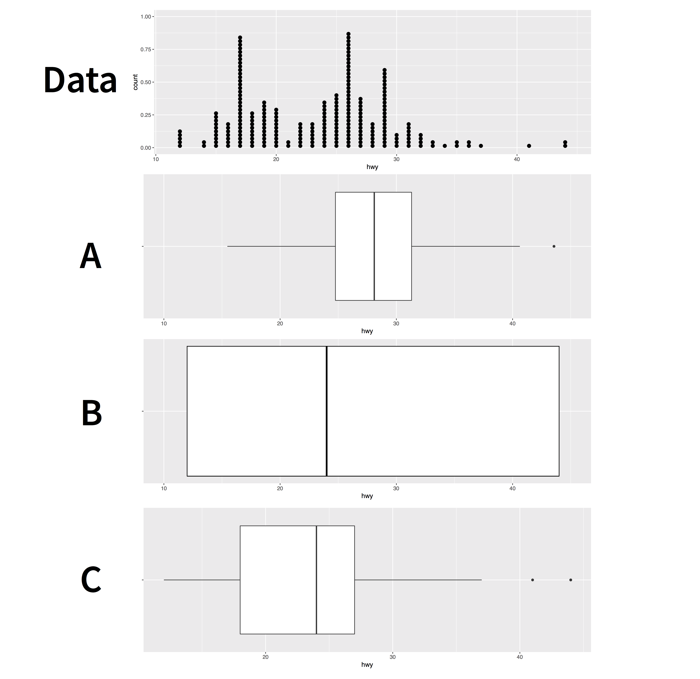

```{r setup, include=FALSE}
library(learnr)
library(tidyverse)

checker <- function(label, user_code, check_code, envir_result, evaluate_result, ...) {
  list(message = check_code, correct = TRUE, location = "append")
}
tutorial_options(exercise.timelimit = 60, exercise.checker = checker)
knitr::opts_chunk$set(error = TRUE, out.width = "100%")
```

```{r, context="server-start", include=FALSE}
# Capture metrics only if running an official primer hosted by RStudio
library(curl)
library(later)
tryCatch(
  source("https://metrics.rstudioprimers.com/learnr/installMetrics", local=TRUE), 
  error = function(e){ 
    print("Warning: An error occurred with the tracking code.")
  }
)
```

```{r, context = "render", results = 'asis', echo = FALSE}
tryCatch(
  source("https://metrics.rstudioprimers.com/learnr/installClient", local=TRUE)$value,
  error = function(e){ 
    print("Warning: An error occurred with the client code.")
  }
)
```

## Welcome

**Boxplots** display the relationship between a continuous variable and a categorical variable. **Count** plots display the relationship between two categorical variables. In this tutorial, you will learn how to use both. You will learn how to:

* Make and interpret boxplots
* Rotate boxplots by flipping the coordinate system of your plot
* Use *violin* plots and *dotplots*, two geoms that are similar to boxplots
* Make and interpret count plots

The tutorial is adapted from _R for Data Science_ by Hadley Wickham and Garrett Grolemund, published by O’Reilly Media, Inc., 2016, ISBN: 9781491910399. You can purchase the book at [shop.oreilly.com](http://shop.oreilly.com/product/0636920034407.do).

The tutorial uses the ggplot2 and dplyr packages, which have been pre-loaded for your convenience.

## Boxplots

### Introduction


### Exercise 1 - Boxplots

```{r echo = FALSE, out.width="80%"}

```


```{r r1, echo = FALSE}
question("Which of the sub-plots accurately describes the data above with a boxplot?",
         answer("A", message = "Good try, but this is tricky. The middle of this box is near the middle of the range of the data, but it is not the median. The median depends on how many observations are on each side of the value."  ),
         answer("B", message = "This box extends the entire range of the data. This could be a useful plot, ggplot2 calls it a crossbar, but it is not a boxplot"),
         answer("C", correct = TRUE),
         allow_retry = TRUE
)
```

### How to make a boxplot

To make a boxplot with ggplot2, add `geom_boxplot()` to the [ggplot2 template](https://tutorials.shinyapps.io/02-Vis-Basics/). For example, the code below uses boxplots to display the relationship between the `class` and `hwy` variables in the `mpg` dataset, which comes with ggplot2. 

```{r boxplot, exercise = TRUE, exercise.eval = TRUE}
ggplot(data = mpg) +
  geom_boxplot(mapping = aes(x = class, y = hwy))
```

### Categorical and continuous

`geom_boxplot()` expects the $y$ axis to be continuous, but accepts categorical variables on the $x$ axis. For example, here `class` is categorical. `geom_boxplot()` will automatically plot a separate boxplot for each value of $x$. This makes it easy to compare the distributions of points with different values of $x$.

```{r  out.width = "80%", echo = FALSE, message = FALSE}
ggplot(data = mpg) +
  geom_boxplot(mapping = aes(x = class, y = hwy))
```

### Exercise 2 - Interpretation

```{r  out.width = "80%", echo = FALSE, message = FALSE}
ggplot(data = mpg) +
  geom_boxplot(mapping = aes(x = class, y = hwy))
```

```{r r2, echo = FALSE}
question("Which class of car has the lowest median highway fuel efficiency (`hwy` value)?",
         answer("2seater"),
         answer("compact"),
         answer("midsize"),
         answer("minivan"),
         answer("pickup", correct = TRUE),
         answer("subcompact"),
         answer("suv", message = "Close. But look closer."),
         allow_retry = TRUE
)
```

### Exercise 3 - Make a Boxplot

Recreate the boxplot below with the diamonds data set.

```{r  out.width = "80%", echo = FALSE, message = FALSE}
ggplot(data = diamonds) +
  geom_boxplot(mapping = aes(x = cut, y = price))
```

```{r r3, exercise = TRUE}

```

```{r r3-solution}
ggplot(data = diamonds) +
  geom_boxplot(mapping = aes(x = cut, y = price))
```

```{r r3-check}
"Do you notice how many outliers appear in the plot? The boxplot algorithm can identify many outliers if your data is big, perhaps too many. Let's look at ways to suppress the appearance of outliers in your plot."
```

### Outliers

You can change how outliers look in your boxplot with the parameters `outlier.color`, `outlier.fill`, `outlier.shape`, `outlier.size`, `outlier.stroke`, and `outlier.alpha` (`outlier.shape` takes a number from 1 to 25). 

Unfortunately, you can't tell `geom_boxplot()` to ignore outliers completely, but you can make outliers disappear by setting `outlier.alpha = 0`. Try it in the plot below.

```{r outliers, exercise = TRUE, exercise.eval = TRUE}
ggplot(data = diamonds) +
  geom_boxplot(mapping = aes(x = cut, y = price), outlier.shape  = 24, 
               outlier.fill = "white", outlier.stroke = 0.25)
```

```{r outliers-solution}
ggplot(data = diamonds) +
  geom_boxplot(mapping = aes(x = cut, y = price), outlier.alpha = 0)
```

<!--

### notch and varwidth

You can further customize your boxplots with the parameters `notch` and `varwidth`. `notch` adds a notch near the median of each box. `varwidth` maps the width of the boxplots on the $x$ axis to the number of points described by the boxplot. This makes it easy to see which distributions have the most points.

Add `varwidth` to the plot below.

```{r varwidth, exercise = TRUE, exercise.eval = TRUE}
ggplot(data = diamonds) +
  geom_boxplot(mapping = aes(x = cut, y = price), notch = TRUE)
```

```{r varwidth-solution}
ggplot(data = diamonds) +
  geom_boxplot(mapping = aes(x = cut, y = price), notch = TRUE, varwidth = TRUE)
```

```{r varwidth-check}
"Good job! You can also customize boxplots with traditional ggplot2 aesthetics. Let's take a look."
```

-->

### Aesthetics

Boxplots recognize the following aesthetics: _alpha_, _color_, _fill_, _group_, _linetype_, _shape_, _size_, and _weight_.

Of these _group_ can be the most useful. Consider the plot below. It uses a continuous variable on the $x$ axis. As a result, `geom_boxplot()` is not sure how to split the data into categories: it lumps all of the data into a single boxplot. The result reveals little about the relationship between carat and price.

```{r  out.width = "80%", echo = FALSE, message = FALSE, warning = FALSE}
ggplot(data = diamonds) +
  geom_boxplot(mapping = aes(x = carat, y = price))
```

In the next sections, we'll use _group_ to make a more informative plot.

### How to "cut" a continuous variable

ggplot2 provides three helper functions that you can use to split a continuous variable into categories. Each takes a continuous vector and returns a categorical vector that assigns each value to a group. For example, `cut_interval()` bins a vector into `n` equal length bins.

```{r}
continuous_vector <- c(1, 2, 3, 4, 5, 6, 7, 8, 9, 10)
continuous_vector
```

```{r}
cut_interval(continuous_vector, n = 3)
```

### The cut functions

The three cut functions are

* `cut_interval()` which makes `n` groups with equal range
* `cut_number()` which makes `n` groups with (approximately) equal numbers of observations
* `cut_width()` which makes groups with width `width`

Use one of three functions below to bin `continuous_vector` into groups of `width = 2`.

```{r cut-setup}
continuous_vector <- c(1, 2, 3, 4, 5, 6, 7, 8, 9, 10)
continuous_vector
```

```{r cut, exercise = TRUE, exercise.eval = TRUE}
continuous_vector
```

```{r cut-solution}
cut_width(continuous_vector, width = 2)
```

```{r cut-check}
"Good job! Now let's apply the cut functions to our graph."
```

### Exercise 4 - Apply a cut function

When you set the $group$ aesthetic of a boxplot, `geom_boxplot()` will draw a separate boxplot for each collection of observations that have the same value of whichever vector you map to $group$. 

This means we can split our `carat` plot by mapping $group$ to the output of a cut function, as in the code below. Study the code, then modify it to create a separate boxplot for each 0.25 wide interval of `carat`.

```{r r4, exercise = TRUE, exercise.eval = TRUE}
ggplot(data = diamonds) +
  geom_boxplot(mapping = aes(x = carat, y = price, group = cut_interval(carat, n = 2)))
```

```{r r4-solution}
ggplot(data = diamonds) +
  geom_boxplot(mapping = aes(x = carat, y = price, group = cut_width(carat, width = 0.25)))
```

```{r r4-check}
"Good job! You can now see a relationship between price and carat. You could also make a scatterplot of these variables, but in this case, it would be a black mass of 54,000 data points."
```

### coord_flip()

`geom_boxplot()` always expects the categorical variable to appear on the $x$ axis, which create horizontal boxplots. But what if you'd like to make horizontal boxplots, like in the plot below?

```{r  out.width = "80%", echo = FALSE, message = FALSE}
ggplot(data = mpg) +
  geom_boxplot(mapping = aes(x = class, y = hwy)) +
  coord_flip()
```

You can do this by adding `+ coord_flip()` to your plot call. 

### Exercise 5 - Horizontal boxplots

Extend the code below to orient the boxplots horizontally.

```{r r5, exercise = TRUE, exercise.eval = TRUE}
ggplot(data = mpg) +
  geom_boxplot(mapping = aes(x = class, y = hwy))
```

```{r r5-solution}
ggplot(data = mpg) +
  geom_boxplot(mapping = aes(x = class, y = hwy)) +
  coord_flip()
```

```{r r5-check}
"Good job! `coord_flip()` is an example of a new coordinate system. You'll learn much more about ggplot2 coordinate systems in a later tutorial."
```


## Similar Geoms

### geom_dotplot()

Boxplots provide a quick way to represent a distribution, but they leave behind a lot of information. ggplot2 supplements boxplots with two geoms that show more information.

The first is `geom_dotplot()`. If you set the `binaxis` parameter of `geom_dotplot()` to `"y"`, `geom_dotplot()` behaves like `geom_boxplot()`, display a separate distribution for each group of data.

Here each group functions like a vertical histogram. Add the parameter `stackdir = "center"` then re-run the code. Can you interpret the results?

```{r r6, exercise = TRUE, exercise.eval = TRUE}
ggplot(data = mpg) +
  geom_dotplot(mapping = aes(x = class, y = hwy), binaxis = "y", 
               dotsize = 0.5, binwidth = 1)
```

```{r r6-solution}
ggplot(data = mpg) +
  geom_dotplot(mapping = aes(x = class, y = hwy), binaxis = "y", 
               dotsize = 0.5, binwidth = 1, stackdir = "center")
```

```{r r6-check}
'Good job! When you set `stackdir = "center"`, `geom_dotplot()` arranges each row of dots symmetrically around the $x$ value. This layout will help you understand the next geom.

As in the histogram tutorial, it takes a lot of tweaking to make a dotplot look right. As a result, I tend to only use them when I want to make a point.'
```

### geom_violin()

`geom_violin()` provides a second alternative to `geom_boxplot()`. A violin plot uses densities to draw a smoothed version of the centered dotplot you just made.

You can think of a violin plot as an outline drawn around the edges of a centered dotplot. Each "violin" spans the range of the data. The violin is thick where there are many values, and thin where there are few.

Convert the plot below from a boxplot to a violin plot. Note that violin plots do not use the parameters you saw for dotplots.

```{r r7, exercise = TRUE, exercise.eval = TRUE}
ggplot(data = mpg) +
  geom_boxplot(mapping = aes(x = class, y = hwy))
```

```{r r7-solution}
ggplot(data = mpg) +
  geom_violin(mapping = aes(x = class, y = hwy))
```

```{r r7-check}
'Good job! Another way to interpret a violin plot is to mentally "push" the width of each violin all to one side (so the other side is a straight line). The result would be a density (e.g. `geom_density()`) turned on its side for each distribution).'
```

### Exercise 7 - Violin plots

You can further enhance violin plots by adding the parameter `draw_quantiles = c(0.25, 0.5, 0.75)`. This will cause ggplot2 to draw horizontal lines across the violins at the 25th, 50th, and 75th percentiles. These are the same three horizontal lines that are displayed in a boxplot (the 25th and 75th percentiles are the bounds of the box, the 50th percentile is the median).

Add these lines to the violin plot below.

```{r r8, exercise = TRUE, exercise.eval = TRUE}
ggplot(data = mpg) +
  geom_violin(mapping = aes(x = class, y = hwy))
```

```{r r8-solution}
ggplot(data = mpg) +
  geom_violin(mapping = aes(x = class, y = hwy), draw_quantiles = c(0.25, 0.5, 0.75))
```

```{r r8-check}
'Good job! Can you predict how you would use `draw_quantiles` to draw a horizontal line at a different percentile, like the 60th percentile?.'
```

## Counts

### geom_count()

Boxplots provide an efficient way to explore the interaction of a continuous variable and a categorical variable. But what if you have two categorical variables?

You can see how observations are distributed across two categorical variables with `geom_count()`. `geom_count()` draws a point at each combination of values from the two variables. The size of the point is mapped to the number of observations with this combination of values. Rare combinations will have small points, frequent combinations will have large points.

```{r  out.width = "80%", echo = FALSE, message = FALSE}
ggplot(data = diamonds) +
  geom_count(mapping = aes(x = color, y = clarity))
```

### Exercise 8 - Count plots

Use `geom_count()` to plot the interaction of the `cut` and `clarity` variables in the `diamonds` data set.

```{r r9, exercise = TRUE}

```

```{r r9-solution}
ggplot(data = diamonds) +
  geom_count(mapping = aes(x = cut, y = clarity))
```

### count

You can use the `count()` function in the **dplyr** package to compute the count values displayed by `geom_count()`. To use `count()`, pass it a data frame and then the names of zero or more variables in the data frame. `count()` will return a new table that lists how many observations occur with each possible combination of the listed variables.

So for example, the code below returns the counts that you visualized in Exercise 8.

```{r}
 diamonds %>% 
   count(cut, clarity)
```

### Heat maps

Heat maps provide a second way to visualize the relationship between two categorical variables. They work like count plots, but use a fill color instead of a point size, to display the number of observations in each combination.

### How to make a heat map

ggplot2 does not provide a geom function for heat maps, but you can construct a heat map by plotting the results of `count()` with `geom_tile()`. 

To do this, set the x and y aesthetics of `geom_tile()` to the variables that you pass to `count()`. Then map the fill aesthetic to the `n` variable computed by `count()`. The plot below displays the same counts as the plot in Exercise 8.

```{r}
 diamonds %>% 
   count(cut, clarity) %>% 
   ggplot() +
     geom_tile(mapping = aes(x = cut, y = clarity, fill = n))
```

### Exercise 9 - Make a heat map

Practice the method above by re-creating the heat map below.

```{r echo = FALSE, out.width = "80%"}
 diamonds %>% 
   count(color, cut) %>% 
   ggplot(mapping = aes(x = color, y = cut)) +
     geom_tile(mapping = aes(fill = n))
```

```{r r10, exercise = TRUE}

```

```{r r10-solution}
 diamonds %>% 
   count(color, cut) %>% 
   ggplot(mapping = aes(x = color, y = cut)) +
     geom_tile(mapping = aes(fill = n))
```

```{r r10-check}
"Good job!"
```


### Recap

Boxplots, dotplots and violin plots provide an easy way to look for relationships between a continuous variable and a categorical variable. Violin plots convey a lot of information quickly, but boxplots have a head start in popularity --- they were easy to use when statisticians had to draw graphs by hand.

In any of these graphs, look for distributions, ranges, medians, skewness or anything else that catches your eye to change in an unusual way from distribution to distribution. Often, you can make patterns even more revealing with the `fct_reorder()` function from the forcats package (we'll wait to learn about forcats until after you study factors).

Count plots and heat maps help you see how observations are distributed across the interactions of two categorical variables.
