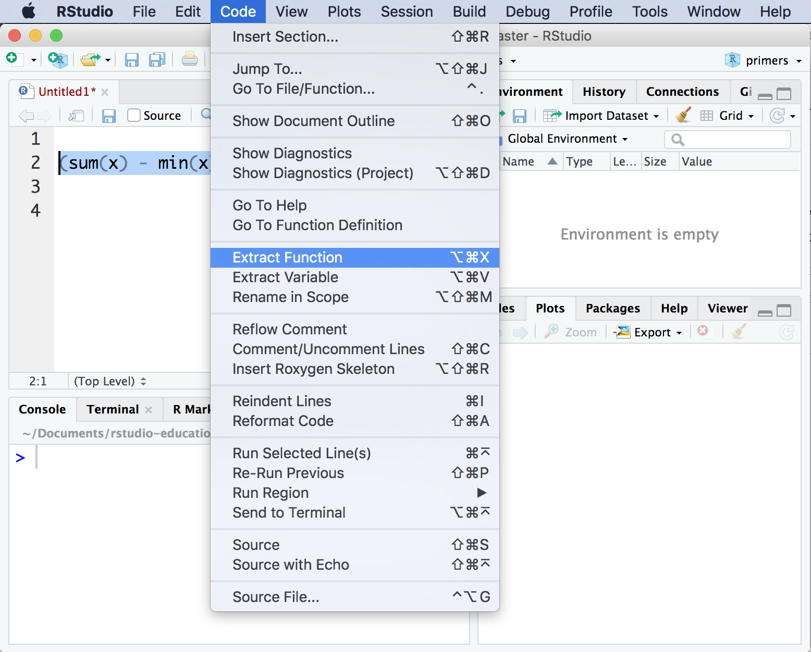

```{r setup, include=FALSE, message = FALSE, warning=FALSE}
library(learnr)

checker <- function(label, user_code, check_code, envir_result, evaluate_result, ...) {
  list(message = check_code, correct = TRUE, location = "append")
}
tutorial_options(exercise.timelimit = 60, exercise.checker = checker)
knitr::opts_chunk$set(error = TRUE, out.width = "100%")
```

```{r, context="server-start", include=FALSE}
# Capture metrics only if running an official primer hosted by RStudio
library(curl)
library(later)
tryCatch(
  source("https://metrics.rstudioprimers.com/learnr/installMetrics", local=TRUE), 
  error = function(e){ 
    print("Warning: An error occurred with the tracking code.")
  }
)
```

```{r, context = "render", results = 'asis', echo = FALSE}
tryCatch(
  source("https://metrics.rstudioprimers.com/learnr/installClient", local=TRUE)$value,
  error = function(e){ 
    print("Warning: An error occurred with the client code.")
  }
)
```

## When to write a function

###  

R comes with thousands of functions, and more are written everyday (these are published in R packages). If you want to do something in R, there is a good chance that a function already exists somewhere that does it.

But what if you want to do something new in R, something that doesn't yet have a function? What should you do?

###  

Write a function?

No, silly. Write some code. But what if you want to use that code _over and over again_, as if it were a part of R? Then what should you do?

###  

Write a function!

This tutorial will show you how. Take the quiz below to begin.

### Quiz

Suppose you need to run the following code on 20 different objects, `sqrt(sum(x^2))`.

```{r why-quiz, echo = FALSE}
question("Why would you not want to rewrite the code 20 times? (Check all that apply)",
     answer("Retyping code takes time.", correct = TRUE),
     answer("Typing the code 20 times creates 20 chances to make a typo.", correct = TRUE),
     answer("If you need to change the code later, you'll need to change it in 20 different places.", correct = TRUE),
     allow_retry = TRUE, 
     type = "multiple", 
     incorrect = "Did you check ALL that applied?",
     correct = "Good job! You can avoid these outcomes by turning your code into a function. A good rule is to turn a piece of code into a function whenever you find yourself re-using the code more than three times.")
```

## Workflow

###  

How should you turn your code into functions? Always follow these four steps: 

1. Create a real R object (or set of objects) to use with your function
2. Write code that works with the real object(s)
3. Wrap the code in `function()`
4. Assign the names of your real objects as argument names to the function

These steps are the best practice for writing functions in R. When you follow these steps, your functions are guaranteed to work for at least one case, which means you will spend more time using your functions and less time debugging them.

Let's use the steps to create your first function.

### Goal - Grading

To make this real, put yourself in the shoes of a teacher: 

You've given your students 10 homework assignments and announced that you will drop their lowest homework score. Their final grade will be the average score of the remaining homeworks.

To make your life easier, you want to write an R function that will take a vector of 10 homework scores and return a final grade. 

Ready to begin?

###  

Remember our steps:

1. Create a real R object (or set of objects) to use with your function

* Create an object named `x` that contains the vector `c(100, 100, 100, 100, 100, 100, 100, 100, 100, 90)` (hint: use copy and paste!). Then click Submit Answer. `x` will be the grades of your test student. 

```{r obj, exercise = TRUE}

```

```{r obj-solution}
x <- c(100, 100, 100, 100, 100, 100, 100, 100, 100, 90)
```

```{r obj-check}
"Now you can use x to develop and test your code"
```

###  

2. Write code that works with the real object(s)

Recall the grading scheme: the final grade is the average homework score after you drop the lowest score. Since there are many ways to calculate this, let's be specific and end up on the same page.

* Use `sum()`, `min()`, `/`, `9` and parentheses to calculate the final grade for student `x`. Click Submit Answer to check that your code works.

```{r make-x, echo = FALSE}
x <- c(100, 100, 100, 100, 100, 100, 100, 100, 100, 90)
```

```{r norm, exercise = TRUE, setup = "make-x"}
x
```

```{r norm-hint}
"Your code should return 100."
```

```{r norm-solution}
(sum(x) - min(x)) / 9
```

```{r norm-check}
"This is the crucial step in writing a function. It is important to get your code working in real life with a real object before you try to abstract the code into a reusable function."
```

###  

3. Wrap the code in `function()`

The `function()` function builds a function from a piece of R code. To use it, call `function()` followed by an opening brace, `{`. Then write one or more lines of R code followed by a closed brace, `}`, e.g.

```{r}
foo <- function() {
 a <- 1
 b <- 2
 a + b
}
```

`function()` will return a function that uses everything between the braces as its code body. If you'd like to save the function, you'll need to assign it in the usual way to an R object that you can call later.

As you write your functions, recall that R will only return the result of the last line in the code body when you call the function (we'll learn about some exceptions to this rule in the Control Flow tutorial). 

###  

Once you save a function, you can run it and inspect its contents.

```{r}
foo()
foo
```

### Your turn

Let's save your code as a function.

* Save the code below as a function named `grade`. Then click Submit Answer.

```{r grade, exercise = TRUE}
(sum(x) - min(x)) / 9
```

```{r grade-hint}
"Use the function() {} function."
```

```{r grade-solution}
grade <- function() { 
  (sum(x) - min(x)) / 9
}
```

```{r grade-check}
"Now that you've saved grade as a function, you can call it whenever you like, but there is still one more thing to do..."
```

###  

At the moment, your `grade()` function is reusable but not _generalizable_. Each time you call `grade()` it computes the final grade of the vector `x` that contains `c(100, 100, 100, 100, 100, 100, 100, 100, 100, 90)`.

```{r echo = FALSE}
x <- c(100, 100, 100, 100, 100, 100, 100, 100, 100, 90)
grade <- function() { 
  (sum(x) - min(x)) / 9
}
```

```{r}
grade()
grade()
```

We'd like to use `grade()` with new vectors that have new values.

### Arguments

4. Assign the names of your real objects as argument names to the function

You can make a function generalizable by turning some of the objects in its code body into _formal arguments_. A formal argument is an object that a user can assign a value to when he or she calls the function. The function will use the user's value for the object when it executes its code body.

For example, we'd like to tell R that `x` in `grade()` is an argument. R shouldn't use a pre-defined value for `x`; it should let the user supply a new value for `x` each time he or she runs the function.

```{r eval = FALSE}
grade <- function() { 
  (sum(x) - min(x)) / 9
}
```

###  

How do you tell R that an object is a formal argument? 

You list the name of the object in the parentheses that follow `function()` in the function definition. If you make more than one argument, separate their names with a comma. For example, you could make `a` and `b` arguments of my `foo` function.

```{r}
foo <- function(a, b) {
 a + b
}
```

Now I can define a new value for `a` and `b` each time I call `foo`. 

```{r}
foo(a = 1, b = 1)
foo(a = 100, b = 200)
```

### Default values

To give an argument a default value, set it equal to a value when you define the function. For example, the code below will set the default value of `b` in `foo` to one.

```{r}
foo <- function(a, b = 1) {
 a + b
}
foo(a = 2)
foo(a = 2, b = 2)
```

###  

Interesting, huh? Now apply what you've learned to `grade()`.

* Change the code below to list `x` as a formal argument of `grade()`. Then click Submit Answer.

```{r x, exercise = TRUE}
grade <- function() { 
  (sum(x) - min(x)) / 9
}
```

```{r x-solution}
grade <- function(x) { 
  (sum(x) - min(x)) / 9
}
```

```{r x-check}
'If you use the "best practice" workflow, your argument names will always be the names of the real R objects that you create in Step 1. Nice and simple.'
```

###   

Good job! You can now have a finished `grade()` function that you can use to calculate the final grade of _any_ vector (I mean, student). Try it out.

* Calculate the final grade of the vector `c(100, 90, 90, 90, 90, 90, 90, 90, 90, 80)`. Then click Submit Answer.

```{r make-grade}
grade <- function(x) { 
  (sum(x) - min(x)) / 9
}
```

```{r function, exercise = TRUE, exercise.setup = "make-grade"}

```

```{r function-solution}
grade(x = c(100, 90, 90, 90, 90, 90, 90, 90, 90, 80))
```

```{r function-check}
"Let's recap the function writing workflow."
```

### Quiz

```{r recap-quiz, echo = FALSE}
question("Which is not a step of the best practice workflow for writing functions?",
         allow_rety = TRUE, random_answer_order = TRUE,
         answer("Create a real R object (or set of objects) to use with your function"),
         answer("Write code that works with the real object(s)"),
         answer("Wrap the code in `function()`"),
         answer("Assign the names of your real objects as argument names to the function"),
         answer("Predict how the function should be written and try it out.", correct = "This looks like a tempting way to save time, but it will lead to long debugging sessions more often than you think.")
)
```

### Recap

Use the four step workflow whenever you need to write a function:

1. Create a real R object (or set of objects) to use with your function
2. Write code that works with the real object(s)
3. Wrap the code in `function()`
4. Assign the names of your real objects as argument names to the function

## Function look-alikes

###  

As an R user, you may have already made things that resemble functions. 

Here are two examples that may be familiar. In each case, you can easily convert your code into a function.

### Purrr expressions

In the Iteration primer, you learned that purrr's map functions can take "expressions." _Expressions_ are a pieces of code that are preceded by `~` and include `.x`s. Map will apply expressions iteratively to each element of a vector.

For example, this call to `map()` will apply the expression `~.x^2` to each element of `vec`. On each iteration, `map()` will assign the _i_th element of vec to `.x` and run the expression.

```{r message=FALSE}
library(tidyverse)

vec <- c(1, 2, 3)
map(vec, ~.x^2)
```

###  

In other words, purrr's map expressions work like functions that have `.x` as a formal argument. To transform an expression to a function, remove the `~`, wrap the code in `function()` and list `.x` as a formal argument.

```{r}
sq <- function(.x) {
  .x^2
}

map(vec, sq)
```

### Functions and pipes

It is also easy to use pipes like simple functions because you can copy and paste a pipe behind different objects. For example, this pipe would compute sum of squares of any vector that you place it behind.

```{r}
c(1, 1, 1) %>% 
  sq() %>% 
  sum()

c(1, 2, 3, 4, 5) %>% 
  sq() %>% 
  sum()
```

###   

It is a good idea to turn a pipe into a function when you find yourself using it often. You don't need to rewrite the pipe to do this. Pipes come with a handy shortcut for turning them into functions.

To turn a pipe into a function, replace its initial object with a `.`, and then save the pipe to an object. R will treat the object as a function that passes its argument to the beginning of the pipe.

```{r}
l2_pipe <- . %>% 
  sq() %>% 
  sum()

l2_pipe(c(1, 1, 1))
```

### Extract function

There is one final way to generate a function. You can use the Extract Function feature of the RStudio IDE to turn a piece of code into a function. 

To do so, highlight a section of code in the scripts pane. Then navigate to **Code > Extract Function** in the RStudio menu bar. RStudio will prompt you to type in a name for the function. It will then surround your code with `function()`, making an educated guess about which objects to list as formal arguments.

```{r echo=FALSE, out.width = "100%"}

```

## Practice

Congratulations on finishing the tutorial. Before you go, complete the following exercises to cement your skills!

### Exercise 1

```{r e1, echo = FALSE}
question("What is the first step of writing a function?",
         answer("Choose a name, then type <- function(){", message = "You shouldn't type function() until you have code that works with a real test case."),
         answer("Create a real R object (or set of objects)", correct = TRUE, message = "You can then use the object to test your code."),
         answer("Assign argument names to your function"),
         answer("Write a help page that describes how your function will work."),
         allow_retry = TRUE)
```

### Exercise 2

What will the following code return?

```{r eval = FALSE}
f <- function(a, b, c) {
  a
  b
  c
}
f(1, 2, 3)
```

```{r q2, echo = FALSE}
question("",
         answer("1"),
         answer("2"),
         answer("3", correct =TRUE, message = "A function will return the result of its *last* line."),
         answer("A vector that contains 1, 2, and 3"),
         answer("An error"),
         allow_retry = TRUE)
```

### Exercise 3

Let's write a function that grades by counting a student's highest score twice and then taking an average of the 11 scores.

```{r e2, echo = FALSE}
question("Do you have a test vector that you can use?",
         answer("Test vector? We don't need no stinking test vector.", 
                message = "Yes you do."),
         answer("Yes, we can reuse the vector named x."),
         allow_retry = TRUE,
         random_answer_order = TRUE)
```

### Exercise 4

* Write a piece of code that uses `max()` to double count the highest score in `x` and then takes the average of the 11 results. Click Submit Answer to check that your code works.

```{r e3, exercise = TRUE, exercise.setup = "make-x"}
x
```

```{r e3-hint}
"Your code should retrun the answer 99.09091."
```

```{r e3-solution}
(sum(x) + max(x)) / 11
```

```{r e3-check}
"That student will be pleased!"
```

### Exercise 5

* Wrap your code in `function()` and save it to the name `grade2`.
* Then define the argument(s) for the function.
* Then click Submit Answer.

```{r e4, exercise = TRUE}
(sum(x) + max(x)) / 11
```

```{r e4-hint}
"When you use this workflow, the names of the argument(s) are always the names of the object(s) that you created in step 1."
```

```{r e4-solution}
grade2 <- function(x) {
  (sum(x) + max(x)) / 11
}
```

```{r e4-check}
"Your skills are almost complete."
```

### Exercise 6

It's time to put it all together. 

* Use the code block below to develop a function named `l2` that calculates the Euclidean distance, or L~2~ norm ($\|x||_{2}$), of a vector of numbers named `x`. The L~2~ norm is the square root of the sum of the squared values in the vector, i.e.

$$\| x \|_{2} = \sqrt{\sum_{i = 1}^{n} x_{i}^{2}}$$

* When you are finished, reduce your code to just the definition of your function. Then click Submit Answer.

```{r e5, exercise = TRUE}

```

```{r e5-hint-1}
"You've already seen the code for the l2 function earlier in this tutorial (I do not mean the pipe example)."
```

```{r e5-hint-2}
"Consider using sqrt(), sum(), and ^2. Your code will work with vectors of any length."
```

```{r e5-solution}
l2 <- function(x) {
  sqrt(sum(x^2))
}
```

```{r e5-check}
"Good job!"
```


